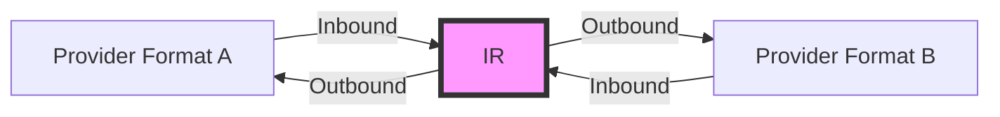
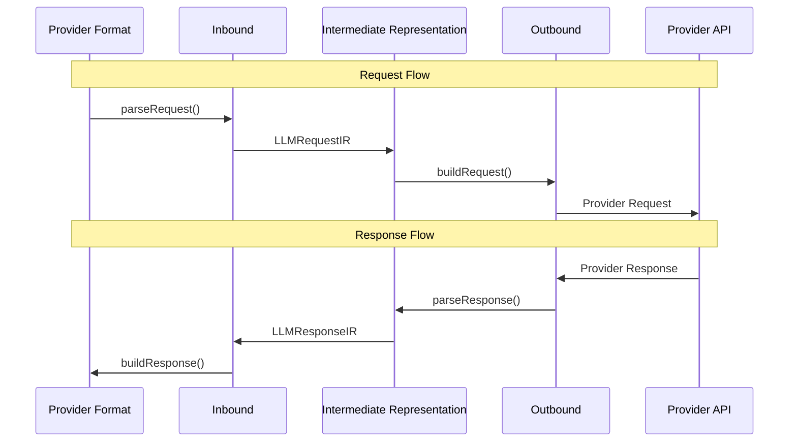

The adapter is the core component that handles the bi-directional conversion between provider-specific formats and intermediate representations (IRs), enabling Amux to collaborate with any provider by realizing two directions: **Inbound** (Provider → IR) and **Outbound** (IR → Provider).

## Adapter Architecture



### Conversion Flow



## LLMAdapter Interface

The main adapter interface that all adapters must implement.

```typescript
interface LLMAdapter {
  readonly name: string
  readonly version: string
  readonly capabilities: AdapterCapabilities
  inbound: InboundAdapter
  outbound: OutboundAdapter
  validateRequest?(ir: LLMRequestIR): ValidationResult
  supportsCapability?(capability: keyof AdapterCapabilities): boolean
  getInfo(): AdapterInfo
}
```

### Properties

<Tabs items={['name', 'version', 'capabilities']}>
  <Tab value="name">
    ```typescript
    readonly name: string
    ```

    The adapter name (e.g., `'openai'`, `'anthropic'`, `'deepseek'`).

    **Example:**
    ```typescript
    console.log(openaiAdapter.name) // "openai"
    ```

  </Tab>

  <Tab value="version">
    ```typescript
    readonly version: string
    ```

    The adapter version following semantic versioning.

    **Example:**
    ```typescript
    console.log(openaiAdapter.version) // "1.0.0"
    ```

  </Tab>

  <Tab value="capabilities">
    ```typescript
    readonly capabilities: AdapterCapabilities
    ```

    Declares what features this adapter supports. See [AdapterCapabilities](#adaptercapabilities).

    **Example:**
    ```typescript
    console.log(openaiAdapter.capabilities)
    // {
    //   streaming: true,
    //   tools: true,
    //   vision: true,
    //   ...
    // }
    ```

  </Tab>
</Tabs>

## InboundAdapter

Handles conversion from provider format to IR.

```typescript
interface InboundAdapter {
  parseRequest(request: unknown): LLMRequestIR
  parseResponse?(response: unknown): LLMResponseIR
  parseStream?(chunk: unknown): LLMStreamEvent | LLMStreamEvent[] | null
  parseError?(error: unknown): LLMErrorIR
}
```

<Callout type="warn">
  All `parse*` methods convert **from provider format to IR**. They are used
  when receiving data from a provider.
</Callout>

### Methods

<Tabs items={['parseRequest', 'parseResponse', 'parseStream', 'parseError']}>
  <Tab value="parseRequest">
    ```typescript
    parseRequest(request: unknown): LLMRequestIR
    ```

    Parses a provider-specific request into IR format.

    **Parameters:**
    - `request` - Request in provider's format

    **Returns:** `LLMRequestIR` - Unified request representation

    **Example:**
    ```typescript
    const ir = adapter.inbound.parseRequest({
      model: 'gpt-4',
      messages: [{ role: 'user', content: 'Hello!' }]
    })
    // Returns: { messages: [...], model: 'gpt-4', ... }
    ```

  </Tab>

  <Tab value="parseResponse">
    ```typescript
    parseResponse?(response: unknown): LLMResponseIR
    ```

    Parses a provider-specific response into IR format.

    **Parameters:**
    - `response` - Response in provider's format

    **Returns:** `LLMResponseIR` - Unified response representation

    **Example:**
    ```typescript
    const ir = adapter.inbound.parseResponse({
      id: 'chatcmpl-123',
      choices: [{ message: { role: 'assistant', content: 'Hi!' } }]
    })
    ```

  </Tab>

  <Tab value="parseStream">
    ```typescript
    parseStream?(chunk: unknown): LLMStreamEvent | LLMStreamEvent[] | null
    ```

    Parses a streaming chunk into IR stream event(s).

    **Parameters:**
    - `chunk` - Stream chunk in provider's format

    **Returns:** Stream event(s) or `null` if chunk should be skipped

    **Example:**
    ```typescript
    const events = adapter.inbound.parseStream({
      choices: [{ delta: { content: 'Hello' } }]
    })
    // Returns: { type: 'content', content: { delta: 'Hello' } }
    ```

  </Tab>

  <Tab value="parseError">
    ```typescript
    parseError?(error: unknown): LLMErrorIR
    ```

    Parses a provider-specific error into IR format.

    **Parameters:**
    - `error` - Error in provider's format

    **Returns:** `LLMErrorIR` - Unified error representation

    **Example:**
    ```typescript
    const errorIR = adapter.inbound.parseError({
      error: { message: 'Rate limit exceeded', type: 'rate_limit_error' }
    })
    // Returns: { type: 'rate_limit', message: '...', retryable: true }
    ```

  </Tab>
</Tabs>

## OutboundAdapter

Handles conversion from IR to provider format.

```typescript
interface OutboundAdapter {
  buildRequest(ir: LLMRequestIR): unknown
  buildResponse?(ir: LLMResponseIR): unknown
  buildStreamEvent?(ir: LLMStreamEvent): unknown
  createStreamBuilder?(): StreamEventBuilder
  buildStreamHandler?(): StreamHandler
  buildErrorHandler?(): ErrorHandler
}
```

<Callout type="warn">
  All `build*` methods convert **from IR to provider format**. They are used
  when sending data to a provider.
</Callout>

### Methods

<Tabs items={['buildRequest', 'buildResponse', 'createStreamBuilder', 'buildStreamHandler', 'buildErrorHandler']}>
  <Tab value="buildRequest">
    ```typescript
    buildRequest(ir: LLMRequestIR): unknown
    ```

    Builds a provider-specific request from IR.

    **Parameters:**
    - `ir` - Request in IR format

    **Returns:** Request in provider's format

    **Example:**
    ```typescript
    const providerRequest = adapter.outbound.buildRequest({
      messages: [{ role: 'user', content: 'Hello!' }],
      model: 'gpt-4'
    })
    // Returns provider-specific format
    ```

  </Tab>

  <Tab value="buildResponse">
    ```typescript
    buildResponse?(ir: LLMResponseIR): unknown
    ```

    Builds a provider-specific response from IR.

    **Parameters:**
    - `ir` - Response in IR format

    **Returns:** Response in provider's format

  </Tab>

  <Tab value="createStreamBuilder">
    ```typescript
    createStreamBuilder?(): StreamEventBuilder
    ```

    Creates a stream event builder for converting IR events to provider SSE format.

    **Returns:** `StreamEventBuilder` - Stateful stream event builder

    ```typescript
    interface StreamEventBuilder {
      // Process an IR stream event and return SSE events
      process(event: LLMStreamEvent): SSEEvent[]

      // Get final events when stream ends
      finalize?(): SSEEvent[]
    }
    ```

    **Purpose:**
    - Maintains state for proper event sequencing
    - Converts IR stream events to provider-specific SSE format
    - Handles complex streaming protocols (e.g., Anthropic's multi-event system)

    **Example:**
    ```typescript
    createStreamBuilder(): StreamEventBuilder {
      let contentBlockIndex = 0

      return {
        process(event: LLMStreamEvent): SSEEvent[] {
          if (event.type === 'start') {
            return [
              { event: 'message_start', data: { id: event.id } }
            ]
          }
          if (event.type === 'content' && event.content) {
            return [
              {
                event: 'content_block_delta',
                data: {
                  index: contentBlockIndex,
                  delta: { text: event.content.delta }
                }
              }
            ]
          }
          return []
        },

        finalize() {
          return [
            { event: 'message_end', data: {} }
          ]
        }
      }
    }
    ```

  </Tab>

  <Tab value="buildStreamHandler">
    ```typescript
    buildStreamHandler?(): StreamHandler
    ```

    Returns a function that handles streaming chunks.

    **Returns:** `StreamHandler` function

    ```typescript
    type StreamHandler = (chunk: unknown) => LLMStreamEvent | LLMStreamEvent[] | null
    ```

  </Tab>

  <Tab value="buildErrorHandler">
    ```typescript
    buildErrorHandler?(): ErrorHandler
    ```

    Returns a function that handles errors.

    **Returns:** `ErrorHandler` function

    ```typescript
    type ErrorHandler = (error: unknown) => LLMErrorIR
    ```

  </Tab>
</Tabs>

## AdapterCapabilities

Declares what features an adapter supports.

```typescript
interface AdapterCapabilities {
  streaming: boolean
  tools: boolean
  vision: boolean
  multimodal: boolean
  systemPrompt: boolean
  toolChoice: boolean
  reasoning?: boolean // Supports reasoning/thinking mode
  webSearch?: boolean // Supports web search
  jsonMode?: boolean // Supports JSON mode/structured output
  logprobs?: boolean // Supports log probabilities
  seed?: boolean // Supports seed for reproducibility
}
```

### Properties

| Property       | Type       | Description                                                  |
| -------------- | ---------- | ------------------------------------------------------------ |
| `streaming`    | `boolean`  | Supports streaming responses                                 |
| `tools`        | `boolean`  | Supports function/tool calling                               |
| `vision`       | `boolean`  | Supports image inputs                                        |
| `multimodal`   | `boolean`  | Supports multiple content types                              |
| `systemPrompt` | `boolean`  | Supports system prompts                                      |
| `toolChoice`   | `boolean`  | Supports tool choice control                                 |
| `reasoning`    | `boolean?` | Supports reasoning/thinking mode (DeepSeek, Qwen, Anthropic) |
| `webSearch`    | `boolean?` | Supports web search (Qwen)                                   |
| `jsonMode`     | `boolean?` | Supports JSON mode and structured output                     |
| `logprobs`     | `boolean?` | Supports log probabilities                                   |
| `seed`         | `boolean?` | Supports seed for reproducible generation                    |

<Callout type="info">
  Use capabilities to check if an adapter supports the features you need before
  using it in a Bridge.
</Callout>

### Example

```typescript
const capabilities: AdapterCapabilities = {
  streaming: true,
  tools: true,
  vision: true,
  multimodal: true,
  systemPrompt: true,
  toolChoice: true,
}

// Check specific capability
if (adapter.capabilities.tools) {
  console.log('This adapter supports tool calling')
}
```

## ValidationResult

Result of IR validation.

```typescript
interface ValidationResult {
  valid: boolean
  errors?: string[]
  warnings?: string[]
}
```

### Example

```typescript
const result = adapter.validateRequest(ir)

if (!result.valid) {
  console.error('Validation errors:', result.errors)
  // ["Missing required field: messages", "Invalid model format"]
}

if (result.warnings) {
  console.warn('Validation warnings:', result.warnings)
  // ["Tool choice not supported by this adapter"]
}
```

## AdapterInfo

Information about an adapter.

```typescript
interface AdapterInfo {
  name: string
  version: string
  capabilities: AdapterCapabilities
  endpoint?: ProviderEndpoint
}

interface ProviderEndpoint {
  baseUrl: string // Base URL for the API
  chatPath?: string // Chat completions path (default: '/v1/chat/completions')
  modelsPath?: string // Models list path (default: '/v1/models')
}
```

### Example

```typescript
const info = adapter.getInfo()

console.log(`${info.name} v${info.version}`)
console.log(`Capabilities:`, info.capabilities)

// Endpoint information
if (info.endpoint) {
  console.log(`Base URL: ${info.endpoint.baseUrl}`)
  console.log(`Chat path: ${info.endpoint.chatPath}`)
  console.log(`Models path: ${info.endpoint.modelsPath}`)
}
```

## Creating Custom Adapters

To create a custom adapter, implement the `LLMAdapter` interface.

<Callout type="info">
  Follow this pattern to ensure your adapter works seamlessly with Amux.
</Callout>

### Step-by-Step Guide

<Tabs items={['1. Define Structure', '2. Implement Inbound', '3. Implement Outbound', '4. Add Metadata']}>
  <Tab value="1. Define Structure">
    ```typescript
    import type { LLMAdapter } from '@amux.ai/llm-bridge'

    export const myAdapter: LLMAdapter = {
      name: 'my-provider',
      version: '1.0.0',

      capabilities: {
        streaming: true,
        tools: true,
        vision: false,
        multimodal: false,
        systemPrompt: true,
        toolChoice: true
      },

      inbound: {
        // Will implement next
      },

      outbound: {
        // Will implement next
      },

      getInfo() {
        return {
          name: this.name,
          version: this.version,
          capabilities: this.capabilities,
          description: 'My custom adapter',
          provider: 'my-provider'
        }
      }
    }
    ```

  </Tab>

  <Tab value="2. Implement Inbound">
    ```typescript
    inbound: {
      parseRequest(request: unknown): LLMRequestIR {
        // Convert provider format → IR
        const req = request as MyProviderRequest

        return {
          messages: req.messages.map(msg => ({
            role: msg.role,
            content: msg.content
          })),
          model: req.model,
          generation: {
            temperature: req.temperature,
            maxTokens: req.max_tokens
          }
        }
      },

      parseResponse(response: unknown): LLMResponseIR {
        // Convert provider format → IR
        const res = response as MyProviderResponse

        return {
          id: res.id,
          model: res.model,
          choices: res.choices.map(choice => ({
            index: choice.index,
            message: choice.message,
            finishReason: choice.finish_reason
          }))
        }
      }
    }
    ```

  </Tab>

  <Tab value="3. Implement Outbound">
    ```typescript
    outbound: {
      buildRequest(ir: LLMRequestIR): unknown {
        // Convert IR → provider format
        return {
          model: ir.model,
          messages: ir.messages,
          temperature: ir.generation?.temperature,
          max_tokens: ir.generation?.maxTokens,
          stream: ir.stream
        }
      },

      buildResponse(ir: LLMResponseIR): unknown {
        // Convert IR → provider format
        return {
          id: ir.id,
          model: ir.model,
          choices: ir.choices.map(choice => ({
            index: choice.index,
            message: choice.message,
            finish_reason: choice.finishReason
          }))
        }
      }
    }
    ```

  </Tab>

  <Tab value="4. Add Metadata">
    ```typescript
    // Optional: Add validation
    validateRequest(ir: LLMRequestIR): ValidationResult {
      const errors: string[] = []
      const warnings: string[] = []

      if (!ir.messages || ir.messages.length === 0) {
        errors.push('Messages array is required')
      }

      if (ir.tools && !this.capabilities.tools) {
        warnings.push('Tools are not supported by this adapter')
      }

      return {
        valid: errors.length === 0,
        errors: errors.length > 0 ? errors : undefined,
        warnings: warnings.length > 0 ? warnings : undefined
      }
    },

    // Optional: Check capability support
    supportsCapability(capability: keyof AdapterCapabilities): boolean {
      return this.capabilities[capability]
    }
    ```

  </Tab>
</Tabs>

### Complete Example

```typescript
import type {
  LLMAdapter,
  LLMRequestIR,
  LLMResponseIR,
} from '@amux.ai/llm-bridge'

export const myAdapter: LLMAdapter = {
  name: 'my-provider',
  version: '1.0.0',

  capabilities: {
    streaming: true,
    tools: true,
    vision: false,
    multimodal: false,
    systemPrompt: true,
    toolChoice: true,
  },

  inbound: {
    parseRequest(request: unknown): LLMRequestIR {
      const req = request as any
      return {
        messages: req.messages,
        model: req.model,
        tools: req.tools,
        generation: {
          temperature: req.temperature,
          maxTokens: req.max_tokens,
        },
      }
    },

    parseResponse(response: unknown): LLMResponseIR {
      const res = response as any
      return {
        id: res.id,
        model: res.model,
        choices: res.choices,
      }
    },
  },

  outbound: {
    buildRequest(ir: LLMRequestIR): unknown {
      return {
        model: ir.model,
        messages: ir.messages,
        tools: ir.tools,
        temperature: ir.generation?.temperature,
        max_tokens: ir.generation?.maxTokens,
      }
    },

    buildResponse(ir: LLMResponseIR): unknown {
      return {
        id: ir.id,
        model: ir.model,
        choices: ir.choices,
      }
    },
  },

  getInfo() {
    return {
      name: this.name,
      version: this.version,
      capabilities: this.capabilities,
      description: 'My custom adapter',
      provider: 'my-provider',
    }
  },
}
```

## Next Steps

<Cards>
  <Card title="IR Format" href="/en/docs/api/ir">
    Learn about the Intermediate Representation format
  </Card>
  <Card title="Bridge API" href="/en/docs/api/bridge">
    Understand how to use adapters with Bridge
  </Card>
  <Card title="Examples" href="/docs/examples">
    See complete adapter examples
  </Card>
</Cards>
