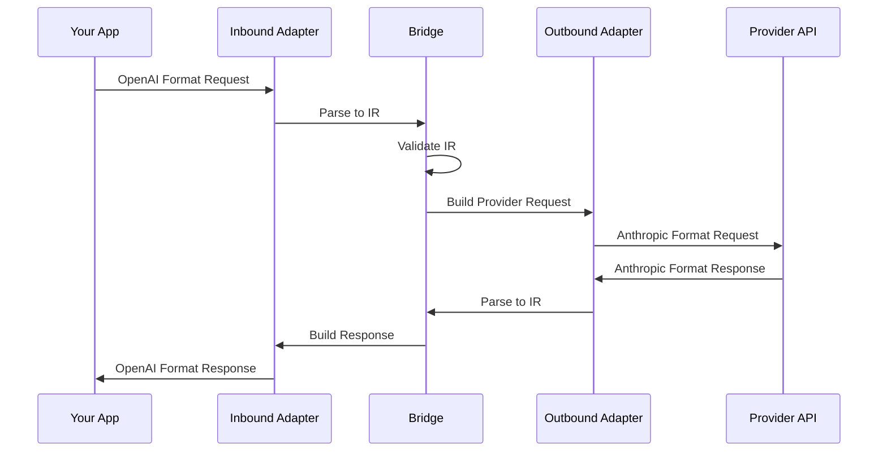
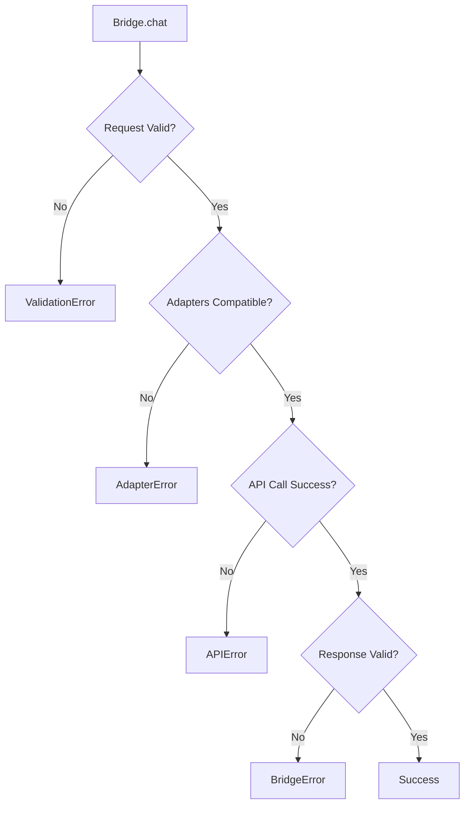

Bridge is the core orchestrator that handles bidirectional translation between LLM providers. It acts as a translator between different LLM provider APIs, allowing you to send requests in one format and receive responses in the same format, while actually calling a different provider's API.

## How Bridge Works



## createBridge

Creates a new Bridge instance.

```typescript
function createBridge(options: BridgeOptions): Bridge
```

### Parameters

<Tabs items={['BridgeOptions', 'BridgeConfig']}>
  <Tab value="BridgeOptions">
    ```typescript
    interface BridgeOptions {
      inbound: LLMAdapter   // Inbound adapter (parses incoming format)
      outbound: LLMAdapter  // Outbound adapter (builds outgoing format)
      config: BridgeConfig  // Configuration
    }
    ```

    | Property | Type | Description |
    |----------|------|-------------|
    | `inbound` | `LLMAdapter` | Adapter that parses incoming requests |
    | `outbound` | `LLMAdapter` | Adapter that calls the target provider |
    | `config` | `BridgeConfig` | Bridge configuration |
  </Tab>

  <Tab value="BridgeConfig">
    ```typescript
    interface BridgeConfig {
      apiKey?: string           // API key for the outbound provider
      baseURL?: string          // Base URL for API calls
      timeout?: number          // Request timeout in milliseconds
      maxRetries?: number       // Maximum number of retries
      headers?: Record<string, string>  // Additional headers
    }
    ```

    | Property | Type | Default | Description |
    |----------|------|---------|-------------|
    | `apiKey` | `string?` | - | API key for authentication |
    | `baseURL` | `string?` | Auto-detected | Custom API base URL |
    | `timeout` | `number?` | `120000` | Request timeout (ms) |
    | `maxRetries` | `number?` | `3` | Max retry attempts |
    | `headers` | `Record<string, string>?` | `{}` | Custom HTTP headers |
  </Tab>
</Tabs>

### Example

<Tabs items={['Basic', 'With Config', 'Multiple Providers']}>
  <Tab value="Basic">
    ```typescript
    import { createBridge } from '@llm-bridge/core'
    import { openaiAdapter } from '@llm-bridge/adapter-openai'
    import { anthropicAdapter } from '@llm-bridge/adapter-anthropic'

    const bridge = createBridge({
      inbound: openaiAdapter,
      outbound: anthropicAdapter,
      config: {
        apiKey: process.env.ANTHROPIC_API_KEY
      }
    })
    ```
  </Tab>

  <Tab value="With Config">
    ```typescript
    const bridge = createBridge({
      inbound: openaiAdapter,
      outbound: anthropicAdapter,
      config: {
        apiKey: process.env.ANTHROPIC_API_KEY,
        baseURL: 'https://api.anthropic.com',
        timeout: 60000,
        maxRetries: 5,
        headers: {
          'X-Custom-Header': 'value',
          'X-Request-ID': 'req_123'
        }
      }
    })
    ```
  </Tab>

  <Tab value="Multiple Providers">
    ```typescript
    // OpenAI → Anthropic
    const bridge1 = createBridge({
      inbound: openaiAdapter,
      outbound: anthropicAdapter,
      config: { apiKey: process.env.ANTHROPIC_API_KEY }
    })

    // Anthropic → DeepSeek
    const bridge2 = createBridge({
      inbound: anthropicAdapter,
      outbound: deepseekAdapter,
      config: { apiKey: process.env.DEEPSEEK_API_KEY }
    })

    // DeepSeek → OpenAI
    const bridge3 = createBridge({
      inbound: deepseekAdapter,
      outbound: openaiAdapter,
      config: { apiKey: process.env.OPENAI_API_KEY }
    })
    ```
  </Tab>
</Tabs>

## Bridge Methods

### chat

Sends a chat completion request and returns the response.

```typescript
async chat(request: unknown): Promise<unknown>
```

<Callout type="warn">
The request must be in the **inbound adapter's format**. The response will also be in the inbound adapter's format, even though a different provider API is called internally.
</Callout>

#### Example

<Tabs items={['Simple', 'With Tools', 'Multimodal']}>
  <Tab value="Simple">
    ```typescript
    const response = await bridge.chat({
      model: 'gpt-4',
      messages: [
        { role: 'user', content: 'Hello!' }
      ]
    })

    console.log(response.choices[0].message.content)
    ```
  </Tab>

  <Tab value="With Tools">
    ```typescript
    const response = await bridge.chat({
      model: 'gpt-4',
      messages: [
        { role: 'user', content: 'What is the weather in Tokyo?' }
      ],
      tools: [{
        type: 'function',
        function: {
          name: 'get_weather',
          description: 'Get weather for a location',
          parameters: {
            type: 'object',
            properties: {
              location: { type: 'string' }
            },
            required: ['location']
          }
        }
      }],
      tool_choice: 'auto'
    })

    // Check for tool calls
    if (response.choices[0].message.tool_calls) {
      const toolCall = response.choices[0].message.tool_calls[0]
      console.log('Tool:', toolCall.function.name)
      console.log('Args:', toolCall.function.arguments)
    }
    ```
  </Tab>

  <Tab value="Multimodal">
    ```typescript
    const response = await bridge.chat({
      model: 'gpt-4-vision',
      messages: [{
        role: 'user',
        content: [
          { type: 'text', text: 'What is in this image?' },
          {
            type: 'image_url',
            image_url: {
              url: 'https://example.com/image.jpg'
            }
          }
        ]
      }]
    })
    ```
  </Tab>
</Tabs>

### chatStream

Sends a streaming chat completion request.

```typescript
async *chatStream(request: unknown): AsyncIterable<unknown>
```

#### Example

```typescript
const stream = bridge.chatStream({
  model: 'gpt-4',
  messages: [{ role: 'user', content: 'Tell me a story' }],
  stream: true
})

for await (const chunk of stream) {
  const content = chunk.choices[0]?.delta?.content
  if (content) {
    process.stdout.write(content)
  }
}
```

### checkCompatibility

Checks compatibility between inbound and outbound adapters.

```typescript
checkCompatibility(): CompatibilityReport
```

<Callout type="info">
Use this method to verify that your adapter combination supports all the features you need before making requests.
</Callout>

#### Returns

```typescript
interface CompatibilityReport {
  compatible: boolean
  issues?: string[]
  warnings?: string[]
}
```

#### Example

```typescript
const report = bridge.checkCompatibility()

if (!report.compatible) {
  console.error('Compatibility issues:', report.issues)
  // Example: ["Inbound adapter supports tools but outbound adapter does not"]
}

if (report.warnings) {
  console.warn('Warnings:', report.warnings)
  // Example: ["Inbound adapter supports vision but outbound adapter does not"]
}
```

### getAdapters

Returns information about the configured adapters.

```typescript
getAdapters(): {
  inbound: { name: string; version: string }
  outbound: { name: string; version: string }
}
```

#### Example

```typescript
const adapters = bridge.getAdapters()

console.log(`Inbound: ${adapters.inbound.name} v${adapters.inbound.version}`)
console.log(`Outbound: ${adapters.outbound.name} v${adapters.outbound.version}`)
// Output:
// Inbound: openai v1.0.0
// Outbound: anthropic v1.0.0
```

## Error Handling

The Bridge throws typed errors for different failure scenarios.



### Error Types

<Tabs items={['BridgeError', 'AdapterError', 'APIError', 'ValidationError']}>
  <Tab value="BridgeError">
    Errors from the Bridge orchestration layer.

    ```typescript
    try {
      const response = await bridge.chat(request)
    } catch (error) {
      if (error instanceof BridgeError) {
        console.error('Bridge error:', error.message)
        console.error('Error code:', error.code)
      }
    }
    ```

    **Common causes:**
    - Response parsing failures
    - Internal orchestration errors
    - Configuration issues
  </Tab>

  <Tab value="AdapterError">
    Errors from adapter conversion.

    ```typescript
    try {
      const response = await bridge.chat(request)
    } catch (error) {
      if (error instanceof AdapterError) {
        console.error('Adapter error:', error.message)
        console.error('Adapter:', error.adapterName)
      }
    }
    ```

    **Common causes:**
    - Unsupported features
    - Format conversion failures
    - Missing required fields
  </Tab>

  <Tab value="APIError">
    Errors from provider API calls.

    ```typescript
    try {
      const response = await bridge.chat(request)
    } catch (error) {
      if (error instanceof APIError) {
        console.error('API error:', error.message)
        console.error('Status:', error.status)
        console.error('Provider:', error.provider)
      }
    }
    ```

    **Common causes:**
    - Invalid API key
    - Rate limiting
    - Network issues
    - Provider service errors
  </Tab>

  <Tab value="ValidationError">
    Errors from IR validation.

    ```typescript
    try {
      const response = await bridge.chat(request)
    } catch (error) {
      if (error instanceof ValidationError) {
        console.error('Validation error:', error.message)
        console.error('Errors:', error.errors)
      }
    }
    ```

    **Common causes:**
    - Missing required fields
    - Invalid field types
    - Constraint violations
  </Tab>
</Tabs>

## Complete Example

Here's a complete example showing error handling, compatibility checking, and streaming:

```typescript
import { createBridge } from '@llm-bridge/core'
import { openaiAdapter } from '@llm-bridge/adapter-openai'
import { anthropicAdapter } from '@llm-bridge/adapter-anthropic'

// Create bridge
const bridge = createBridge({
  inbound: openaiAdapter,
  outbound: anthropicAdapter,
  config: {
    apiKey: process.env.ANTHROPIC_API_KEY,
    timeout: 30000
  }
})

// Check compatibility
const report = bridge.checkCompatibility()
if (!report.compatible) {
  console.error('Incompatible adapters:', report.issues)
  process.exit(1)
}

// Make request with error handling
try {
  const response = await bridge.chat({
    model: 'gpt-4',
    messages: [
      { role: 'system', content: 'You are a helpful assistant.' },
      { role: 'user', content: 'Explain quantum computing in simple terms.' }
    ],
    temperature: 0.7,
    max_tokens: 500
  })

  console.log(response.choices[0].message.content)
} catch (error) {
  if (error instanceof APIError) {
    console.error(`API Error (${error.status}):`, error.message)
  } else if (error instanceof AdapterError) {
    console.error('Adapter Error:', error.message)
  } else {
    console.error('Unknown Error:', error)
  }
}
```

## Next Steps

<Cards>
  <Card title="Adapters API" href="/docs/api/adapters">
    Learn about adapter interfaces and capabilities
  </Card>
  <Card title="IR Format" href="/docs/api/ir">
    Understand the Intermediate Representation
  </Card>
  <Card title="Examples" href="/docs/examples">
    See complete working examples
  </Card>
</Cards>
