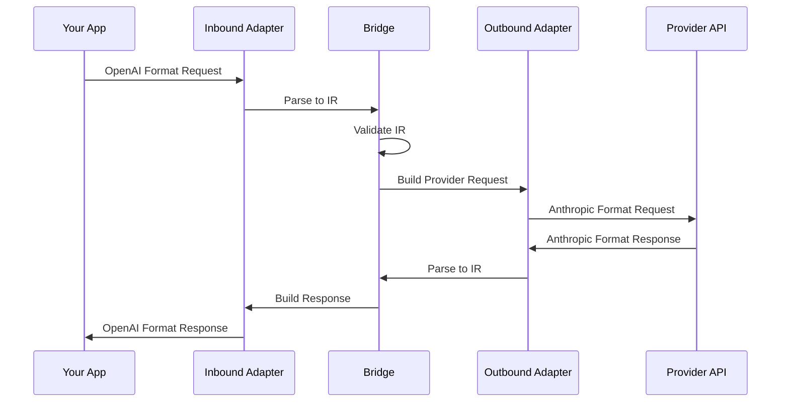
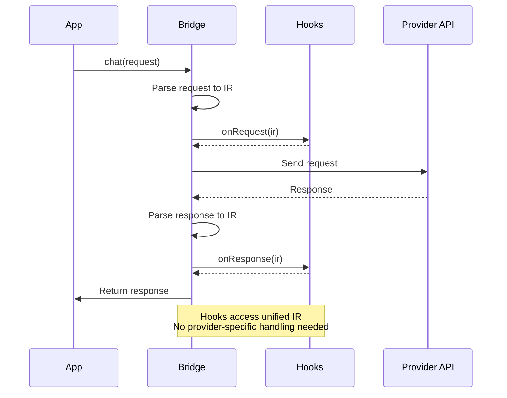
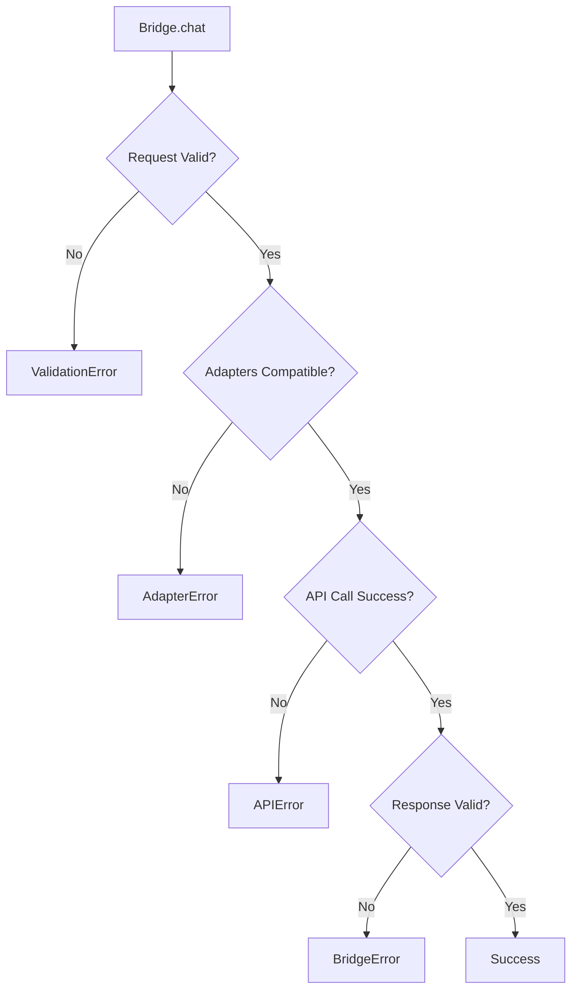

Bridge is the core orchestrator that handles bidirectional translation between LLM providers. It acts as a translator between different LLM provider APIs, allowing you to send requests in one format and receive responses in the same format, while actually calling a different provider's API.

## How Bridge Works



## createBridge

Creates a new Bridge instance.

```typescript
function createBridge(options: BridgeOptions): Bridge
```

### Parameters

<Tabs items={['BridgeOptions', 'BridgeConfig']}>
  <Tab value="BridgeOptions">
    ```typescript
    interface BridgeOptions {
      inbound: LLMAdapter   // Inbound adapter (parses incoming format)
      outbound: LLMAdapter  // Outbound adapter (builds outgoing format)
      config: BridgeConfig  // Configuration

      // Model mapping options (optional)
      targetModel?: string  // Fixed target model
      modelMapper?: (inboundModel: string) => string  // Model mapping function
      modelMapping?: { [inboundModel: string]: string }  // Model mapping table
    }
    ```

    | Property | Type | Description |
    |----------|------|-------------|
    | `inbound` | `LLMAdapter` | Adapter that parses incoming requests |
    | `outbound` | `LLMAdapter` | Adapter that calls the target provider |
    | `config` | `BridgeConfig` | Bridge configuration |
    | `targetModel` | `string?` | Fixed target model to use (highest priority) |
    | `modelMapper` | `function?` | Model mapping function (second priority) |
    | `modelMapping` | `object?` | Model mapping table (third priority) |
  </Tab>

  <Tab value="BridgeConfig">
    ```typescript
    interface BridgeConfig {
      apiKey?: string           // API key for the outbound provider
      baseURL?: string          // Base URL for API calls
      chatPath?: string         // Custom chat endpoint path
      modelsPath?: string       // Custom models endpoint path
      timeout?: number          // Request timeout in milliseconds
      maxRetries?: number       // Maximum number of retries
      headers?: Record<string, string>  // Additional headers
      authHeaderName?: string   // Authentication header name (default: 'Authorization')
      authHeaderPrefix?: string // Authentication header prefix (default: 'Bearer')
    }
    ```

    | Property | Type | Default | Description |
    |----------|------|---------|-------------|
    | `apiKey` | `string?` | - | API key for authentication |
    | `baseURL` | `string?` | Auto-detected | Custom API base URL |
    | `chatPath` | `string?` | Auto-detected | Custom chat endpoint path (overrides adapter default) |
    | `modelsPath` | `string?` | Auto-detected | Custom models endpoint path (overrides adapter default) |
    | `timeout` | `number?` | `120000` | Request timeout (ms) |
    | `maxRetries` | `number?` | `3` | Max retry attempts |
    | `headers` | `Record<string, string>?` | `{}` | Custom HTTP headers |
    | `authHeaderName` | `string?` | `'Authorization'` | Name of the authentication header |
    | `authHeaderPrefix` | `string?` | `'Bearer'` | Prefix for the authentication header value |
  </Tab>
</Tabs>

### Example

<Tabs items={['Basic', 'With Config', 'Model Mapping', 'Multiple Providers']}>
  <Tab value="Basic">
    ```typescript
    import { createBridge } from '@amux/llm-bridge'
    import { openaiAdapter } from '@amux/adapter-openai'
    import { anthropicAdapter } from '@amux/adapter-anthropic'

    const bridge = createBridge({
      inbound: openaiAdapter,
      outbound: anthropicAdapter,
      config: {
        apiKey: process.env.ANTHROPIC_API_KEY
      }
    })
    ```
  </Tab>

  <Tab value="With Config">
    ```typescript
    const bridge = createBridge({
      inbound: openaiAdapter,
      outbound: anthropicAdapter,
      config: {
        apiKey: process.env.ANTHROPIC_API_KEY,
        baseURL: 'https://api.anthropic.com',
        timeout: 60000,
        maxRetries: 5,
        headers: {
          'X-Custom-Header': 'value',
          'X-Request-ID': 'req_123'
        }
      }
    })
    ```
  </Tab>

  <Tab value="Model Mapping">
    ### Model Mapping Configuration

    When inbound and outbound use different providers, configure model mapping:

    ```typescript
    // Method 1: Using mapping table (recommended)
    const bridge1 = createBridge({
      inbound: anthropicAdapter,
      outbound: openaiAdapter,
      config: { apiKey: process.env.OPENAI_API_KEY },

      // Configure model mapping table
      modelMapping: {
        'claude-3-5-sonnet-20241022': 'gpt-4',
        'claude-3-opus-20240229': 'gpt-4',
        'claude-3-haiku-20240307': 'gpt-3.5-turbo'
      }
    })

    // Method 2: Using mapping function (more flexible)
    const bridge2 = createBridge({
      inbound: anthropicAdapter,
      outbound: openaiAdapter,
      config: { apiKey: process.env.OPENAI_API_KEY },

      // Use function for dynamic mapping
      modelMapper: (model) => {
        if (model.startsWith('claude-3-5')) return 'gpt-4'
        if (model.startsWith('claude-3-opus')) return 'gpt-4'
        if (model.startsWith('claude-3-haiku')) return 'gpt-3.5-turbo'
        return 'gpt-4' // default
      }
    })

    // Method 3: Fixed target model (simplest)
    const bridge3 = createBridge({
      inbound: anthropicAdapter,
      outbound: openaiAdapter,
      config: { apiKey: process.env.OPENAI_API_KEY },

      // Ignore inbound model, always use gpt-4
      targetModel: 'gpt-4'
    })
    ```

    <Callout type="warn">
    **Important**: Without model mapping, inbound model names are passed directly to the outbound API, which may cause errors. For example, passing `'claude-3-5-sonnet'` to OpenAI API will fail.
    </Callout>

    **Mapping Priority**:
    1. `targetModel` - Highest priority, ignores inbound model
    2. `modelMapper` - Use function for dynamic mapping
    3. `modelMapping` - Look up mapping table
    4. Original model - If none configured, use original (may fail)
  </Tab>

  <Tab value="Multiple Providers">
    ```typescript
    // OpenAI → Anthropic
    const bridge1 = createBridge({
      inbound: openaiAdapter,
      outbound: anthropicAdapter,
      config: { apiKey: process.env.ANTHROPIC_API_KEY }
    })

    // Anthropic → DeepSeek
    const bridge2 = createBridge({
      inbound: anthropicAdapter,
      outbound: deepseekAdapter,
      config: { apiKey: process.env.DEEPSEEK_API_KEY }
    })

    // DeepSeek → OpenAI
    const bridge3 = createBridge({
      inbound: deepseekAdapter,
      outbound: openaiAdapter,
      config: { apiKey: process.env.OPENAI_API_KEY }
    })
    ```
  </Tab>
</Tabs>

## Lifecycle Hooks

<Callout type="info">
**New in v0.1.0**: Bridge now supports lifecycle hooks for monitoring, logging, and custom processing at the IR (Intermediate Representation) layer.
</Callout>

Lifecycle hooks allow you to intercept and observe the Bridge's request/response flow at key points where all data is in a unified format. This is perfect for logging, monitoring, cost tracking, and debugging.

### Hook Interface

```typescript
interface BridgeHooks {
  // Called after parsing the inbound request into IR
  onRequest?: (ir: LLMRequestIR) => void | Promise<void>
  
  // Called after parsing the provider response into IR
  // ⭐ Best place to extract token usage - all providers use same format
  onResponse?: (ir: LLMResponseIR) => void | Promise<void>
  
  // Called for each streaming event after parsing into IR
  onStreamEvent?: (event: LLMStreamEvent) => void | Promise<void>
  
  // Called when an error occurs
  onError?: (error: LLMErrorIR) => void | Promise<void>
}
```

### Why Hooks?

**Problem**: Different LLM providers return token usage in different formats:
- OpenAI: `{ usage: { prompt_tokens, completion_tokens } }`
- Anthropic: `{ usage: { input_tokens, output_tokens } }`
- DeepSeek, Moonshot: Different variations

**Solution**: Hooks operate at the IR layer where all providers' data is already unified!

```typescript
const bridge = createBridge({
  inbound: openaiAdapter,
  outbound: anthropicAdapter,
  config: { apiKey: '...' },
  
  hooks: {
    onResponse: async (ir) => {
      // ✅ Always the same format, regardless of provider!
      if (ir.usage) {
        console.log(`Input tokens: ${ir.usage.promptTokens}`)
        console.log(`Output tokens: ${ir.usage.completionTokens}`)
        console.log(`Total tokens: ${ir.usage.totalTokens}`)
        
        // Save to database, track costs, etc.
        await saveTokenMetrics({
          input: ir.usage.promptTokens,
          output: ir.usage.completionTokens
        })
      }
    }
  }
})
```

### Use Cases

<Tabs items={['Token Tracking', 'Cost Monitoring', 'Request Logging', 'Rate Limiting']}>
  <Tab value="Token Tracking">
    ### Tracking Token Usage

    Extract token usage from any provider in a unified way:

    ```typescript
    const bridge = createBridge({
      inbound: openaiAdapter,
      outbound: anthropicAdapter, // Or any provider
      config: { apiKey: process.env.ANTHROPIC_API_KEY },
      
      hooks: {
        // Non-streaming responses
        onResponse: async (ir) => {
          if (ir.usage) {
            await recordTokens({
              proxyId: 'proxy-123',
              inputTokens: ir.usage.promptTokens,
              outputTokens: ir.usage.completionTokens,
              totalTokens: ir.usage.totalTokens,
              timestamp: Date.now()
            })
          }
        },
        
        // Streaming responses
        onStreamEvent: async (event) => {
          if (event.type === 'end' && event.usage) {
            await recordTokens({
              proxyId: 'proxy-123',
              inputTokens: event.usage.promptTokens,
              outputTokens: event.usage.completionTokens,
              totalTokens: event.usage.totalTokens,
              timestamp: Date.now()
            })
          }
        }
      }
    })
    ```

    **Benefits**:
    - ✅ No need to handle different provider formats
    - ✅ Works with all adapters automatically
    - ✅ Same code for streaming and non-streaming
  </Tab>

  <Tab value="Cost Monitoring">
    ### Real-time Cost Tracking

    Calculate costs based on token usage:

    ```typescript
    // Define pricing per 1K tokens
    const pricing = {
      'gpt-4': { input: 0.03, output: 0.06 },
      'gpt-3.5-turbo': { input: 0.001, output: 0.002 },
      'claude-3-5-sonnet': { input: 0.003, output: 0.015 }
    }

    const bridge = createBridge({
      inbound: openaiAdapter,
      outbound: openaiAdapter,
      config: { apiKey: process.env.OPENAI_API_KEY },
      
      hooks: {
        onResponse: async (ir) => {
          if (ir.usage && ir.model) {
            const modelPricing = pricing[ir.model]
            if (modelPricing) {
              const cost = 
                (ir.usage.promptTokens / 1000) * modelPricing.input +
                (ir.usage.completionTokens / 1000) * modelPricing.output
              
              await recordCost({
                model: ir.model,
                inputTokens: ir.usage.promptTokens,
                outputTokens: ir.usage.completionTokens,
                cost: cost,
                currency: 'USD',
                timestamp: Date.now()
              })
              
              console.log(`Request cost: $${cost.toFixed(4)}`)
            }
          }
        }
      }
    })
    ```
  </Tab>

  <Tab value="Request Logging">
    ### Comprehensive Request Logging

    Log requests and responses for debugging and auditing:

    ```typescript
    const bridge = createBridge({
      inbound: openaiAdapter,
      outbound: anthropicAdapter,
      config: { apiKey: process.env.ANTHROPIC_API_KEY },
      
      hooks: {
        onRequest: async (ir) => {
          console.log('[Bridge] Request:', {
            model: ir.model,
            messageCount: ir.messages.length,
            hasTools: !!ir.tools,
            hasSystemPrompt: !!ir.system,
            stream: ir.stream
          })
        },
        
        onResponse: async (ir) => {
          console.log('[Bridge] Response:', {
            model: ir.model,
            choiceCount: ir.choices.length,
            finishReason: ir.choices[0]?.finishReason,
            usage: ir.usage
          })
          
          // Save to database
          await saveRequestLog({
            requestId: ir.id,
            model: ir.model,
            status: 'success',
            usage: ir.usage,
            timestamp: Date.now()
          })
        },
        
        onError: async (error) => {
          console.error('[Bridge] Error:', {
            type: error.type,
            message: error.message,
            code: error.code,
            status: error.status
          })
          
          // Log error to monitoring service
          await logError({
            type: error.type,
            message: error.message,
            timestamp: Date.now()
          })
        }
      }
    })
    ```
  </Tab>

  <Tab value="Rate Limiting">
    ### Implementing Rate Limits

    Enforce token-based rate limits:

    ```typescript
    let dailyTokens = 0
    const DAILY_LIMIT = 1000000  // 1M tokens per day

    const bridge = createBridge({
      inbound: openaiAdapter,
      outbound: openaiAdapter,
      config: { apiKey: process.env.OPENAI_API_KEY },
      
      hooks: {
        onRequest: async (ir) => {
          // Check if approaching limit
          if (dailyTokens > DAILY_LIMIT * 0.9) {
            console.warn(`Warning: 90% of daily token limit reached`)
          }
          
          if (dailyTokens >= DAILY_LIMIT) {
            throw new Error('Daily token limit exceeded')
          }
        },
        
        onResponse: async (ir) => {
          if (ir.usage) {
            dailyTokens += ir.usage.totalTokens
            
            console.log(`Daily usage: ${dailyTokens}/${DAILY_LIMIT} tokens`)
            
            // Send alert at 80%
            if (dailyTokens > DAILY_LIMIT * 0.8) {
              await sendAlert({
                message: `Token usage at ${Math.round(dailyTokens / DAILY_LIMIT * 100)}%`,
                usage: dailyTokens,
                limit: DAILY_LIMIT
              })
            }
          }
        }
      }
    })
    ```
  </Tab>
</Tabs>

### Hook Execution Flow



### Best Practices

1. **Use hooks for observability**: Perfect for logging, monitoring, and debugging
2. **Keep hooks lightweight**: Avoid heavy computation in hooks to prevent latency
3. **Handle errors gracefully**: Errors in hooks should not break the main flow
4. **Leverage the IR format**: No need to parse provider-specific formats

```typescript
// ✅ Good: Lightweight logging
hooks: {
  onResponse: async (ir) => {
    console.log(`Tokens: ${ir.usage?.totalTokens}`)
  }
}

// ⚠️ Acceptable: Async operations (but be mindful of latency)
hooks: {
  onResponse: async (ir) => {
    await saveToDatabase(ir.usage) // Keep this fast
  }
}

// ❌ Bad: Heavy computation
hooks: {
  onResponse: async (ir) => {
    // Don't do expensive operations here
    await processLargeDataset()
    await complexAnalysis()
  }
}
```

### Multiple Hooks Example

You can combine multiple hooks for comprehensive monitoring:

```typescript
const bridge = createBridge({
  inbound: openaiAdapter,
  outbound: anthropicAdapter,
  config: { apiKey: process.env.ANTHROPIC_API_KEY },
  
  hooks: {
    onRequest: async (ir) => {
      // Log incoming request
      logger.info('Request received', {
        model: ir.model,
        messageCount: ir.messages.length
      })
    },
    
    onResponse: async (ir) => {
      // Track tokens
      metrics.recordTokens(ir.usage)
      
      // Calculate cost
      const cost = calculateCost(ir.model, ir.usage)
      metrics.recordCost(cost)
      
      // Log success
      logger.info('Request completed', {
        model: ir.model,
        tokens: ir.usage?.totalTokens,
        cost
      })
    },
    
    onStreamEvent: async (event) => {
      // Track streaming progress
      if (event.type === 'content' && event.content?.delta) {
        metrics.incrementStreamChunks()
      }
      
      if (event.type === 'end' && event.usage) {
        metrics.recordTokens(event.usage)
      }
    },
    
    onError: async (error) => {
      // Log and alert on errors
      logger.error('Request failed', {
        type: error.type,
        message: error.message,
        code: error.code
      })
      
      await alerting.sendAlert({
        severity: 'error',
        message: `Bridge error: ${error.message}`
      })
    }
  }
})
```

## Bridge Methods

### chat

Sends a chat completion request and returns the response.

```typescript
async chat(request: unknown): Promise<unknown>
```

<Callout type="warn">
The request must be in the **inbound adapter's format**. The response will also be in the inbound adapter's format, even though a different provider API is called internally.
</Callout>

#### Example

<Tabs items={['Simple', 'With Tools', 'Multimodal']}>
  <Tab value="Simple">
    ```typescript
    const response = await bridge.chat({
      model: 'gpt-4',
      messages: [
        { role: 'user', content: 'Hello!' }
      ]
    })

    console.log(response.choices[0].message.content)
    ```
  </Tab>

  <Tab value="With Tools">
    ```typescript
    const response = await bridge.chat({
      model: 'gpt-4',
      messages: [
        { role: 'user', content: 'What is the weather in Tokyo?' }
      ],
      tools: [{
        type: 'function',
        function: {
          name: 'get_weather',
          description: 'Get weather for a location',
          parameters: {
            type: 'object',
            properties: {
              location: { type: 'string' }
            },
            required: ['location']
          }
        }
      }],
      tool_choice: 'auto'
    })

    // Check for tool calls
    if (response.choices[0].message.tool_calls) {
      const toolCall = response.choices[0].message.tool_calls[0]
      console.log('Tool:', toolCall.function.name)
      console.log('Args:', toolCall.function.arguments)
    }
    ```
  </Tab>

  <Tab value="Multimodal">
    ```typescript
    const response = await bridge.chat({
      model: 'gpt-4-vision',
      messages: [{
        role: 'user',
        content: [
          { type: 'text', text: 'What is in this image?' },
          {
            type: 'image_url',
            image_url: {
              url: 'https://example.com/image.jpg'
            }
          }
        ]
      }]
    })
    ```
  </Tab>
</Tabs>

### chatRaw

Sends a chat completion request and returns the raw IR response. Use this when you need to access the intermediate representation directly.

```typescript
async chatRaw(request: unknown): Promise<LLMResponseIR>
```

#### Example

```typescript
// Get raw IR response for custom processing
const ir = await bridge.chatRaw({
  model: 'gpt-4',
  messages: [{ role: 'user', content: 'Hello!' }]
})

// Access IR fields directly
console.log('Model:', ir.model)
console.log('Choices:', ir.choices.length)
console.log('Usage:', ir.usage?.totalTokens)

// Build custom response format
const customResponse = {
  text: ir.choices[0]?.message.content,
  tokens: ir.usage?.totalTokens,
}
```

### chatStream

Sends a streaming chat completion request. Returns SSE events in the inbound adapter's format.

```typescript
async *chatStream(request: unknown): AsyncIterable<SSEEvent>
```

The `SSEEvent` interface:

```typescript
interface SSEEvent {
  event: string  // Event type (e.g., 'message_start', 'content_block_delta', 'data')
  data: unknown  // Event data payload
}
```

#### Example

```typescript
// Simple streaming - events are already in inbound format
const stream = bridge.chatStream({
  model: 'gpt-4',
  messages: [{ role: 'user', content: 'Tell me a story' }],
  stream: true
})

// Write SSE events directly to HTTP response
res.setHeader('Content-Type', 'text/event-stream')
for await (const sse of stream) {
  res.write(`event: ${sse.event}\ndata: ${JSON.stringify(sse.data)}\n\n`)
}
res.end()
```

### chatStreamRaw

Sends a streaming chat request and returns raw IR stream events. Use this when you need custom stream processing.

```typescript
async *chatStreamRaw(request: unknown): AsyncIterable<LLMStreamEvent>
```

#### Example

```typescript
// Raw IR events for custom processing
for await (const event of bridge.chatStreamRaw(request)) {
  if (event.type === 'content' && event.content?.delta) {
    // Custom handling of content deltas
    console.log('Content:', event.content.delta)
  }
  if (event.type === 'tool_call' && event.toolCall) {
    // Custom handling of tool calls
    console.log('Tool call:', event.toolCall.name)
  }
}
```

### checkCompatibility

Checks compatibility between inbound and outbound adapters.

```typescript
checkCompatibility(): CompatibilityReport
```

<Callout type="info">
Use this method to verify that your adapter combination supports all the features you need before making requests.
</Callout>

#### Returns

```typescript
interface CompatibilityReport {
  compatible: boolean
  issues?: string[]
  warnings?: string[]
}
```

#### Example

```typescript
const report = bridge.checkCompatibility()

if (!report.compatible) {
  console.error('Compatibility issues:', report.issues)
  // Example: ["Inbound adapter supports tools but outbound adapter does not"]
}

if (report.warnings) {
  console.warn('Warnings:', report.warnings)
  // Example: ["Inbound adapter supports vision but outbound adapter does not"]
}
```

### getAdapters

Returns information about the configured adapters.

```typescript
getAdapters(): {
  inbound: { name: string; version: string }
  outbound: { name: string; version: string }
}
```

#### Example

```typescript
const adapters = bridge.getAdapters()

console.log(`Inbound: ${adapters.inbound.name} v${adapters.inbound.version}`)
console.log(`Outbound: ${adapters.outbound.name} v${adapters.outbound.version}`)
// Output:
// Inbound: openai v1.0.0
// Outbound: anthropic v1.0.0
```

## Model Mapping

When inbound and outbound adapters use different providers, model names need to be mapped. Amux provides three mapping methods.

### Why Model Mapping?

Different providers use different model names:
- OpenAI: `gpt-4`, `gpt-3.5-turbo`
- Anthropic: `claude-3-5-sonnet-20241022`, `claude-3-haiku-20240307`
- DeepSeek: `deepseek-chat`, `deepseek-coder`

Without mapping, model names are passed directly, causing API errors:

```typescript
// ❌ Wrong - No mapping configured
const bridge = createBridge({
  inbound: openaiAdapter,
  outbound: anthropicAdapter,
  config: { apiKey: 'ANTHROPIC_KEY' }
})

await bridge.chat({
  model: 'gpt-4',  // Anthropic API doesn't recognize this
  messages: [...]
})
// Result: API Error - Invalid model 'gpt-4'
```

### Mapping Methods

<Tabs items={['Mapping Table', 'Mapping Function', 'Fixed Model']}>
  <Tab value="Mapping Table">
    ### Using Mapping Table (Recommended)

    Best for fixed mapping relationships:

    ```typescript
    const bridge = createBridge({
      inbound: anthropicAdapter,
      outbound: openaiAdapter,
      config: { apiKey: process.env.OPENAI_API_KEY },

      modelMapping: {
        'claude-3-5-sonnet-20241022': 'gpt-4',
        'claude-3-opus-20240229': 'gpt-4',
        'claude-3-haiku-20240307': 'gpt-3.5-turbo'
      }
    })

    // User request
    await bridge.chat({
      model: 'claude-3-5-sonnet-20241022',  // Auto-mapped to 'gpt-4'
      messages: [...]
    })
    ```

    **Advantages**:
    - Simple and clear
    - Easy to maintain
    - Type-safe

    **Use Cases**:
    - Fixed mapping relationships
    - Small number of models
  </Tab>

  <Tab value="Mapping Function">
    ### Using Mapping Function (Flexible)

    Best for dynamic mapping logic:

    ```typescript
    const bridge = createBridge({
      inbound: anthropicAdapter,
      outbound: openaiAdapter,
      config: { apiKey: process.env.OPENAI_API_KEY },

      modelMapper: (inboundModel) => {
        // Map by model name prefix
        if (inboundModel.startsWith('claude-3-5')) {
          return 'gpt-4'
        }
        if (inboundModel.startsWith('claude-3-opus')) {
          return 'gpt-4'
        }
        if (inboundModel.startsWith('claude-3-haiku')) {
          return 'gpt-3.5-turbo'
        }

        // Map by model features
        if (inboundModel.includes('vision')) {
          return 'gpt-4-vision-preview'
        }

        // Default mapping
        return 'gpt-4'
      }
    })
    ```

    **Advantages**:
    - Flexible mapping logic
    - Pattern matching support
    - Complex logic possible

    **Use Cases**:
    - Dynamic mapping needed
    - Model names follow patterns
    - Special handling required
  </Tab>

  <Tab value="Fixed Model">
    ### Using Fixed Model (Simplest)

    Ignore inbound model, always use fixed model:

    ```typescript
    const bridge = createBridge({
      inbound: anthropicAdapter,
      outbound: openaiAdapter,
      config: { apiKey: process.env.OPENAI_API_KEY },

      // Always use gpt-4 regardless of user input
      targetModel: 'gpt-4'
    })

    // User request
    await bridge.chat({
      model: 'claude-3-5-sonnet-20241022',  // Will be ignored
      messages: [...]
    })
    // Actually calls: gpt-4
    ```

    **Advantages**:
    - Simplest approach
    - Cost control
    - Predictable behavior

    **Use Cases**:
    - Only want to use one model
    - Cost control
    - Simplified configuration
  </Tab>
</Tabs>

### Mapping Priority

When multiple mapping options are configured, they are used in this priority order:

```
targetModel > modelMapper > modelMapping > original model
```

```typescript
const bridge = createBridge({
  inbound: anthropicAdapter,
  outbound: openaiAdapter,
  config: { apiKey: process.env.OPENAI_API_KEY },

  targetModel: 'gpt-4',  // Priority 1 (highest)
  modelMapper: (model) => 'gpt-3.5-turbo',  // Priority 2
  modelMapping: {  // Priority 3
    'claude-3-5-sonnet-20241022': 'gpt-4-turbo'
  }
})

// Result: Always uses 'gpt-4' (targetModel has highest priority)
```

### Real-World Use Cases

<Tabs items={['Proxy Service', 'Cost Optimization', 'Multi-Tenant']}>
  <Tab value="Proxy Service">
    ### Scenario 1: Building LLM Proxy Service

    Your app accepts Anthropic format but calls OpenAI:

    ```typescript
    class LLMProxyService {
      private bridge = createBridge({
        inbound: anthropicAdapter,
        outbound: openaiAdapter,
        config: { apiKey: process.env.OPENAI_API_KEY },

        // Configure model mapping
        modelMapping: {
          'claude-3-5-sonnet-20241022': 'gpt-4',
          'claude-3-opus-20240229': 'gpt-4',
          'claude-3-haiku-20240307': 'gpt-3.5-turbo'
        }
      })

      async chat(request) {
        return this.bridge.chat(request)
      }
    }

    // User calls
    const service = new LLMProxyService()
    await service.chat({
      model: 'claude-3-5-sonnet-20241022',  // Auto-mapped to gpt-4
      messages: [{ role: 'user', content: 'Hello' }]
    })
    ```
  </Tab>

  <Tab value="Cost Optimization">
    ### Scenario 2: Cost Optimization

    Use different models based on user tier:

    ```typescript
    function createBridgeForUser(userTier: 'free' | 'pro' | 'enterprise') {
      return createBridge({
        inbound: openaiAdapter,
        outbound: openaiAdapter,
        config: { apiKey: process.env.OPENAI_API_KEY },

        modelMapper: (model) => {
          // Free users: Always use cheaper model
          if (userTier === 'free') {
            return 'gpt-3.5-turbo'
          }

          // Pro users: Downgrade GPT-4 to GPT-3.5
          if (userTier === 'pro' && model === 'gpt-4') {
            return 'gpt-3.5-turbo'
          }

          // Enterprise users: Use original model
          return model
        }
      })
    }
    ```
  </Tab>

  <Tab value="Multi-Tenant">
    ### Scenario 3: Multi-Tenant System

    Different tenants use different providers:

    ```typescript
    function createBridgeForTenant(tenantConfig) {
      const { provider, apiKey, modelMapping } = tenantConfig

      // Select adapter based on tenant config
      const outboundAdapter = {
        openai: openaiAdapter,
        anthropic: anthropicAdapter,
        deepseek: deepseekAdapter
      }[provider]

      return createBridge({
        inbound: openaiAdapter,  // Unified OpenAI format
        outbound: outboundAdapter,
        config: { apiKey },

        // Use tenant's custom model mapping
        modelMapping: modelMapping || {
          'gpt-4': getDefaultModel(provider)
        }
      })
    }

    // Tenant A uses OpenAI
    const bridgeA = createBridgeForTenant({
      provider: 'openai',
      apiKey: 'sk-...',
      modelMapping: { 'gpt-4': 'gpt-4' }
    })

    // Tenant B uses Anthropic
    const bridgeB = createBridgeForTenant({
      provider: 'anthropic',
      apiKey: 'sk-ant-...',
      modelMapping: { 'gpt-4': 'claude-3-5-sonnet-20241022' }
    })
    ```
  </Tab>
</Tabs>

### Best Practices

1. **Always configure mapping**: When inbound and outbound use different providers, always configure model mapping
2. **Use mapping table**: For fixed relationships, prefer `modelMapping`
3. **Document mappings**: Comment your mapping logic in code
4. **Test mappings**: Ensure all mapped models are valid
5. **Monitor costs**: Be aware of cost differences between models

```typescript
// ✅ Good practice
const bridge = createBridge({
  inbound: anthropicAdapter,
  outbound: openaiAdapter,
  config: { apiKey: process.env.OPENAI_API_KEY },

  // Clear mapping configuration
  modelMapping: {
    // Claude Sonnet → GPT-4 (high performance)
    'claude-3-5-sonnet-20241022': 'gpt-4',

    // Claude Opus → GPT-4 (highest performance)
    'claude-3-opus-20240229': 'gpt-4',

    // Claude Haiku → GPT-3.5 (economical)
    'claude-3-haiku-20240307': 'gpt-3.5-turbo'
  }
})
```

## Error Handling

The Bridge throws typed errors for different failure scenarios.



### Error Types

<Tabs items={['BridgeError', 'AdapterError', 'APIError', 'ValidationError']}>
  <Tab value="BridgeError">
    Errors from the Bridge orchestration layer.

    ```typescript
    try {
      const response = await bridge.chat(request)
    } catch (error) {
      if (error instanceof BridgeError) {
        console.error('Bridge error:', error.message)
        console.error('Error code:', error.code)
      }
    }
    ```

    **Common causes:**
    - Response parsing failures
    - Internal orchestration errors
    - Configuration issues
  </Tab>

  <Tab value="AdapterError">
    Errors from adapter conversion.

    ```typescript
    try {
      const response = await bridge.chat(request)
    } catch (error) {
      if (error instanceof AdapterError) {
        console.error('Adapter error:', error.message)
        console.error('Adapter:', error.adapterName)
      }
    }
    ```

    **Common causes:**
    - Unsupported features
    - Format conversion failures
    - Missing required fields
  </Tab>

  <Tab value="APIError">
    Errors from provider API calls.

    ```typescript
    try {
      const response = await bridge.chat(request)
    } catch (error) {
      if (error instanceof APIError) {
        console.error('API error:', error.message)
        console.error('Status:', error.status)
        console.error('Provider:', error.provider)
      }
    }
    ```

    **Common causes:**
    - Invalid API key
    - Rate limiting
    - Network issues
    - Provider service errors
  </Tab>

  <Tab value="ValidationError">
    Errors from IR validation.

    ```typescript
    try {
      const response = await bridge.chat(request)
    } catch (error) {
      if (error instanceof ValidationError) {
        console.error('Validation error:', error.message)
        console.error('Errors:', error.errors)
      }
    }
    ```

    **Common causes:**
    - Missing required fields
    - Invalid field types
    - Constraint violations
  </Tab>
</Tabs>

## Complete Example

Here's a complete example showing error handling, compatibility checking, and streaming:

```typescript
import { createBridge } from '@amux/llm-bridge'
import { openaiAdapter } from '@amux/adapter-openai'
import { anthropicAdapter } from '@amux/adapter-anthropic'

// Create bridge
const bridge = createBridge({
  inbound: openaiAdapter,
  outbound: anthropicAdapter,
  config: {
    apiKey: process.env.ANTHROPIC_API_KEY,
    timeout: 30000
  }
})

// Check compatibility
const report = bridge.checkCompatibility()
if (!report.compatible) {
  console.error('Incompatible adapters:', report.issues)
  process.exit(1)
}

// Make request with error handling
try {
  const response = await bridge.chat({
    model: 'gpt-4',
    messages: [
      { role: 'system', content: 'You are a helpful assistant.' },
      { role: 'user', content: 'Explain quantum computing in simple terms.' }
    ],
    temperature: 0.7,
    max_tokens: 500
  })

  console.log(response.choices[0].message.content)
} catch (error) {
  if (error instanceof APIError) {
    console.error(`API Error (${error.status}):`, error.message)
  } else if (error instanceof AdapterError) {
    console.error('Adapter Error:', error.message)
  } else {
    console.error('Unknown Error:', error)
  }
}
```

## Next Steps

<Cards>
  <Card title="Adapters API" href="/en/docs/api/adapters">
    Learn about adapter interfaces and capabilities
  </Card>
  <Card title="IR Format" href="/en/docs/api/ir">
    Understand the Intermediate Representation
  </Card>
  <Card title="Examples" href="/docs/examples">
    See complete working examples
  </Card>
</Cards>
