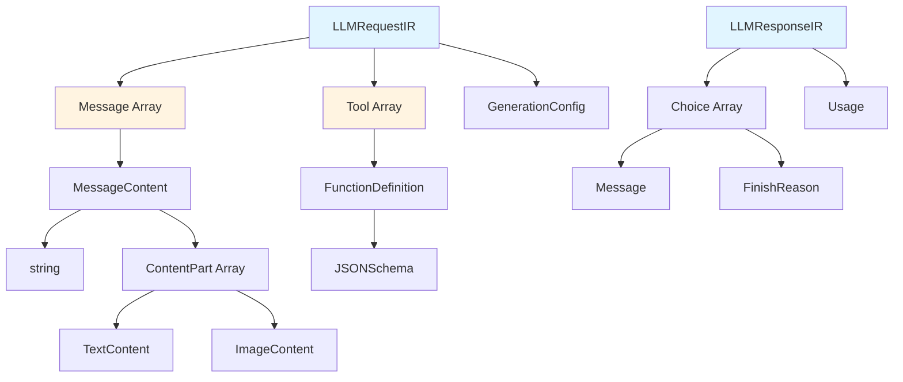
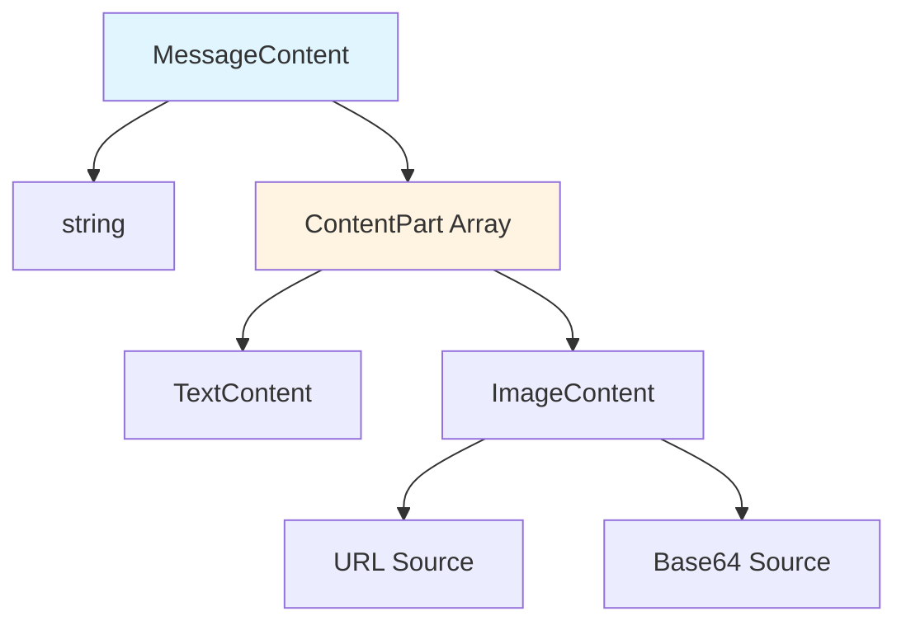
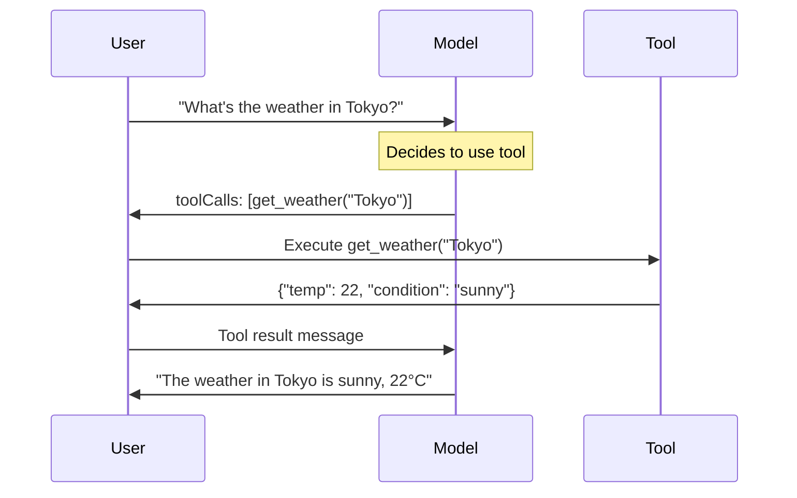

IR is at the heart of Amux, a unified format for all adapter conversions that captures all LLM functionality in a provider-agnostic manner, providing a common language understood by all adapters and enabling seamless conversions between any provider format.

## IR Type Hierarchy



## Core Types

<Tabs items={['Request', 'Response', 'Message', 'Tool', 'Stream', 'Error']}>
  <Tab value="Request">
    ### LLMRequestIR

    The unified request format.

    ```typescript
    interface LLMRequestIR {
      messages: Message[]              // Required: Conversation messages
      model?: string                   // Model identifier
      tools?: Tool[]                   // Available tools/functions
      toolChoice?: ToolChoice          // Tool usage control
      stream?: boolean                 // Enable streaming
      generation?: GenerationConfig    // Generation parameters
      system?: string                  // System prompt
      metadata?: Record<string, unknown>
      extensions?: Record<string, unknown>
      raw?: unknown
    }
    ```

    <Callout type="warn">
    Only `messages` is required. All other fields are optional and depend on the use case.
    </Callout>

    **Example:**
    ```typescript
    const request: LLMRequestIR = {
      messages: [
        { role: 'user', content: 'What is the weather in Tokyo?' }
      ],
      model: 'gpt-4',
      tools: [{
        type: 'function',
        function: {
          name: 'get_weather',
          description: 'Get weather for a location',
          parameters: {
            type: 'object',
            properties: {
              location: { type: 'string' }
            },
            required: ['location']
          }
        }
      }],
      toolChoice: 'auto',
      generation: {
        temperature: 0.7,
        maxTokens: 1000
      }
    }
    ```
  </Tab>

  <Tab value="Response">
    ### LLMResponseIR

    The unified response format.

    ```typescript
    interface LLMResponseIR {
      id: string                       // Required: Response ID
      model: string                    // Required: Model used
      choices: Choice[]                // Required: Generated responses
      usage?: Usage                    // Token usage stats
      metadata?: Record<string, unknown>
      extensions?: Record<string, unknown>
      raw?: unknown
    }
    ```

    **Example:**
    ```typescript
    const response: LLMResponseIR = {
      id: 'resp_123',
      model: 'gpt-4',
      choices: [{
        index: 0,
        message: {
          role: 'assistant',
          content: 'The weather in Tokyo is sunny, 22°C.'
        },
        finishReason: 'stop'
      }],
      usage: {
        promptTokens: 20,
        completionTokens: 15,
        totalTokens: 35
      }
    }
    ```
  </Tab>

  <Tab value="Message">
    ### Message

    Represents a single message in the conversation.

    ```typescript
    interface Message {
      role: Role                       // Required: Message role
      content: MessageContent          // Required: Message content
      name?: string                    // Sender name (for tool messages)
      toolCallId?: string              // Tool call ID (for tool responses)
      toolCalls?: ToolCall[]           // Tool calls (for assistant)
      reasoningContent?: string        // Reasoning/thinking content (DeepSeek, Qwen, Anthropic)
    }

    type Role = 'system' | 'user' | 'assistant' | 'tool'
    type MessageContent = string | ContentPart[]
    ```

    **Examples:**
    ```typescript
    // Simple text message
    { role: 'user', content: 'Hello!' }

    // Multimodal message
    {
      role: 'user',
      content: [
        { type: 'text', text: 'What is in this image?' },
        {
          type: 'image',
          source: { type: 'url', url: 'https://example.com/image.jpg' }
        }
      ]
    }

    // Assistant with tool calls
    {
      role: 'assistant',
      content: 'Let me check the weather.',
      toolCalls: [{
        id: 'call_123',
        type: 'function',
        function: {
          name: 'get_weather',
          arguments: '{"location":"Tokyo"}'
        }
      }]
    }

    // Tool result
    {
      role: 'tool',
      content: '{"temperature":22,"condition":"sunny"}',
      toolCallId: 'call_123',
      name: 'get_weather'
    }

    // Assistant with reasoning content
    {
      role: 'assistant',
      content: 'The answer is 42.',
      reasoningContent: 'Let me think about this step by step...'
    }
    ```
  </Tab>

  <Tab value="Tool">
    ### Tool

    Function/tool definition.

    ```typescript
    interface Tool {
      type: 'function'
      function: FunctionDefinition
    }

    interface FunctionDefinition {
      name: string                     // Required: Function name
      description?: string             // Function description
      parameters?: JSONSchema          // Parameter schema
      strict?: boolean                 // OpenAI structured outputs
    }
    ```

    **Example:**
    ```typescript
    const tool: Tool = {
      type: 'function',
      function: {
        name: 'get_weather',
        description: 'Get current weather for a location',
        parameters: {
          type: 'object',
          properties: {
            location: {
              type: 'string',
              description: 'City name'
            },
            unit: {
              type: 'string',
              enum: ['celsius', 'fahrenheit'],
              description: 'Temperature unit'
            }
          },
          required: ['location']
        }
      }
    }
    ```

    ### ToolChoice

    Controls how the model uses tools.

    ```typescript
    type ToolChoice =
      | 'auto'      // Let model decide
      | 'none'      // Don't use tools
      | 'required'  // Must use a tool
      | {           // Use specific tool
          type: 'function'
          function: { name: string }
        }
    ```
  </Tab>

  <Tab value="Stream">
    ### LLMStreamEvent

    Stream event for streaming responses.

    ```typescript
    interface LLMStreamEvent {
      type: StreamEventType
      id?: string
      model?: string
      content?: ContentDelta
      reasoning?: ReasoningDelta        // Reasoning/thinking content delta
      toolCall?: ToolCallDelta
      finishReason?: FinishReason
      message?: Message
      usage?: Usage                     // Usage statistics (for end event)
      error?: { message: string; code?: string }
      raw?: unknown
    }

    type StreamEventType =
      | 'start'      // Stream started
      | 'content'    // Content delta
      | 'reasoning'  // Reasoning/thinking content delta
      | 'tool_call'  // Tool call delta
      | 'end'        // Stream ended
      | 'error'      // Error occurred

    interface ReasoningDelta {
      type: 'reasoning'
      delta: string
      index?: number
    }
    ```

    **Example Flow:**
    ```typescript
    // 1. Start event
    { type: 'start', id: 'stream_123', model: 'gpt-4' }

    // 2. Content deltas
    { type: 'content', content: { type: 'content', delta: 'Hello' } }
    { type: 'content', content: { type: 'content', delta: ' world' } }
    { type: 'content', content: { type: 'content', delta: '!' } }

    // 3. End event
    {
      type: 'end',
      finishReason: 'stop',
      message: {
        role: 'assistant',
        content: 'Hello world!'
      }
    }
    ```

    **Flow with Reasoning (DeepSeek, Qwen, Anthropic):**
    ```typescript
    // 1. Start event
    { type: 'start', id: 'stream_456', model: 'deepseek-reasoner' }

    // 2. Reasoning content deltas
    { type: 'reasoning', reasoning: { type: 'reasoning', delta: 'Let me analyze this problem...' } }
    { type: 'reasoning', reasoning: { type: 'reasoning', delta: ' First, I need to consider...' } }

    // 3. Content deltas
    { type: 'content', content: { type: 'content', delta: 'Based on my analysis, ' } }
    { type: 'content', content: { type: 'content', delta: 'the answer is 42.' } }

    // 4. End event
    {
      type: 'end',
      finishReason: 'stop',
      message: {
        role: 'assistant',
        content: 'Based on my analysis, the answer is 42.',
        reasoningContent: 'Let me analyze this problem... First, I need to consider...'
      }
    }
    ```
  </Tab>

  <Tab value="Error">
    ### LLMErrorIR

    Unified error format.

    ```typescript
    interface LLMErrorIR {
      type: ErrorType
      message: string
      code?: string
      status?: number
      retryable?: boolean
      details?: Record<string, unknown>
      raw?: unknown
    }

    type ErrorType =
      | 'network'        // Network error
      | 'api'            // API error
      | 'validation'     // Validation error
      | 'rate_limit'     // Rate limit error
      | 'authentication' // Authentication error
      | 'permission'     // Permission error
      | 'not_found'      // Resource not found
      | 'server'         // Server error
      | 'unknown'        // Unknown error
    ```

    **Example:**
    ```typescript
    {
      type: 'rate_limit',
      message: 'Rate limit exceeded',
      code: 'rate_limit_exceeded',
      status: 429,
      retryable: true,
      details: {
        retryAfter: 60
      }
    }
    ```
  </Tab>
</Tabs>

## Message Content Types

Messages can contain different types of content for multimodal interactions.



<Tabs items={['Text', 'Image']}>
  <Tab value="Text">
    ### TextContent

    ```typescript
    interface TextContent {
      type: 'text'
      text: string
    }
    ```

    **Example:**
    ```typescript
    {
      type: 'text',
      text: 'What is in this image?'
    }
    ```
  </Tab>

  <Tab value="Image">
    ### ImageContent

    ```typescript
    interface ImageContent {
      type: 'image'
      source: ImageSource
    }

    type ImageSource =
      | { type: 'url'; url: string }
      | { type: 'base64'; mediaType: string; data: string }
    ```

    **Examples:**
    ```typescript
    // URL image
    {
      type: 'image',
      source: {
        type: 'url',
        url: 'https://example.com/image.jpg'
      }
    }

    // Base64 image
    {
      type: 'image',
      source: {
        type: 'base64',
        mediaType: 'image/jpeg',
        data: '/9j/4AAQSkZJRg...'
      }
    }
    ```
  </Tab>
</Tabs>

<Callout type="info">
**Note on Tool Calls:** Tool calls are represented using the `toolCalls` field on the Message object (OpenAI-style), not as ContentPart types. See the [Tool Calling Flow](#tool-calling-flow) section for details.
</Callout>

## Generation Parameters

Control how the model generates responses.

```typescript
interface GenerationConfig {
  temperature?: number          // 0-2: Randomness
  topP?: number                // 0-1: Nucleus sampling
  topK?: number                // >0: Top-k sampling
  maxTokens?: number           // >0: Max tokens to generate
  stopSequences?: string[]     // Stop at these sequences
  presencePenalty?: number     // -2 to 2: Penalize presence
  frequencyPenalty?: number    // -2 to 2: Penalize frequency
  n?: number                   // >0: Number of completions
  seed?: number                // Deterministic generation
}
```

<Tabs items={['Temperature', 'Sampling', 'Limits', 'Penalties']}>
  <Tab value="Temperature">
    ### Temperature

    Controls randomness in generation (0-2, typically 0-1).

    ```typescript
    generation: {
      temperature: 0.7  // Balanced creativity
    }
    ```

    **Guidelines:**
    - `0.0-0.3`: Focused, deterministic (good for factual tasks)
    - `0.4-0.7`: Balanced (good for general use)
    - `0.8-1.0`: Creative (good for brainstorming)
    - `1.0+`: Very creative (experimental)
  </Tab>

  <Tab value="Sampling">
    ### Sampling Methods

    ```typescript
    generation: {
      topP: 0.9,    // Nucleus sampling
      topK: 40      // Top-k sampling
    }
    ```

    **Top-P (Nucleus Sampling):**
    - Considers tokens with cumulative probability ≤ P
    - `0.9` is a good default
    - Alternative to temperature

    **Top-K:**
    - Considers only top K tokens
    - `40-50` is typical
    - Can be combined with top-P
  </Tab>

  <Tab value="Limits">
    ### Token Limits

    ```typescript
    generation: {
      maxTokens: 1000,
      stopSequences: ['\n\n', 'END', '---']
    }
    ```

    **Max Tokens:**
    - Maximum tokens to generate
    - Does not include prompt tokens
    - Model-specific limits apply

    **Stop Sequences:**
    - Generation stops when any sequence is encountered
    - Useful for structured output
  </Tab>

  <Tab value="Penalties">
    ### Penalties

    ```typescript
    generation: {
      presencePenalty: 0.1,   // Encourage new topics
      frequencyPenalty: 0.1   // Reduce repetition
    }
    ```

    **Presence Penalty (-2 to 2):**
    - Positive: Encourage new tokens
    - Negative: Encourage existing tokens
    - Good for topic diversity

    **Frequency Penalty (-2 to 2):**
    - Positive: Reduce repetition
    - Negative: Encourage repetition
    - Good for reducing redundancy
  </Tab>
</Tabs>

## Tool Calling Flow



<Callout type="info">
**Unified Tool Call Format:** IR uses OpenAI-style tool calling as the unified format. When converting from Anthropic format, the adapter automatically converts `tool_use` content blocks to `toolCalls` and `tool_result` content blocks to tool role messages.
</Callout>

### Tool Calling in IR

```typescript
// 1. User message
{
  role: 'user',
  content: 'What is the weather in Tokyo?'
}

// 2. Assistant with tool call
{
  role: 'assistant',
  content: 'Let me check the weather for you.',
  toolCalls: [{
    id: 'call_abc123',
    type: 'function',
    function: {
      name: 'get_weather',
      arguments: '{"location":"Tokyo"}'
    }
  }]
}

// 3. Tool result
{
  role: 'tool',
  content: '{"temperature":22,"condition":"sunny"}',
  toolCallId: 'call_abc123',
  name: 'get_weather'
}

// 4. Final assistant response
{
  role: 'assistant',
  content: 'The weather in Tokyo is sunny with a temperature of 22°C.'
}
```

## Complete Examples

<Tabs items={['Simple Chat', 'Tool Calling', 'Multimodal', 'Streaming']}>
  <Tab value="Simple Chat">
    ```typescript
    const request: LLMRequestIR = {
      messages: [
        {
          role: 'system',
          content: 'You are a helpful assistant.'
        },
        {
          role: 'user',
          content: 'Explain quantum computing in simple terms.'
        }
      ],
      model: 'gpt-4',
      generation: {
        temperature: 0.7,
        maxTokens: 500
      }
    }

    const response: LLMResponseIR = {
      id: 'resp_123',
      model: 'gpt-4',
      choices: [{
        index: 0,
        message: {
          role: 'assistant',
          content: 'Quantum computing uses quantum mechanics...'
        },
        finishReason: 'stop'
      }],
      usage: {
        promptTokens: 25,
        completionTokens: 150,
        totalTokens: 175
      }
    }
    ```
  </Tab>

  <Tab value="Tool Calling">
    ```typescript
    const request: LLMRequestIR = {
      messages: [
        {
          role: 'user',
          content: 'What is the weather in Tokyo and Paris?'
        }
      ],
      model: 'gpt-4',
      tools: [{
        type: 'function',
        function: {
          name: 'get_weather',
          description: 'Get weather for a location',
          parameters: {
            type: 'object',
            properties: {
              location: { type: 'string' }
            },
            required: ['location']
          }
        }
      }],
      toolChoice: 'auto'
    }

    const response: LLMResponseIR = {
      id: 'resp_456',
      model: 'gpt-4',
      choices: [{
        index: 0,
        message: {
          role: 'assistant',
          content: null,
          toolCalls: [
            {
              id: 'call_1',
              type: 'function',
              function: {
                name: 'get_weather',
                arguments: '{"location":"Tokyo"}'
              }
            },
            {
              id: 'call_2',
              type: 'function',
              function: {
                name: 'get_weather',
                arguments: '{"location":"Paris"}'
              }
            }
          ]
        },
        finishReason: 'tool_calls'
      }]
    }
    ```
  </Tab>

  <Tab value="Multimodal">
    ```typescript
    const request: LLMRequestIR = {
      messages: [
        {
          role: 'user',
          content: [
            {
              type: 'text',
              text: 'What objects are in this image?'
            },
            {
              type: 'image',
              source: {
                type: 'url',
                url: 'https://example.com/image.jpg'
              }
            }
          ]
        }
      ],
      model: 'gpt-4-vision'
    }

    const response: LLMResponseIR = {
      id: 'resp_789',
      model: 'gpt-4-vision',
      choices: [{
        index: 0,
        message: {
          role: 'assistant',
          content: 'I can see a cat, a laptop, and a coffee mug in the image.'
        },
        finishReason: 'stop'
      }]
    }
    ```
  </Tab>

  <Tab value="Streaming">
    ```typescript
    const request: LLMRequestIR = {
      messages: [
        { role: 'user', content: 'Tell me a short story.' }
      ],
      model: 'gpt-4',
      stream: true
    }

    // Stream events:
    const events: LLMStreamEvent[] = [
      {
        type: 'start',
        id: 'stream_123',
        model: 'gpt-4'
      },
      {
        type: 'content',
        content: { type: 'content', delta: 'Once' }
      },
      {
        type: 'content',
        content: { type: 'content', delta: ' upon' }
      },
      {
        type: 'content',
        content: { type: 'content', delta: ' a' }
      },
      {
        type: 'content',
        content: { type: 'content', delta: ' time' }
      },
      // ... more content deltas
      {
        type: 'end',
        finishReason: 'stop',
        message: {
          role: 'assistant',
          content: 'Once upon a time...'
        }
      }
    ]
    ```
  </Tab>
</Tabs>

## Next Steps

<Cards>
  <Card title="Bridge API" href="/docs/api/bridge">
    Learn how to use IR with Bridge
  </Card>
  <Card title="Adapters API" href="/docs/api/adapters">
    Understand adapter conversion
  </Card>
  <Card title="Examples" href="/docs/examples">
    See IR in action
  </Card>
</Cards>
