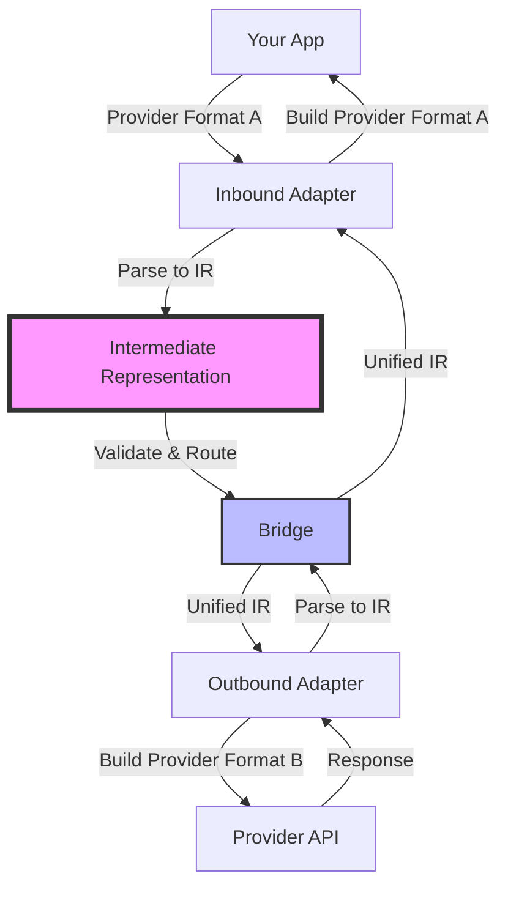
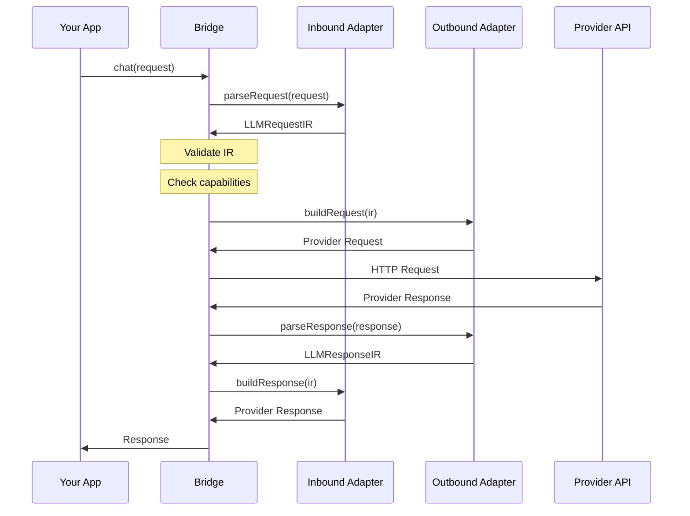

<Callout type="info">
LLM Bridge is built on three core concepts: **Adapters**, **IR (Intermediate Representation)**, and **Bridge**. Understanding these concepts is key to using LLM Bridge effectively.
</Callout>

## Architecture Overview

LLM Bridge is built on three core concepts:

1. **Adapters** - Convert between provider formats and IR
2. **IR (Intermediate Representation)** - Unified format for all LLM capabilities
3. **Bridge** - Orchestrates the bidirectional conversion



## Adapters

Adapters are the core of LLM Bridge. Each adapter implements two directions:

<Tabs items={['Inbound', 'Outbound', 'Capabilities', 'Example']}>
  <Tab value="Inbound">
    ### Inbound (Provider → IR)

    Parses provider-specific format to IR:

    ```typescript
    interface InboundAdapter {
      parseRequest(request: unknown): LLMRequestIR
      parseResponse?(response: unknown): LLMResponseIR
      parseStream?(chunk: unknown): LLMStreamEvent | LLMStreamEvent[] | null
      parseError?(error: unknown): LLMErrorIR
    }
    ```

    **Methods:**
    - `parseRequest` - Convert provider request to IR (required)
    - `parseResponse` - Convert provider response to IR (optional)
    - `parseStream` - Convert stream chunks to IR events (optional)
    - `parseError` - Convert provider errors to IR (optional)

    **Example:**
    ```typescript
    const ir = adapter.inbound.parseRequest({
      model: 'gpt-4',
      messages: [{ role: 'user', content: 'Hello!' }]
    })
    // Returns: LLMRequestIR
    ```
  </Tab>

  <Tab value="Outbound">
    ### Outbound (IR → Provider)

    Builds provider-specific format from IR:

    ```typescript
    interface OutboundAdapter {
      buildRequest(ir: LLMRequestIR): unknown
      buildResponse?(ir: LLMResponseIR): unknown
      buildStreamHandler?(): StreamHandler
      buildErrorHandler?(): ErrorHandler
    }
    ```

    **Methods:**
    - `buildRequest` - Convert IR to provider request (required)
    - `buildResponse` - Convert IR to provider response (optional)
    - `buildStreamHandler` - Create stream handler (optional)
    - `buildErrorHandler` - Create error handler (optional)

    **Example:**
    ```typescript
    const providerRequest = adapter.outbound.buildRequest(ir)
    // Returns provider-specific format
    ```
  </Tab>

  <Tab value="Capabilities">
    ### Adapter Capabilities

    Each adapter declares its capabilities:

    ```typescript
    interface AdapterCapabilities {
      streaming: boolean      // Supports streaming responses
      tools: boolean          // Supports function/tool calling
      vision: boolean         // Supports image inputs
      multimodal: boolean     // Supports multiple content types
      systemPrompt: boolean   // Supports system prompts
      toolChoice: boolean     // Supports tool choice control
      reasoning?: boolean     // Supports reasoning/thinking mode (DeepSeek, Qwen, Anthropic)
      webSearch?: boolean     // Supports web search (Qwen)
      jsonMode?: boolean      // Supports JSON mode / structured output
      logprobs?: boolean      // Supports log probabilities
      seed?: boolean          // Supports seed for reproducibility
    }
    ```

    **Example:**
    ```typescript
    console.log(openaiAdapter.capabilities)
    // {
    //   streaming: true,
    //   tools: true,
    //   vision: true,
    //   multimodal: true,
    //   systemPrompt: true,
    //   toolChoice: true,
    //   reasoning: false,
    //   webSearch: false,
    //   jsonMode: true,
    //   logprobs: true,
    //   seed: true
    // }
    ```

    <Callout type="warn">
    The Bridge uses capabilities to check compatibility and warn about unsupported features.
    </Callout>
  </Tab>

  <Tab value="Example">
    ### Complete Adapter Example

    ```typescript
    import type { LLMAdapter } from '@llm-bridge/core'

    export const myAdapter: LLMAdapter = {
      name: 'my-provider',
      version: '1.0.0',

      capabilities: {
        streaming: true,
        tools: true,
        vision: false,
        multimodal: false,
        systemPrompt: true,
        toolChoice: true,
        reasoning: false,
        webSearch: false,
        jsonMode: false,
        logprobs: false,
        seed: false,
      },

      inbound: {
        parseRequest(request: unknown): LLMRequestIR {
          // Convert provider format → IR
          return {
            messages: request.messages,
            model: request.model,
            // ... more fields
          }
        },

        parseResponse(response: unknown): LLMResponseIR {
          // Convert provider format → IR
          return {
            id: response.id,
            model: response.model,
            choices: response.choices
          }
        }
      },

      outbound: {
        buildRequest(ir: LLMRequestIR): unknown {
          // Convert IR → provider format
          return {
            model: ir.model,
            messages: ir.messages,
            // ... more fields
          }
        }
      },

      getInfo() {
        return {
          name: this.name,
          version: this.version,
          capabilities: this.capabilities,
          endpoint: {
            baseUrl: 'https://api.my-provider.com',
            chatPath: '/v1/chat/completions',
          }
        }
      }
    }
    ```
  </Tab>
</Tabs>

## Intermediate Representation (IR)

The IR is a unified format that captures all LLM capabilities:

```typescript
interface LLMRequestIR {
  messages: Message[]                    // Required: conversation messages
  model?: string                         // Model identifier
  tools?: Tool[]                         // Available tools/functions
  toolChoice?: ToolChoice                // Tool usage control
  stream?: boolean                       // Enable streaming
  generation?: GenerationConfig          // Generation parameters
  system?: string                        // System prompt
  metadata?: Record<string, unknown>     // Additional metadata
  extensions?: Record<string, unknown>   // Provider-specific extensions
  raw?: unknown                          // Original request (for debugging)
}
```

### Key Features

<Tabs items={['Comprehensive', 'Extensible', 'Debuggable', 'Type-Safe']}>
  <Tab value="Comprehensive">
    ### Comprehensive

    The IR supports all common LLM capabilities:

    - **Messages** - Text, images, tool calls, tool results
    - **Tools** - Function definitions with JSON schemas
    - **Streaming** - Real-time response generation
    - **Multimodal** - Text, images, and more
    - **Generation** - Temperature, top-p, max tokens, etc.

    ```typescript
    const ir: LLMRequestIR = {
      messages: [
        { role: 'user', content: 'Hello!' }
      ],
      model: 'gpt-4',
      tools: [{
        type: 'function',
        function: {
          name: 'get_weather',
          parameters: { /* ... */ }
        }
      }],
      generation: {
        temperature: 0.7,
        maxTokens: 1000
      }
    }
    ```
  </Tab>

  <Tab value="Extensible">
    ### Extensible

    The `extensions` field allows provider-specific features:

    ```typescript
    const ir: LLMRequestIR = {
      messages: [{ role: 'user', content: 'Hello!' }],
      extensions: {
        // OpenAI-specific
        response_format: { type: 'json_object' },
        // Anthropic-specific
        thinking: { type: 'enabled', budget_tokens: 1000 }
      }
    }
    ```

    <Callout type="info">
    Extensions are preserved during conversion, allowing provider-specific features to work when both adapters support them.
    </Callout>
  </Tab>

  <Tab value="Debuggable">
    ### Debuggable

    The `raw` field preserves the original request:

    ```typescript
    const ir: LLMRequestIR = {
      messages: [{ role: 'user', content: 'Hello!' }],
      raw: originalRequest  // Original provider format
    }
    ```

    This is useful for:
    - Debugging conversion issues
    - Logging original requests
    - Fallback to original format
  </Tab>

  <Tab value="Type-Safe">
    ### Type-Safe

    Full TypeScript support with comprehensive types:

    ```typescript
    import type {
      LLMRequestIR,
      LLMResponseIR,
      Message,
      Tool,
      GenerationConfig
    } from '@llm-bridge/core'

    // All types are fully defined
    const message: Message = {
      role: 'user',
      content: 'Hello!'
    }

    const tool: Tool = {
      type: 'function',
      function: {
        name: 'get_weather',
        description: 'Get weather for a location',
        parameters: {
          type: 'object',
          properties: {
            location: { type: 'string' }
          }
        }
      }
    }
    ```
  </Tab>
</Tabs>

## Bridge

The Bridge orchestrates the conversion:

```typescript
const bridge = createBridge({
  inbound: openaiAdapter,      // Parse incoming format
  outbound: anthropicAdapter,  // Build outgoing format
  config: {
    apiKey: 'xxx',
    baseURL: 'https://api.anthropic.com'
  }
})
```

### Bridge Workflow



### Bridge Steps

<Tabs items={['1-2: Parse & Validate', '3-4: Build & Call', '5-6: Parse & Build', '7-8: Return']}>
  <Tab value="1-2: Parse & Validate">
    ### Steps 1-2: Parse & Validate

    **1. Parse** - Inbound adapter parses request → IR
    ```typescript
    const ir = inbound.parseRequest(request)
    ```

    **2. Validate** - Bridge validates IR completeness
    ```typescript
    if (!ir.messages || ir.messages.length === 0) {
      throw new Error('Messages are required')
    }
    ```

    <Callout type="info">
    The Bridge ensures the IR has all required fields before proceeding.
    </Callout>
  </Tab>

  <Tab value="3-4: Build & Call">
    ### Steps 3-4: Build & Call

    **3. Check** - Bridge checks adapter compatibility
    ```typescript
    if (ir.tools && !outbound.capabilities.tools) {
      console.warn('Outbound adapter does not support tools')
    }
    ```

    **4. Build** - Outbound adapter builds provider request
    ```typescript
    const providerRequest = outbound.buildRequest(ir)
    ```
  </Tab>

  <Tab value="5-6: Parse & Build">
    ### Steps 5-6: Parse & Build

    **5. Call** - Bridge calls provider API
    ```typescript
    const response = await fetch(apiUrl, {
      method: 'POST',
      body: JSON.stringify(providerRequest)
    })
    ```

    **6. Parse** - Outbound adapter parses response → IR
    ```typescript
    const responseIR = outbound.parseResponse(response)
    ```
  </Tab>

  <Tab value="7-8: Return">
    ### Steps 7-8: Build & Return

    **7. Build** - Inbound adapter builds response format
    ```typescript
    const finalResponse = inbound.buildResponse(responseIR)
    ```

    **8. Return** - Bridge returns response to user
    ```typescript
    return finalResponse
    ```

    <Callout type="info">
    The response is in the same format as the original request, ensuring consistency for your application.
    </Callout>
  </Tab>
</Tabs>

## Error Handling

The Bridge provides unified error handling:

```typescript
import { LLMBridgeError } from '@llm-bridge/core'

try {
  const response = await bridge.chat(request)
} catch (error) {
  if (error instanceof LLMBridgeError) {
    console.error('Error type:', error.type)
    console.error('Message:', error.message)
    console.error('Retryable:', error.retryable)
    console.error('Details:', error.details)
  }
}
```

### Error Types

| Type | Description | Retryable |
|------|-------------|-----------|
| `network` | Network connectivity issues | Yes |
| `api` | Provider API errors | Maybe |
| `validation` | Invalid request format | No |
| `rate_limit` | Rate limit exceeded | Yes |
| `authentication` | Invalid API key | No |
| `permission` | Insufficient permissions | No |
| `not_found` | Resource not found | No |
| `server` | Provider server error | Yes |
| `unknown` | Unknown error | Maybe |

## Next Steps

<Cards>
  <Card title="Bridge API" href="/docs/api/bridge">
    Explore the complete Bridge API
  </Card>
  <Card title="Adapters API" href="/docs/api/adapters">
    Learn about adapter implementation
  </Card>
  <Card title="IR Format" href="/docs/api/ir">
    Deep dive into the IR format
  </Card>
  <Card title="Quick Start" href="/docs/quick-start">
    Build your first bridge
  </Card>
</Cards>
