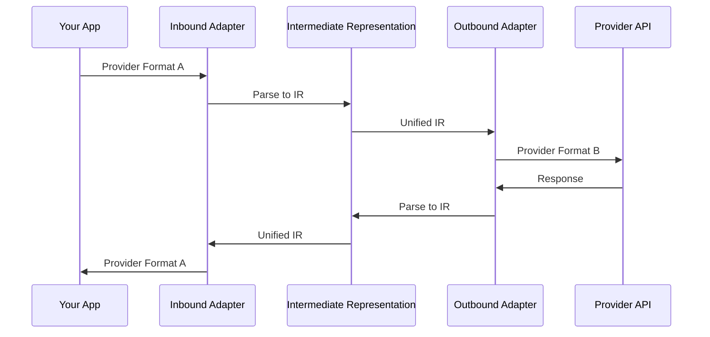

## What is LLM Bridge?

LLM Bridge is a bidirectional API adapter that allows you to:

- 🔄 **Convert between any LLM provider formats** - OpenAI, Anthropic, DeepSeek, Kimi, Qwen, Gemini
- 🎯 **Type-safe TypeScript** - Full type definitions for all adapters
- 🔌 **Extensible** - Easy to add custom adapters
- ⚡ **Zero dependencies** - Core package has no runtime dependencies
- 📦 **Tree-shakable** - Optimized for modern bundlers

<Callout type="info">
LLM Bridge enables **true bidirectional conversion** - accept requests in any format, call any provider API, and return responses in any format.
</Callout>

## Quick Example

```typescript
import { createBridge } from '@llm-bridge/core'
import { openaiAdapter } from '@llm-bridge/adapter-openai'
import { anthropicAdapter } from '@llm-bridge/adapter-anthropic'

// Create a bridge: OpenAI format in → Anthropic API out
const bridge = createBridge({
  inbound: openaiAdapter,
  outbound: anthropicAdapter,
  config: {
    apiKey: process.env.ANTHROPIC_API_KEY
  }
})

// Send OpenAI-format request, get OpenAI-format response
// But actually calls Claude API under the hood
const response = await bridge.chat({
  model: 'gpt-4',
  messages: [{ role: 'user', content: 'Hello!' }]
})
```

## Architecture



The **Intermediate Representation (IR)** is the key to bidirectional conversion:
- Unified format for all LLM capabilities
- Supports messages, tools, streaming, multimodal content
- Extensible for provider-specific features

## Key Features

<Tabs items={['Bidirectional', 'Type Safety', 'Extensibility', 'Performance']}>
  <Tab value="Bidirectional">
    ### Bidirectional Conversion

    Unlike other solutions that only provide a unified interface, LLM Bridge allows you to:

    - **Accept requests** in any provider format
    - **Send requests** to any provider API
    - **Return responses** in any provider format

    ```typescript
    // Example: Accept OpenAI format, call Anthropic API
    const bridge1 = createBridge({
      inbound: openaiAdapter,
      outbound: anthropicAdapter
    })

    // Example: Accept Anthropic format, call OpenAI API
    const bridge2 = createBridge({
      inbound: anthropicAdapter,
      outbound: openaiAdapter
    })
    ```
  </Tab>

  <Tab value="Type Safety">
    ### Type Safety

    Full TypeScript support with comprehensive type definitions for:

    - All provider request/response formats
    - Intermediate Representation (IR)
    - Adapter interfaces
    - Bridge configuration

    ```typescript
    import type { LLMRequestIR, LLMResponseIR } from '@llm-bridge/core'

    // Fully typed IR
    const request: LLMRequestIR = {
      messages: [{ role: 'user', content: 'Hello!' }],
      model: 'gpt-4',
      generation: {
        temperature: 0.7,
        maxTokens: 1000
      }
    }
    ```
  </Tab>

  <Tab value="Extensibility">
    ### Extensibility

    Easy to extend with custom adapters:

    - Clear adapter interface
    - Well-documented IR format
    - Examples for common patterns

    ```typescript
    import type { LLMAdapter } from '@llm-bridge/core'

    export const myAdapter: LLMAdapter = {
      name: 'my-provider',
      version: '1.0.0',
      capabilities: {
        streaming: true,
        tools: true,
        vision: false,
        multimodal: false,
        systemPrompt: true,
        toolChoice: true
      },
      inbound: {
        parseRequest: (request) => { /* ... */ }
      },
      outbound: {
        buildRequest: (ir) => { /* ... */ }
      }
    }
    ```
  </Tab>

  <Tab value="Performance">
    ### Performance

    Optimized for production use:

    - **Zero runtime dependencies** in core package
    - **Tree-shakable** - Only bundle what you use
    - **Minimal overhead** - Direct conversion without intermediate steps
    - **Streaming support** - Efficient handling of large responses

    ```typescript
    // Only the adapters you use are bundled
    import { createBridge } from '@llm-bridge/core'
    import { openaiAdapter } from '@llm-bridge/adapter-openai'
    // Other adapters are not included in your bundle
    ```
  </Tab>
</Tabs>

## Supported Providers

<Tabs items={['OpenAI', 'Anthropic', 'DeepSeek', 'Others']}>
  <Tab value="OpenAI">
    ### OpenAI

    Full support for OpenAI API format:
    - Chat completions
    - Streaming
    - Function calling
    - Vision (GPT-4V)
    - JSON mode

    ```typescript
    import { openaiAdapter } from '@llm-bridge/adapter-openai'
    ```
  </Tab>

  <Tab value="Anthropic">
    ### Anthropic

    Full support for Anthropic API format:
    - Messages API
    - Streaming
    - Tool use
    - Vision
    - System prompts

    ```typescript
    import { anthropicAdapter } from '@llm-bridge/adapter-anthropic'
    ```
  </Tab>

  <Tab value="DeepSeek">
    ### DeepSeek

    Full support for DeepSeek API format:
    - Chat completions
    - Streaming
    - Function calling

    ```typescript
    import { deepseekAdapter } from '@llm-bridge/adapter-deepseek'
    ```
  </Tab>

  <Tab value="Others">
    ### Other Providers

    Additional adapters available:

    - **Kimi** - Moonshot AI
    - **Qwen** - Alibaba Cloud
    - **Gemini** - Google AI

    ```typescript
    import { kimiAdapter } from '@llm-bridge/adapter-kimi'
    import { qwenAdapter } from '@llm-bridge/adapter-qwen'
    import { geminiAdapter } from '@llm-bridge/adapter-gemini'
    ```
  </Tab>
</Tabs>

## Use Cases

<Callout type="info">
LLM Bridge is perfect for applications that need to support multiple LLM providers or migrate between providers without changing application code.
</Callout>

- **Multi-provider support** - Let users choose their preferred LLM provider
- **Provider migration** - Switch providers without rewriting code
- **Testing** - Test against multiple providers with the same code
- **Cost optimization** - Route requests to different providers based on cost/performance
- **Fallback handling** - Automatically fallback to alternative providers

## Next Steps

<Cards>
  <Card title="Installation" href="/docs/installation">
    Get started with LLM Bridge
  </Card>
  <Card title="Quick Start" href="/docs/quick-start">
    Build your first bridge in 5 minutes
  </Card>
  <Card title="Core Concepts" href="/docs/core-concepts">
    Understand the architecture
  </Card>
  <Card title="API Reference" href="/docs/api/bridge">
    Explore the complete API
  </Card>
</Cards>
