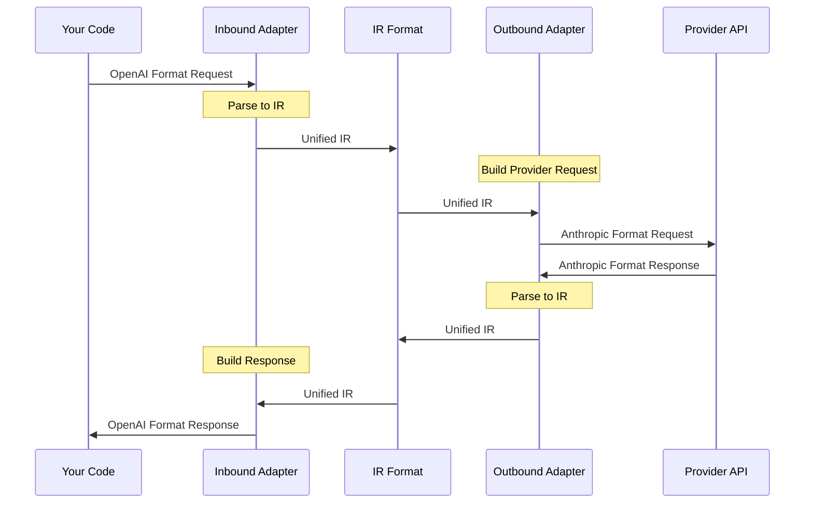

<Callout type="info">
This guide will walk you through creating your first LLM Bridge. You'll learn how to convert between OpenAI and Anthropic formats in just a few minutes.
</Callout>

## Step 1: Install Packages

```bash tab="pnpm"
pnpm add @llm-bridge/core @llm-bridge/adapter-openai @llm-bridge/adapter-anthropic
```

```bash tab="npm"
npm install @llm-bridge/core @llm-bridge/adapter-openai @llm-bridge/adapter-anthropic
```

```bash tab="yarn"
yarn add @llm-bridge/core @llm-bridge/adapter-openai @llm-bridge/adapter-anthropic
```

```bash tab="bun"
bun add @llm-bridge/core @llm-bridge/adapter-openai @llm-bridge/adapter-anthropic
```

## Step 2: Set Up Environment Variables

Create a `.env` file in your project root:

```bash
OPENAI_API_KEY=your_openai_key_here
ANTHROPIC_API_KEY=your_anthropic_key_here
```

<Callout type="warn">
Never commit your `.env` file to version control. Add it to your `.gitignore` file.
</Callout>

## Step 3: Create Your First Bridge

Create a file `bridge.ts`:

<Tabs items={['OpenAI → Anthropic', 'Anthropic → OpenAI', 'With Streaming']}>
  <Tab value="OpenAI → Anthropic">
    ### OpenAI Format In → Anthropic API Out

    ```typescript
    import { createBridge } from '@llm-bridge/core'
    import { openaiAdapter } from '@llm-bridge/adapter-openai'
    import { anthropicAdapter } from '@llm-bridge/adapter-anthropic'

    // Create a bridge: OpenAI format in → Anthropic API out
    const bridge = createBridge({
      inbound: openaiAdapter,
      outbound: anthropicAdapter,
      config: {
        apiKey: process.env.ANTHROPIC_API_KEY!,
        baseURL: 'https://api.anthropic.com'
      }
    })

    // Send OpenAI-format request
    const response = await bridge.chat({
      model: 'gpt-4',
      messages: [
        { role: 'user', content: 'Say hello!' }
      ]
    })

    console.log(response.choices[0].message.content)
    ```

    **What happens:**
    1. You send a request in OpenAI format
    2. The bridge converts it to Anthropic format
    3. Claude API is called
    4. The response is converted back to OpenAI format
  </Tab>

  <Tab value="Anthropic → OpenAI">
    ### Anthropic Format In → OpenAI API Out

    ```typescript
    import { createBridge } from '@llm-bridge/core'
    import { openaiAdapter } from '@llm-bridge/adapter-openai'
    import { anthropicAdapter } from '@llm-bridge/adapter-anthropic'

    // Anthropic format in → OpenAI API out
    const bridge = createBridge({
      inbound: anthropicAdapter,
      outbound: openaiAdapter,
      config: {
        apiKey: process.env.OPENAI_API_KEY!
      }
    })

    const response = await bridge.chat({
      model: 'claude-3-5-sonnet-20241022',
      messages: [
        { role: 'user', content: 'Say hello!' }
      ],
      max_tokens: 100
    })

    console.log(response.content[0].text)
    ```

    **What happens:**
    1. You send a request in Anthropic format
    2. The bridge converts it to OpenAI format
    3. GPT API is called
    4. The response is converted back to Anthropic format
  </Tab>

  <Tab value="With Streaming">
    ### Streaming Responses

    ```typescript
    import { createBridge } from '@llm-bridge/core'
    import { openaiAdapter } from '@llm-bridge/adapter-openai'
    import { anthropicAdapter } from '@llm-bridge/adapter-anthropic'

    const bridge = createBridge({
      inbound: openaiAdapter,
      outbound: anthropicAdapter,
      config: {
        apiKey: process.env.ANTHROPIC_API_KEY!
      }
    })

    // Enable streaming
    const stream = await bridge.chat({
      model: 'gpt-4',
      messages: [
        { role: 'user', content: 'Tell me a short story' }
      ],
      stream: true
    })

    // Process stream events
    for await (const event of stream) {
      if (event.type === 'content') {
        process.stdout.write(event.content.delta)
      }
    }
    ```

    **Streaming benefits:**
    - Lower latency - see responses as they're generated
    - Better UX - show progress to users
    - Works across all providers
  </Tab>
</Tabs>

## Step 4: Run Your Bridge

```bash tab="tsx"
tsx bridge.ts
```

```bash tab="node"
node --loader tsx bridge.ts
```

```bash tab="bun"
bun bridge.ts
```

You should see a response from Claude API, but in OpenAI format!

## What Just Happened?



<Callout type="info">
The **Intermediate Representation (IR)** is the key to bidirectional conversion. It's a unified format that all adapters understand.
</Callout>

## Advanced Examples

<Tabs items={['Tool Calling', 'Vision', 'Error Handling']}>
  <Tab value="Tool Calling">
    ### Function/Tool Calling

    ```typescript
    const bridge = createBridge({
      inbound: openaiAdapter,
      outbound: anthropicAdapter,
      config: {
        apiKey: process.env.ANTHROPIC_API_KEY!
      }
    })

    const response = await bridge.chat({
      model: 'gpt-4',
      messages: [
        { role: 'user', content: 'What is the weather in Beijing?' }
      ],
      tools: [{
        type: 'function',
        function: {
          name: 'get_weather',
          description: 'Get the weather for a location',
          parameters: {
            type: 'object',
            properties: {
              location: { type: 'string' }
            },
            required: ['location']
          }
        }
      }],
      toolChoice: 'auto'
    })

    // Check if the model wants to call a tool
    if (response.choices[0].message.toolCalls) {
      console.log('Tool calls:', response.choices[0].message.toolCalls)
    }
    ```
  </Tab>

  <Tab value="Vision">
    ### Vision/Multimodal

    ```typescript
    const bridge = createBridge({
      inbound: openaiAdapter,
      outbound: anthropicAdapter,
      config: {
        apiKey: process.env.ANTHROPIC_API_KEY!
      }
    })

    const response = await bridge.chat({
      model: 'gpt-4-vision-preview',
      messages: [{
        role: 'user',
        content: [
          { type: 'text', text: 'What is in this image?' },
          {
            type: 'image',
            source: {
              type: 'url',
              url: 'https://example.com/image.jpg'
            }
          }
        ]
      }]
    })

    console.log(response.choices[0].message.content)
    ```
  </Tab>

  <Tab value="Error Handling">
    ### Error Handling

    ```typescript
    import { LLMBridgeError } from '@llm-bridge/core'

    try {
      const response = await bridge.chat({
        model: 'gpt-4',
        messages: [{ role: 'user', content: 'Hello!' }]
      })
      console.log(response.choices[0].message.content)
    } catch (error) {
      if (error instanceof LLMBridgeError) {
        console.error('Bridge error:', error.type)
        console.error('Message:', error.message)
        console.error('Retryable:', error.retryable)

        // Handle specific error types
        switch (error.type) {
          case 'rate_limit':
            console.log('Rate limited, retry after:', error.details?.retryAfter)
            break
          case 'authentication':
            console.log('Invalid API key')
            break
          case 'network':
            console.log('Network error, retrying...')
            break
        }
      }
    }
    ```
  </Tab>
</Tabs>

## Next Steps

<Cards>
  <Card title="Core Concepts" href="/docs/core-concepts">
    Understand how LLM Bridge works
  </Card>
  <Card title="API Reference" href="/docs/api/bridge">
    Explore the complete API
  </Card>
  <Card title="Adapters" href="/docs/api/adapters">
    Learn about all available adapters
  </Card>
  <Card title="IR Format" href="/docs/api/ir">
    Deep dive into the IR format
  </Card>
</Cards>
