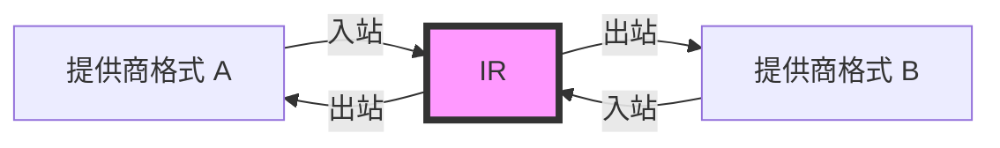
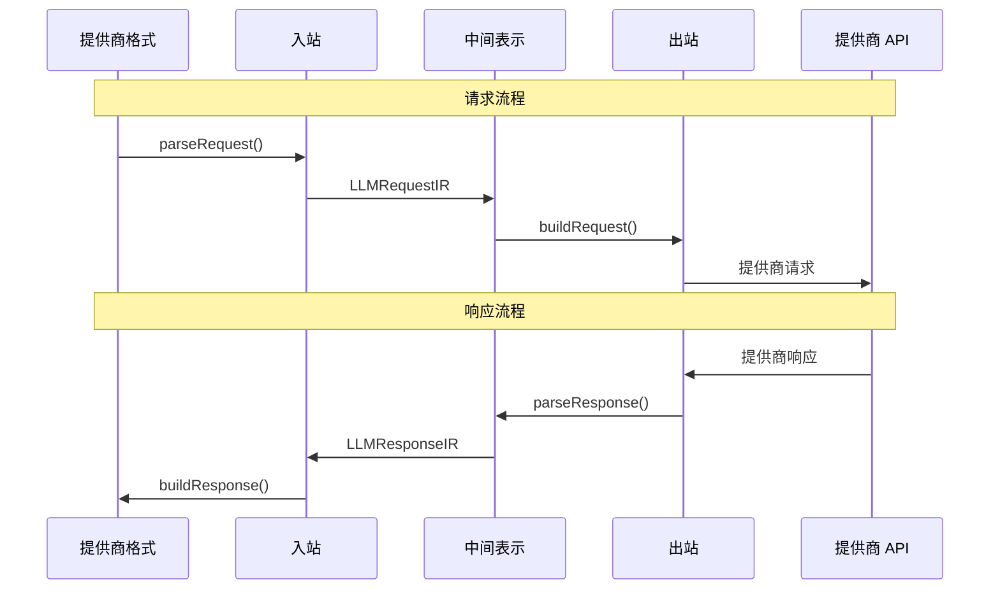

适配器是处理提供商特定格式与中间表示（IR）之间双向转换的核心组件，它使 Amux 能够通过实现两个方向来与任何提供商协作：**入站**（提供商 → IR）和**出站**（IR → 提供商）。

## 适配器架构



### 转换流程



## LLMAdapter 接口

所有适配器必须实现的主接口。

```typescript
interface LLMAdapter {
  readonly name: string
  readonly version: string
  readonly capabilities: AdapterCapabilities
  inbound: InboundAdapter
  outbound: OutboundAdapter
  validateRequest?(ir: LLMRequestIR): ValidationResult
  supportsCapability?(capability: keyof AdapterCapabilities): boolean
  getInfo(): AdapterInfo
}
```

### 属性

<Tabs items={['name', 'version', 'capabilities']}>
  <Tab value="name">
    ```typescript
    readonly name: string
    ```

    适配器名称（例如 `'openai'`、`'anthropic'`、`'deepseek'`）。

    **示例：**
    ```typescript
    console.log(openaiAdapter.name) // "openai"
    ```
  </Tab>

  <Tab value="version">
    ```typescript
    readonly version: string
    ```

    遵循语义化版本的适配器版本。

    **示例：**
    ```typescript
    console.log(openaiAdapter.version) // "1.0.0"
    ```
  </Tab>

  <Tab value="capabilities">
    ```typescript
    readonly capabilities: AdapterCapabilities
    ```

    声明此适配器支持的功能。参见 [AdapterCapabilities](#adaptercapabilities)。

    **示例：**
    ```typescript
    console.log(openaiAdapter.capabilities)
    // {
    //   streaming: true,
    //   tools: true,
    //   vision: true,
    //   ...
    // }
    ```
  </Tab>
</Tabs>

## InboundAdapter

处理从提供商格式到 IR 的转换。

```typescript
interface InboundAdapter {
  parseRequest(request: unknown): LLMRequestIR
  parseResponse?(response: unknown): LLMResponseIR
  parseStream?(chunk: unknown): LLMStreamEvent | LLMStreamEvent[] | null
  parseError?(error: unknown): LLMErrorIR
}
```

<Callout type="warn">
所有 `parse*` 方法将**从提供商格式转换为 IR**。它们在从提供商接收数据时使用。
</Callout>

### 方法

<Tabs items={['parseRequest', 'parseResponse', 'parseStream', 'parseError']}>
  <Tab value="parseRequest">
    ```typescript
    parseRequest(request: unknown): LLMRequestIR
    ```

    将提供商特定的请求解析为 IR 格式。

    **参数：**
    - `request` - 提供商格式的请求

    **返回：** `LLMRequestIR` - 统一的请求表示

    **示例：**
    ```typescript
    const ir = adapter.inbound.parseRequest({
      model: 'gpt-4',
      messages: [{ role: 'user', content: 'Hello!' }]
    })
    // 返回：{ messages: [...], model: 'gpt-4', ... }
    ```
  </Tab>

  <Tab value="parseResponse">
    ```typescript
    parseResponse?(response: unknown): LLMResponseIR
    ```

    将提供商特定的响应解析为 IR 格式。

    **参数：**
    - `response` - 提供商格式的响应

    **返回：** `LLMResponseIR` - 统一的响应表示

    **示例：**
    ```typescript
    const ir = adapter.inbound.parseResponse({
      id: 'chatcmpl-123',
      choices: [{ message: { role: 'assistant', content: 'Hi!' } }]
    })
    ```
  </Tab>

  <Tab value="parseStream">
    ```typescript
    parseStream?(chunk: unknown): LLMStreamEvent | LLMStreamEvent[] | null
    ```

    将流式数据块解析为 IR 流事件。

    **参数：**
    - `chunk` - 提供商格式的流数据块

    **返回：** 流事件或 `null`（如果应跳过该数据块）

    **示例：**
    ```typescript
    const events = adapter.inbound.parseStream({
      choices: [{ delta: { content: 'Hello' } }]
    })
    // 返回：{ type: 'content', content: { delta: 'Hello' } }
    ```
  </Tab>

  <Tab value="parseError">
    ```typescript
    parseError?(error: unknown): LLMErrorIR
    ```

    将提供商特定的错误解析为 IR 格式。

    **参数：**
    - `error` - 提供商格式的错误

    **返回：** `LLMErrorIR` - 统一的错误表示

    **示例：**
    ```typescript
    const errorIR = adapter.inbound.parseError({
      error: { message: 'Rate limit exceeded', type: 'rate_limit_error' }
    })
    // 返回：{ type: 'rate_limit', message: '...', retryable: true }
    ```
  </Tab>
</Tabs>

## OutboundAdapter

处理从 IR 到提供商格式的转换。

```typescript
interface OutboundAdapter {
  buildRequest(ir: LLMRequestIR): unknown
  buildResponse?(ir: LLMResponseIR): unknown
  createStreamBuilder?(): StreamEventBuilder
  buildStreamHandler?(): StreamHandler
  buildErrorHandler?(): ErrorHandler
}
```

<Callout type="warn">
所有 `build*` 方法将**从 IR 转换为提供商格式**。它们在向提供商发送数据时使用。
</Callout>

### 方法

<Tabs items={['buildRequest', 'buildResponse', 'createStreamBuilder', 'buildStreamHandler', 'buildErrorHandler']}>
  <Tab value="buildRequest">
    ```typescript
    buildRequest(ir: LLMRequestIR): unknown
    ```

    从 IR 构建提供商特定的请求。

    **参数：**
    - `ir` - IR 格式的请求

    **返回：** 提供商格式的请求

    **示例：**
    ```typescript
    const providerRequest = adapter.outbound.buildRequest({
      messages: [{ role: 'user', content: 'Hello!' }],
      model: 'gpt-4'
    })
    // 返回提供商特定格式
    ```
  </Tab>

  <Tab value="buildResponse">
    ```typescript
    buildResponse?(ir: LLMResponseIR): unknown
    ```

    从 IR 构建提供商特定的响应。

    **参数：**
    - `ir` - IR 格式的响应

    **返回：** 提供商格式的响应
  </Tab>

  <Tab value="createStreamBuilder">
    ```typescript
    createStreamBuilder?(): StreamEventBuilder
    ```

    创建用于将 IR 事件转换为提供商 SSE 格式的流事件构建器。

    **返回：** `StreamEventBuilder` - 有状态的流事件构建器

    ```typescript
    interface StreamEventBuilder {
      // 处理 IR 流事件并返回 SSE 事件
      process(event: LLMStreamEvent): SSEEvent[]

      // 获取流结束时的最终事件
      finalize?(): SSEEvent[]
    }
    ```

    **目的：**
    - 维护状态以确保正确的事件顺序
    - 将 IR 流事件转换为提供商特定的 SSE 格式
    - 处理复杂的流式协议（例如 Anthropic 的多事件系统）

    **示例：**
    ```typescript
    createStreamBuilder(): StreamEventBuilder {
      let contentBlockIndex = 0

      return {
        process(event: LLMStreamEvent): SSEEvent[] {
          if (event.type === 'start') {
            return [
              { event: 'message_start', data: { id: event.id } }
            ]
          }
          if (event.type === 'content' && event.content) {
            return [
              {
                event: 'content_block_delta',
                data: {
                  index: contentBlockIndex,
                  delta: { text: event.content.delta }
                }
              }
            ]
          }
          return []
        },

        finalize() {
          return [
            { event: 'message_end', data: {} }
          ]
        }
      }
    }
    ```
  </Tab>

  <Tab value="buildStreamHandler">
    ```typescript
    buildStreamHandler?(): StreamHandler
    ```

    返回处理流式数据块的函数。

    **返回：** `StreamHandler` 函数

    ```typescript
    type StreamHandler = (chunk: unknown) => LLMStreamEvent | LLMStreamEvent[] | null
    ```
  </Tab>

  <Tab value="buildErrorHandler">
    ```typescript
    buildErrorHandler?(): ErrorHandler
    ```

    返回处理错误的函数。

    **返回：** `ErrorHandler` 函数

    ```typescript
    type ErrorHandler = (error: unknown) => LLMErrorIR
    ```
  </Tab>
</Tabs>

## AdapterCapabilities

声明适配器支持的功能。

```typescript
interface AdapterCapabilities {
  streaming: boolean
  tools: boolean
  vision: boolean
  multimodal: boolean
  systemPrompt: boolean
  toolChoice: boolean
  reasoning?: boolean          // 支持推理/思考模式
  webSearch?: boolean          // 支持网页搜索
  jsonMode?: boolean           // 支持 JSON 模式/结构化输出
  logprobs?: boolean           // 支持对数概率
  seed?: boolean               // 支持种子以实现可复现性
}
```

### 属性

| 属性 | 类型 | 描述 |
|------|------|------|
| `streaming` | `boolean` | 支持流式响应 |
| `tools` | `boolean` | 支持函数/工具调用 |
| `vision` | `boolean` | 支持图像输入 |
| `multimodal` | `boolean` | 支持多种内容类型 |
| `systemPrompt` | `boolean` | 支持系统提示词 |
| `toolChoice` | `boolean` | 支持工具选择控制 |
| `reasoning` | `boolean?` | 支持推理/思考模式（DeepSeek, Qwen, Anthropic） |
| `webSearch` | `boolean?` | 支持网页搜索（Qwen） |
| `jsonMode` | `boolean?` | 支持 JSON 模式和结构化输出 |
| `logprobs` | `boolean?` | 支持对数概率 |
| `seed` | `boolean?` | 支持种子以实现可复现生成 |

<Callout type="info">
使用功能声明在 Bridge 中使用适配器之前检查它是否支持您需要的功能。
</Callout>

### 示例

```typescript
const capabilities: AdapterCapabilities = {
  streaming: true,
  tools: true,
  vision: true,
  multimodal: true,
  systemPrompt: true,
  toolChoice: true
}

// 检查特定功能
if (adapter.capabilities.tools) {
  console.log('此适配器支持工具调用')
}
```

## ValidationResult

IR 验证结果。

```typescript
interface ValidationResult {
  valid: boolean
  errors?: string[]
  warnings?: string[]
}
```

### 示例

```typescript
const result = adapter.validateRequest(ir)

if (!result.valid) {
  console.error('验证错误：', result.errors)
  // ["缺少必需字段：messages", "无效的模型格式"]
}

if (result.warnings) {
  console.warn('验证警告：', result.warnings)
  // ["此适配器不支持工具选择"]
}
```

## AdapterInfo

适配器信息。

```typescript
interface AdapterInfo {
  name: string
  version: string
  capabilities: AdapterCapabilities
  description?: string
  provider?: string
  endpoint?: ProviderEndpoint
}

interface ProviderEndpoint {
  baseUrl: string             // API 的基础 URL
  chatPath?: string          // 聊天完成路径（默认：'/v1/chat/completions'）
  modelsPath?: string        // 模型列表路径（默认：'/v1/models'）
}
```

### 示例

```typescript
const info = adapter.getInfo()

console.log(`${info.name} v${info.version}`)
console.log(`提供商：${info.provider}`)
console.log(`描述：${info.description}`)
console.log(`功能：`, info.capabilities)

// 端点信息
if (info.endpoint) {
  console.log(`基础 URL：${info.endpoint.baseUrl}`)
  console.log(`聊天路径：${info.endpoint.chatPath}`)
  console.log(`模型路径：${info.endpoint.modelsPath}`)
}
```

## 创建自定义适配器

要创建自定义适配器，请实现 `LLMAdapter` 接口。

<Callout type="info">
遵循此模式以确保您的适配器与 Amux 无缝协作。
</Callout>

### 分步指南

<Tabs items={['1. 定义结构', '2. 实现入站', '3. 实现出站', '4. 添加元数据']}>
  <Tab value="1. 定义结构">
    ```typescript
    import type { LLMAdapter } from '@amux.ai/llm-bridge'

    export const myAdapter: LLMAdapter = {
      name: 'my-provider',
      version: '1.0.0',

      capabilities: {
        streaming: true,
        tools: true,
        vision: false,
        multimodal: false,
        systemPrompt: true,
        toolChoice: true
      },

      inbound: {
        // 接下来实现
      },

      outbound: {
        // 接下来实现
      },

      getInfo() {
        return {
          name: this.name,
          version: this.version,
          capabilities: this.capabilities,
          description: '我的自定义适配器',
          provider: 'my-provider'
        }
      }
    }
    ```
  </Tab>

  <Tab value="2. 实现入站">
    ```typescript
    inbound: {
      parseRequest(request: unknown): LLMRequestIR {
        // 转换提供商格式 → IR
        const req = request as MyProviderRequest

        return {
          messages: req.messages.map(msg => ({
            role: msg.role,
            content: msg.content
          })),
          model: req.model,
          generation: {
            temperature: req.temperature,
            maxTokens: req.max_tokens
          }
        }
      },

      parseResponse(response: unknown): LLMResponseIR {
        // 转换提供商格式 → IR
        const res = response as MyProviderResponse

        return {
          id: res.id,
          model: res.model,
          choices: res.choices.map(choice => ({
            index: choice.index,
            message: choice.message,
            finishReason: choice.finish_reason
          }))
        }
      }
    }
    ```
  </Tab>

  <Tab value="3. 实现出站">
    ```typescript
    outbound: {
      buildRequest(ir: LLMRequestIR): unknown {
        // 转换 IR → 提供商格式
        return {
          model: ir.model,
          messages: ir.messages,
          temperature: ir.generation?.temperature,
          max_tokens: ir.generation?.maxTokens,
          stream: ir.stream
        }
      },

      buildResponse(ir: LLMResponseIR): unknown {
        // 转换 IR → 提供商格式
        return {
          id: ir.id,
          model: ir.model,
          choices: ir.choices.map(choice => ({
            index: choice.index,
            message: choice.message,
            finish_reason: choice.finishReason
          }))
        }
      }
    }
    ```
  </Tab>

  <Tab value="4. 添加元数据">
    ```typescript
    // 可选：添加验证
    validateRequest(ir: LLMRequestIR): ValidationResult {
      const errors: string[] = []
      const warnings: string[] = []

      if (!ir.messages || ir.messages.length === 0) {
        errors.push('消息数组是必需的')
      }

      if (ir.tools && !this.capabilities.tools) {
        warnings.push('此适配器不支持工具')
      }

      return {
        valid: errors.length === 0,
        errors: errors.length > 0 ? errors : undefined,
        warnings: warnings.length > 0 ? warnings : undefined
      }
    },

    // 可选：检查功能支持
    supportsCapability(capability: keyof AdapterCapabilities): boolean {
      return this.capabilities[capability]
    }
    ```
  </Tab>
</Tabs>

### 完整示例

```typescript
import type { LLMAdapter, LLMRequestIR, LLMResponseIR } from '@amux.ai/llm-bridge'

export const myAdapter: LLMAdapter = {
  name: 'my-provider',
  version: '1.0.0',

  capabilities: {
    streaming: true,
    tools: true,
    vision: false,
    multimodal: false,
    systemPrompt: true,
    toolChoice: true
  },

  inbound: {
    parseRequest(request: unknown): LLMRequestIR {
      const req = request as any
      return {
        messages: req.messages,
        model: req.model,
        tools: req.tools,
        generation: {
          temperature: req.temperature,
          maxTokens: req.max_tokens
        }
      }
    },

    parseResponse(response: unknown): LLMResponseIR {
      const res = response as any
      return {
        id: res.id,
        model: res.model,
        choices: res.choices
      }
    }
  },

  outbound: {
    buildRequest(ir: LLMRequestIR): unknown {
      return {
        model: ir.model,
        messages: ir.messages,
        tools: ir.tools,
        temperature: ir.generation?.temperature,
        max_tokens: ir.generation?.maxTokens
      }
    },

    buildResponse(ir: LLMResponseIR): unknown {
      return {
        id: ir.id,
        model: ir.model,
        choices: ir.choices
      }
    }
  },

  getInfo() {
    return {
      name: this.name,
      version: this.version,
      capabilities: this.capabilities,
      description: '我的自定义适配器',
      provider: 'my-provider'
    }
  }
}
```

## 下一步

<Cards>
  <Card title="IR 格式" href="/zh/docs/api/ir">
    了解中间表示格式
  </Card>
  <Card title="Bridge API" href="/zh/docs/api/bridge">
    了解如何在 Bridge 中使用适配器
  </Card>
  <Card title="示例" href="/zh/docs/examples">
    查看完整的适配器示例
  </Card>
</Cards>
