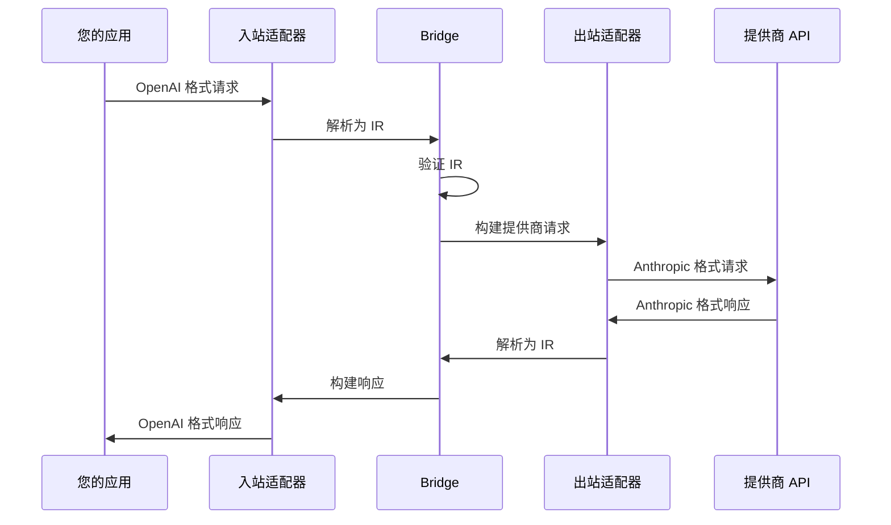
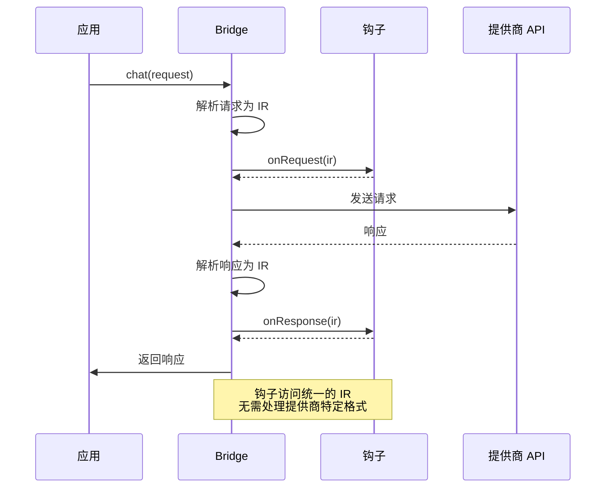
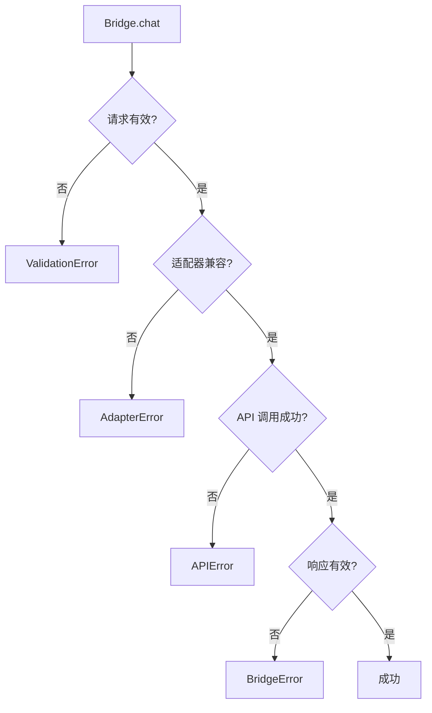

Bridge 是处理 LLM 提供商之间双向转换的核心编排器，它充当不同 LLM 提供商 API 之间的翻译器，允许您以一种格式发送请求并接收相同格式的响应，而实际上调用的是不同提供商的 API。

## Bridge 工作原理



## createBridge

创建一个新的 Bridge 实例。

```typescript
function createBridge(options: BridgeOptions): Bridge
```

### 参数

<Tabs items={['BridgeOptions', 'BridgeConfig']}>
  <Tab value="BridgeOptions">
    ```typescript
    interface BridgeOptions {
      inbound: LLMAdapter   // 入站适配器（解析传入格式）
      outbound: LLMAdapter  // 出站适配器（构建传出格式）
      config: BridgeConfig  // 配置

      // 模型映射选项（可选）
      targetModel?: string  // 固定目标模型
      modelMapper?: (inboundModel: string) => string  // 模型映射函数
      modelMapping?: { [inboundModel: string]: string }  // 模型映射表
    }
    ```

    | 属性 | 类型 | 描述 |
    |------|------|------|
    | `inbound` | `LLMAdapter` | 解析传入请求的适配器 |
    | `outbound` | `LLMAdapter` | 调用目标提供商的适配器 |
    | `config` | `BridgeConfig` | Bridge 配置 |
    | `targetModel` | `string?` | 固定使用的目标模型（优先级最高） |
    | `modelMapper` | `function?` | 模型映射函数（优先级第二） |
    | `modelMapping` | `object?` | 模型映射表（优先级第三） |
  </Tab>

  <Tab value="BridgeConfig">
    ```typescript
    interface BridgeConfig {
      apiKey?: string           // 出站提供商的 API 密钥
      baseURL?: string          // API 调用的基础 URL
      chatPath?: string         // 自定义聊天端点路径
      modelsPath?: string       // 自定义模型端点路径
      timeout?: number          // 请求超时时间（毫秒）
      maxRetries?: number       // 最大重试次数
      headers?: Record<string, string>  // 额外的请求头
      authHeaderName?: string   // 认证请求头名称（默认：'Authorization'）
      authHeaderPrefix?: string // 认证请求头前缀（默认：'Bearer'）
    }
    ```

    | 属性 | 类型 | 默认值 | 描述 |
    |------|------|--------|------|
    | `apiKey` | `string?` | - | 用于身份验证的 API 密钥 |
    | `baseURL` | `string?` | 自动检测 | 自定义 API 基础 URL |
    | `chatPath` | `string?` | 自动检测 | 自定义聊天端点路径（覆盖适配器默认值） |
    | `modelsPath` | `string?` | 自动检测 | 自定义模型端点路径（覆盖适配器默认值） |
    | `timeout` | `number?` | `120000` | 请求超时时间（毫秒） |
    | `maxRetries` | `number?` | `3` | 最大重试次数 |
    | `headers` | `Record<string, string>?` | `{}` | 自定义 HTTP 请求头 |
    | `authHeaderName` | `string?` | `'Authorization'` | 认证请求头的名称 |
    | `authHeaderPrefix` | `string?` | `'Bearer'` | 认证请求头值的前缀 |
  </Tab>
</Tabs>

### 示例

<Tabs items={['基础用法', '完整配置', '模型映射', '多提供商']}>
  <Tab value="基础用法">
    ```typescript
    import { createBridge } from '@amux.ai/llm-bridge'
    import { openaiAdapter } from '@amux.ai/adapter-openai'
    import { anthropicAdapter } from '@amux.ai/adapter-anthropic'

    const bridge = createBridge({
      inbound: openaiAdapter,
      outbound: anthropicAdapter,
      config: {
        apiKey: process.env.ANTHROPIC_API_KEY
      }
    })
    ```
  </Tab>

  <Tab value="完整配置">
    ```typescript
    const bridge = createBridge({
      inbound: openaiAdapter,
      outbound: anthropicAdapter,
      config: {
        apiKey: process.env.ANTHROPIC_API_KEY,
        baseURL: 'https://api.anthropic.com',
        timeout: 60000,
        maxRetries: 5,
        headers: {
          'X-Custom-Header': 'value',
          'X-Request-ID': 'req_123'
        }
      }
    })
    ```
  </Tab>

  <Tab value="模型映射">
    ### 模型映射配置

    当入站和出站使用不同提供商时，需要配置模型映射：

    ```typescript
    // 方式 1: 使用映射表（推荐）
    const bridge1 = createBridge({
      inbound: anthropicAdapter,
      outbound: openaiAdapter,
      config: { apiKey: process.env.OPENAI_API_KEY },

      // 配置模型映射表
      modelMapping: {
        'claude-3-5-sonnet-20241022': 'gpt-4',
        'claude-3-opus-20240229': 'gpt-4',
        'claude-3-haiku-20240307': 'gpt-3.5-turbo'
      }
    })

    // 方式 2: 使用映射函数（更灵活）
    const bridge2 = createBridge({
      inbound: anthropicAdapter,
      outbound: openaiAdapter,
      config: { apiKey: process.env.OPENAI_API_KEY },

      // 使用函数进行动态映射
      modelMapper: (model) => {
        if (model.startsWith('claude-3-5')) return 'gpt-4'
        if (model.startsWith('claude-3-opus')) return 'gpt-4'
        if (model.startsWith('claude-3-haiku')) return 'gpt-3.5-turbo'
        return 'gpt-4' // 默认
      }
    })

    // 方式 3: 固定目标模型（最简单）
    const bridge3 = createBridge({
      inbound: anthropicAdapter,
      outbound: openaiAdapter,
      config: { apiKey: process.env.OPENAI_API_KEY },

      // 忽略入站模型，总是使用 gpt-4
      targetModel: 'gpt-4'
    })
    ```

    <Callout type="warn">
    **重要**: 如果不配置模型映射，入站模型名会直接传递给出站 API，可能导致错误。例如，将 `'claude-3-5-sonnet'` 传给 OpenAI API 会失败。
    </Callout>

    **映射优先级**:
    1. `targetModel` - 最高优先级，忽略入站模型
    2. `modelMapper` - 使用函数动态映射
    3. `modelMapping` - 查找映射表
    4. 原模型 - 如果都没配置，使用原模型（可能失败）
  </Tab>

  <Tab value="多提供商">
    ```typescript
    // OpenAI → Anthropic
    const bridge1 = createBridge({
      inbound: openaiAdapter,
      outbound: anthropicAdapter,
      config: { apiKey: process.env.ANTHROPIC_API_KEY }
    })

    // Anthropic → DeepSeek
    const bridge2 = createBridge({
      inbound: anthropicAdapter,
      outbound: deepseekAdapter,
      config: { apiKey: process.env.DEEPSEEK_API_KEY }
    })

    // DeepSeek → OpenAI
    const bridge3 = createBridge({
      inbound: deepseekAdapter,
      outbound: openaiAdapter,
      config: { apiKey: process.env.OPENAI_API_KEY }
    })
    ```
  </Tab>
</Tabs>

## 生命周期钩子

<Callout type="info">
**v0.1.0 新特性**: Bridge 现在支持生命周期钩子，用于在 IR (中间表示层) 进行监控、日志记录和自定义处理。
</Callout>

生命周期钩子允许您在所有数据都以统一格式呈现的关键点拦截和观察 Bridge 的请求/响应流程。这非常适合日志记录、监控、成本追踪和调试。

### 钩子接口

```typescript
interface BridgeHooks {
  // 在解析入站请求为 IR 后调用
  onRequest?: (ir: LLMRequestIR) => void | Promise<void>
  
  // 在解析提供商响应为 IR 后调用
  // ⭐ 提取 Token 用量的最佳位置 - 所有提供商使用相同格式
  onResponse?: (ir: LLMResponseIR) => void | Promise<void>
  
  // 在每个流式事件解析为 IR 后调用
  onStreamEvent?: (event: LLMStreamEvent) => void | Promise<void>
  
  // 发生错误时调用
  onError?: (error: LLMErrorIR) => void | Promise<void>
}
```

### 为什么需要钩子？

**问题**: 不同的 LLM 提供商以不同的格式返回 Token 用量：
- OpenAI: `{ usage: { prompt_tokens, completion_tokens } }`
- Anthropic: `{ usage: { input_tokens, output_tokens } }`
- DeepSeek、Moonshot: 各种不同的变体

**解决方案**: 钩子在 IR 层操作，此时所有提供商的数据已经统一！

```typescript
const bridge = createBridge({
  inbound: openaiAdapter,
  outbound: anthropicAdapter,
  config: { apiKey: '...' },
  
  hooks: {
    onResponse: async (ir) => {
      // ✅ 无论哪个提供商，格式都相同！
      if (ir.usage) {
        console.log(`输入 Token: ${ir.usage.promptTokens}`)
        console.log(`输出 Token: ${ir.usage.completionTokens}`)
        console.log(`总 Token: ${ir.usage.totalTokens}`)
        
        // 保存到数据库、追踪成本等
        await saveTokenMetrics({
          input: ir.usage.promptTokens,
          output: ir.usage.completionTokens
        })
      }
    }
  }
})
```

### 使用场景

<Tabs items={['Token 统计', '成本监控', '请求日志', '速率限制']}>
  <Tab value="Token 统计">
    ### 追踪 Token 使用量

    以统一的方式从任何提供商提取 Token 用量：

    ```typescript
    const bridge = createBridge({
      inbound: openaiAdapter,
      outbound: anthropicAdapter, // 或任何提供商
      config: { apiKey: process.env.ANTHROPIC_API_KEY },
      
      hooks: {
        // 非流式响应
        onResponse: async (ir) => {
          if (ir.usage) {
            await recordTokens({
              proxyId: 'proxy-123',
              inputTokens: ir.usage.promptTokens,
              outputTokens: ir.usage.completionTokens,
              totalTokens: ir.usage.totalTokens,
              timestamp: Date.now()
            })
          }
        },
        
        // 流式响应
        onStreamEvent: async (event) => {
          if (event.type === 'end' && event.usage) {
            await recordTokens({
              proxyId: 'proxy-123',
              inputTokens: event.usage.promptTokens,
              outputTokens: event.usage.completionTokens,
              totalTokens: event.usage.totalTokens,
              timestamp: Date.now()
            })
          }
        }
      }
    })
    ```

    **优势**:
    - ✅ 无需处理不同提供商的格式
    - ✅ 自动支持所有适配器
    - ✅ 流式和非流式使用相同代码
  </Tab>

  <Tab value="成本监控">
    ### 实时成本追踪

    基于 Token 用量计算成本：

    ```typescript
    // 定义每 1K Token 的价格
    const pricing = {
      'gpt-4': { input: 0.03, output: 0.06 },
      'gpt-3.5-turbo': { input: 0.001, output: 0.002 },
      'claude-3-5-sonnet': { input: 0.003, output: 0.015 }
    }

    const bridge = createBridge({
      inbound: openaiAdapter,
      outbound: openaiAdapter,
      config: { apiKey: process.env.OPENAI_API_KEY },
      
      hooks: {
        onResponse: async (ir) => {
          if (ir.usage && ir.model) {
            const modelPricing = pricing[ir.model]
            if (modelPricing) {
              const cost = 
                (ir.usage.promptTokens / 1000) * modelPricing.input +
                (ir.usage.completionTokens / 1000) * modelPricing.output
              
              await recordCost({
                model: ir.model,
                inputTokens: ir.usage.promptTokens,
                outputTokens: ir.usage.completionTokens,
                cost: cost,
                currency: 'USD',
                timestamp: Date.now()
              })
              
              console.log(`请求成本: $${cost.toFixed(4)}`)
            }
          }
        }
      }
    })
    ```
  </Tab>

  <Tab value="请求日志">
    ### 完整的请求日志记录

    记录请求和响应用于调试和审计：

    ```typescript
    const bridge = createBridge({
      inbound: openaiAdapter,
      outbound: anthropicAdapter,
      config: { apiKey: process.env.ANTHROPIC_API_KEY },
      
      hooks: {
        onRequest: async (ir) => {
          console.log('[Bridge] 请求:', {
            model: ir.model,
            messageCount: ir.messages.length,
            hasTools: !!ir.tools,
            hasSystemPrompt: !!ir.system,
            stream: ir.stream
          })
        },
        
        onResponse: async (ir) => {
          console.log('[Bridge] 响应:', {
            model: ir.model,
            choiceCount: ir.choices.length,
            finishReason: ir.choices[0]?.finishReason,
            usage: ir.usage
          })
          
          // 保存到数据库
          await saveRequestLog({
            requestId: ir.id,
            model: ir.model,
            status: 'success',
            usage: ir.usage,
            timestamp: Date.now()
          })
        },
        
        onError: async (error) => {
          console.error('[Bridge] 错误:', {
            type: error.type,
            message: error.message,
            code: error.code,
            status: error.status
          })
          
          // 记录错误到监控服务
          await logError({
            type: error.type,
            message: error.message,
            timestamp: Date.now()
          })
        }
      }
    })
    ```
  </Tab>

  <Tab value="速率限制">
    ### 实现速率限制

    强制实施基于 Token 的速率限制：

    ```typescript
    let dailyTokens = 0
    const DAILY_LIMIT = 1000000  // 每天 100 万 Token

    const bridge = createBridge({
      inbound: openaiAdapter,
      outbound: openaiAdapter,
      config: { apiKey: process.env.OPENAI_API_KEY },
      
      hooks: {
        onRequest: async (ir) => {
          // 检查是否接近限制
          if (dailyTokens > DAILY_LIMIT * 0.9) {
            console.warn(`警告: 已达到每日 Token 限制的 90%`)
          }
          
          if (dailyTokens >= DAILY_LIMIT) {
            throw new Error('已超出每日 Token 限制')
          }
        },
        
        onResponse: async (ir) => {
          if (ir.usage) {
            dailyTokens += ir.usage.totalTokens
            
            console.log(`每日用量: ${dailyTokens}/${DAILY_LIMIT} Token`)
            
            // 80% 时发送警报
            if (dailyTokens > DAILY_LIMIT * 0.8) {
              await sendAlert({
                message: `Token 使用量达到 ${Math.round(dailyTokens / DAILY_LIMIT * 100)}%`,
                usage: dailyTokens,
                limit: DAILY_LIMIT
              })
            }
          }
        }
      }
    })
    ```
  </Tab>
</Tabs>

### 钩子执行流程



### 最佳实践

1. **使用钩子进行可观测性**: 非常适合日志记录、监控和调试
2. **保持钩子轻量**: 避免在钩子中进行重计算，以免增加延迟
3. **优雅地处理错误**: 钩子中的错误不应破坏主流程
4. **利用 IR 格式**: 无需解析提供商特定格式

```typescript
// ✅ 好: 轻量级日志记录
hooks: {
  onResponse: async (ir) => {
    console.log(`Tokens: ${ir.usage?.totalTokens}`)
  }
}

// ⚠️ 可接受: 异步操作（但要注意延迟）
hooks: {
  onResponse: async (ir) => {
    await saveToDatabase(ir.usage) // 保持快速
  }
}

// ❌ 不好: 重计算
hooks: {
  onResponse: async (ir) => {
    // 不要在这里进行昂贵的操作
    await processLargeDataset()
    await complexAnalysis()
  }
}
```

### 多钩子示例

您可以组合多个钩子进行全面监控：

```typescript
const bridge = createBridge({
  inbound: openaiAdapter,
  outbound: anthropicAdapter,
  config: { apiKey: process.env.ANTHROPIC_API_KEY },
  
  hooks: {
    onRequest: async (ir) => {
      // 记录传入请求
      logger.info('收到请求', {
        model: ir.model,
        messageCount: ir.messages.length
      })
    },
    
    onResponse: async (ir) => {
      // 追踪 Token
      metrics.recordTokens(ir.usage)
      
      // 计算成本
      const cost = calculateCost(ir.model, ir.usage)
      metrics.recordCost(cost)
      
      // 记录成功
      logger.info('请求完成', {
        model: ir.model,
        tokens: ir.usage?.totalTokens,
        cost
      })
    },
    
    onStreamEvent: async (event) => {
      // 追踪流式进度
      if (event.type === 'content' && event.content?.delta) {
        metrics.incrementStreamChunks()
      }
      
      if (event.type === 'end' && event.usage) {
        metrics.recordTokens(event.usage)
      }
    },
    
    onError: async (error) => {
      // 记录和警报错误
      logger.error('请求失败', {
        type: error.type,
        message: error.message,
        code: error.code
      })
      
      await alerting.sendAlert({
        severity: 'error',
        message: `Bridge 错误: ${error.message}`
      })
    }
  }
})
```

## Bridge 方法

### chat

发送聊天完成请求并返回响应。

```typescript
async chat(request: unknown): Promise<unknown>
```

<Callout type="warn">
请求必须使用**入站适配器的格式**。响应也将使用入站适配器的格式，即使内部调用的是不同的提供商 API。
</Callout>

#### 示例

<Tabs items={['简单对话', '工具调用', '多模态']}>
  <Tab value="简单对话">
    ```typescript
    const response = await bridge.chat({
      model: 'gpt-4',
      messages: [
        { role: 'user', content: '你好！' }
      ]
    })

    console.log(response.choices[0].message.content)
    ```
  </Tab>

  <Tab value="工具调用">
    ```typescript
    const response = await bridge.chat({
      model: 'gpt-4',
      messages: [
        { role: 'user', content: '北京的天气怎么样？' }
      ],
      tools: [{
        type: 'function',
        function: {
          name: 'get_weather',
          description: '获取某个位置的天气',
          parameters: {
            type: 'object',
            properties: {
              location: { type: 'string' }
            },
            required: ['location']
          }
        }
      }],
      tool_choice: 'auto'
    })

    // 检查工具调用
    if (response.choices[0].message.tool_calls) {
      const toolCall = response.choices[0].message.tool_calls[0]
      console.log('工具：', toolCall.function.name)
      console.log('参数：', toolCall.function.arguments)
    }
    ```
  </Tab>

  <Tab value="多模态">
    ```typescript
    const response = await bridge.chat({
      model: 'gpt-4-vision',
      messages: [{
        role: 'user',
        content: [
          { type: 'text', text: '这张图片里有什么？' },
          {
            type: 'image_url',
            image_url: {
              url: 'https://example.com/image.jpg'
            }
          }
        ]
      }]
    })
    ```
  </Tab>
</Tabs>

### chatRaw

发送聊天完成请求并返回原始 IR 响应。当你需要直接访问中间表示时使用此方法。

```typescript
async chatRaw(request: unknown): Promise<LLMResponseIR>
```

#### 示例

```typescript
// 获取原始 IR 响应用于自定义处理
const ir = await bridge.chatRaw({
  model: 'gpt-4',
  messages: [{ role: 'user', content: '你好！' }]
})

// 直接访问 IR 字段
console.log('模型:', ir.model)
console.log('选项数:', ir.choices.length)
console.log('Token 用量:', ir.usage?.totalTokens)

// 构建自定义响应格式
const customResponse = {
  text: ir.choices[0]?.message.content,
  tokens: ir.usage?.totalTokens,
}
```

### chatStream

发送流式聊天完成请求。返回入站适配器格式的 SSE 事件。

```typescript
async *chatStream(request: unknown): AsyncIterable<SSEEvent>
```

`SSEEvent` 接口：

```typescript
interface SSEEvent {
  event: string  // 事件类型（如 'message_start', 'content_block_delta', 'data'）
  data: unknown  // 事件数据
}
```

#### 示例

```typescript
// 简单的流式处理 - 事件已经是入站格式
const stream = bridge.chatStream({
  model: 'gpt-4',
  messages: [{ role: 'user', content: '讲个故事' }],
  stream: true
})

// 直接将 SSE 事件写入 HTTP 响应
res.setHeader('Content-Type', 'text/event-stream')
for await (const sse of stream) {
  res.write(`event: ${sse.event}\ndata: ${JSON.stringify(sse.data)}\n\n`)
}
res.end()
```

### chatStreamRaw

发送流式聊天请求并返回原始 IR 流事件。当你需要自定义流处理时使用此方法。

```typescript
async *chatStreamRaw(request: unknown): AsyncIterable<LLMStreamEvent>
```

#### 示例

```typescript
// 原始 IR 事件用于自定义处理
for await (const event of bridge.chatStreamRaw(request)) {
  if (event.type === 'content' && event.content?.delta) {
    // 自定义内容增量处理
    console.log('内容:', event.content.delta)
  }
  if (event.type === 'tool_call' && event.toolCall) {
    // 自定义工具调用处理
    console.log('工具调用:', event.toolCall.name)
  }
}
```

### checkCompatibility

检查入站和出站适配器之间的兼容性。

```typescript
checkCompatibility(): CompatibilityReport
```

<Callout type="info">
使用此方法在发出请求之前验证您的适配器组合是否支持所需的所有功能。
</Callout>

#### 返回

```typescript
interface CompatibilityReport {
  compatible: boolean
  issues?: string[]
  warnings?: string[]
}
```

#### 示例

```typescript
const report = bridge.checkCompatibility()

if (!report.compatible) {
  console.error('兼容性问题：', report.issues)
  // 示例：["入站适配器支持工具但出站适配器不支持"]
}

if (report.warnings) {
  console.warn('警告：', report.warnings)
  // 示例：["入站适配器支持视觉但出站适配器不支持"]
}
```

### getAdapters

返回已配置适配器的信息。

```typescript
getAdapters(): {
  inbound: { name: string; version: string }
  outbound: { name: string; version: string }
}
```

#### 示例

```typescript
const adapters = bridge.getAdapters()

console.log(`入站：${adapters.inbound.name} v${adapters.inbound.version}`)
console.log(`出站：${adapters.outbound.name} v${adapters.outbound.version}`)
// 输出：
// 入站：openai v1.0.0
// 出站：anthropic v1.0.0
```

## 模型映射

当入站和出站适配器使用不同提供商时，模型名称需要映射。Amux 提供三种映射方式。

### 为什么需要模型映射？

不同提供商使用不同的模型名称：
- OpenAI: `gpt-4`, `gpt-3.5-turbo`
- Anthropic: `claude-3-5-sonnet-20241022`, `claude-3-haiku-20240307`
- DeepSeek: `deepseek-chat`, `deepseek-coder`

如果不配置映射，模型名会直接传递，导致 API 错误：

```typescript
// ❌ 错误示例 - 没有配置映射
const bridge = createBridge({
  inbound: openaiAdapter,
  outbound: anthropicAdapter,
  config: { apiKey: 'ANTHROPIC_KEY' }
})

await bridge.chat({
  model: 'gpt-4',  // Anthropic API 不认识这个模型
  messages: [...]
})
// 结果：API 错误 - Invalid model 'gpt-4'
```

### 映射方式

<Tabs items={['映射表', '映射函数', '固定模型']}>
  <Tab value="映射表">
    ### 使用映射表（推荐）

    适合固定的模型映射关系：

    ```typescript
    const bridge = createBridge({
      inbound: anthropicAdapter,
      outbound: openaiAdapter,
      config: { apiKey: process.env.OPENAI_API_KEY },

      modelMapping: {
        'claude-3-5-sonnet-20241022': 'gpt-4',
        'claude-3-opus-20240229': 'gpt-4',
        'claude-3-haiku-20240307': 'gpt-3.5-turbo'
      }
    })

    // 用户请求
    await bridge.chat({
      model: 'claude-3-5-sonnet-20241022',  // 自动映射到 'gpt-4'
      messages: [...]
    })
    ```

    **优点**:
    - 简单明了
    - 易于维护
    - 类型安全

    **适用场景**:
    - 固定的模型映射关系
    - 模型数量较少
  </Tab>

  <Tab value="映射函数">
    ### 使用映射函数（灵活）

    适合动态映射逻辑：

    ```typescript
    const bridge = createBridge({
      inbound: anthropicAdapter,
      outbound: openaiAdapter,
      config: { apiKey: process.env.OPENAI_API_KEY },

      modelMapper: (inboundModel) => {
        // 根据模型名称前缀映射
        if (inboundModel.startsWith('claude-3-5')) {
          return 'gpt-4'
        }
        if (inboundModel.startsWith('claude-3-opus')) {
          return 'gpt-4'
        }
        if (inboundModel.startsWith('claude-3-haiku')) {
          return 'gpt-3.5-turbo'
        }

        // 根据模型特征映射
        if (inboundModel.includes('vision')) {
          return 'gpt-4-vision-preview'
        }

        // 默认映射
        return 'gpt-4'
      }
    })
    ```

    **优点**:
    - 灵活的映射逻辑
    - 支持模式匹配
    - 可以添加复杂逻辑

    **适用场景**:
    - 需要动态映射
    - 模型名称有规律
    - 需要特殊处理逻辑
  </Tab>

  <Tab value="固定模型">
    ### 使用固定模型（最简单）

    忽略入站模型，总是使用固定模型：

    ```typescript
    const bridge = createBridge({
      inbound: anthropicAdapter,
      outbound: openaiAdapter,
      config: { apiKey: process.env.OPENAI_API_KEY },

      // 无论用户传什么模型，都使用 gpt-4
      targetModel: 'gpt-4'
    })

    // 用户请求
    await bridge.chat({
      model: 'claude-3-5-sonnet-20241022',  // 会被忽略
      messages: [...]
    })
    // 实际调用：gpt-4
    ```

    **优点**:
    - 最简单
    - 成本可控
    - 行为可预测

    **适用场景**:
    - 只想使用一个模型
    - 成本控制
    - 简化配置
  </Tab>
</Tabs>

### 映射优先级

当配置多个映射选项时，按以下优先级使用：

```
targetModel > modelMapper > modelMapping > 原模型
```

```typescript
const bridge = createBridge({
  inbound: anthropicAdapter,
  outbound: openaiAdapter,
  config: { apiKey: process.env.OPENAI_API_KEY },

  targetModel: 'gpt-4',  // 优先级 1（最高）
  modelMapper: (model) => 'gpt-3.5-turbo',  // 优先级 2
  modelMapping: {  // 优先级 3
    'claude-3-5-sonnet-20241022': 'gpt-4-turbo'
  }
})

// 结果：总是使用 'gpt-4'（targetModel 优先级最高）
```

### 实际应用场景

<Tabs items={['代理服务', '成本优化', '多租户']}>
  <Tab value="代理服务">
    ### 场景 1: 构建 LLM 代理服务

    你的应用接受 Anthropic 格式，但实际调用 OpenAI：

    ```typescript
    class LLMProxyService {
      private bridge = createBridge({
        inbound: anthropicAdapter,
        outbound: openaiAdapter,
        config: { apiKey: process.env.OPENAI_API_KEY },

        // 配置模型映射
        modelMapping: {
          'claude-3-5-sonnet-20241022': 'gpt-4',
          'claude-3-opus-20240229': 'gpt-4',
          'claude-3-haiku-20240307': 'gpt-3.5-turbo'
        }
      })

      async chat(request) {
        return this.bridge.chat(request)
      }
    }

    // 用户调用
    const service = new LLMProxyService()
    await service.chat({
      model: 'claude-3-5-sonnet-20241022',  // 自动映射到 gpt-4
      messages: [{ role: 'user', content: '你好' }]
    })
    ```
  </Tab>

  <Tab value="成本优化">
    ### 场景 2: 成本优化

    根据用户等级使用不同模型：

    ```typescript
    function createBridgeForUser(userTier: 'free' | 'pro' | 'enterprise') {
      return createBridge({
        inbound: openaiAdapter,
        outbound: openaiAdapter,
        config: { apiKey: process.env.OPENAI_API_KEY },

        modelMapper: (model) => {
          // 免费用户：总是使用便宜的模型
          if (userTier === 'free') {
            return 'gpt-3.5-turbo'
          }

          // Pro 用户：GPT-4 请求降级到 GPT-3.5
          if (userTier === 'pro' && model === 'gpt-4') {
            return 'gpt-3.5-turbo'
          }

          // 企业用户：使用原模型
          return model
        }
      })
    }
    ```
  </Tab>

  <Tab value="多租户">
    ### 场景 3: 多租户系统

    不同租户使用不同提供商：

    ```typescript
    function createBridgeForTenant(tenantConfig) {
      const { provider, apiKey, modelMapping } = tenantConfig

      // 根据租户配置选择适配器
      const outboundAdapter = {
        openai: openaiAdapter,
        anthropic: anthropicAdapter,
        deepseek: deepseekAdapter
      }[provider]

      return createBridge({
        inbound: openaiAdapter,  // 统一接受 OpenAI 格式
        outbound: outboundAdapter,
        config: { apiKey },

        // 使用租户自定义的模型映射
        modelMapping: modelMapping || {
          'gpt-4': getDefaultModel(provider)
        }
      })
    }

    // 租户 A 使用 OpenAI
    const bridgeA = createBridgeForTenant({
      provider: 'openai',
      apiKey: 'sk-...',
      modelMapping: { 'gpt-4': 'gpt-4' }
    })

    // 租户 B 使用 Anthropic
    const bridgeB = createBridgeForTenant({
      provider: 'anthropic',
      apiKey: 'sk-ant-...',
      modelMapping: { 'gpt-4': 'claude-3-5-sonnet-20241022' }
    })
    ```
  </Tab>
</Tabs>

### 最佳实践

1. **总是配置映射**: 当入站和出站使用不同提供商时，务必配置模型映射
2. **使用映射表**: 对于固定映射关系，优先使用 `modelMapping`
3. **文档化映射**: 在代码中注释说明映射逻辑
4. **测试映射**: 确保所有映射的模型都是有效的
5. **监控成本**: 注意不同模型的成本差异

```typescript
// ✅ 好的实践
const bridge = createBridge({
  inbound: anthropicAdapter,
  outbound: openaiAdapter,
  config: { apiKey: process.env.OPENAI_API_KEY },

  // 清晰的映射配置
  modelMapping: {
    // Claude Sonnet → GPT-4 (高性能)
    'claude-3-5-sonnet-20241022': 'gpt-4',

    // Claude Opus → GPT-4 (最高性能)
    'claude-3-opus-20240229': 'gpt-4',

    // Claude Haiku → GPT-3.5 (经济型)
    'claude-3-haiku-20240307': 'gpt-3.5-turbo'
  }
})
```

## 错误处理

Bridge 为不同的失败场景抛出类型化错误。



### 错误���型

<Tabs items={['BridgeError', 'AdapterError', 'APIError', 'ValidationError']}>
  <Tab value="BridgeError">
    来自 Bridge 编排层的错误。

    ```typescript
    try {
      const response = await bridge.chat(request)
    } catch (error) {
      if (error instanceof BridgeError) {
        console.error('Bridge 错误：', error.message)
        console.error('错误代码：', error.code)
      }
    }
    ```

    **常见原因：**
    - 响应解析失败
    - 内部编排错误
    - 配置问题
  </Tab>

  <Tab value="AdapterError">
    来自适配器转换的错误。

    ```typescript
    try {
      const response = await bridge.chat(request)
    } catch (error) {
      if (error instanceof AdapterError) {
        console.error('适配器错误：', error.message)
        console.error('适配器：', error.adapterName)
      }
    }
    ```

    **常见原因：**
    - 不支持的功能
    - 格式转换失败
    - 缺少必需字段
  </Tab>

  <Tab value="APIError">
    来自提供商 API 调用的错误。

    ```typescript
    try {
      const response = await bridge.chat(request)
    } catch (error) {
      if (error instanceof APIError) {
        console.error('API 错误：', error.message)
        console.error('状态：', error.status)
        console.error('提供商：', error.provider)
      }
    }
    ```

    **常见原因：**
    - 无效的 API 密钥
    - 速率限制
    - 网络问题
    - 提供商服务错误
  </Tab>

  <Tab value="ValidationError">
    来自 IR 验证的错误。

    ```typescript
    try {
      const response = await bridge.chat(request)
    } catch (error) {
      if (error instanceof ValidationError) {
        console.error('验证错误：', error.message)
        console.error('错误：', error.errors)
      }
    }
    ```

    **常见原因：**
    - 缺少必需字段
    - 无效的字段类型
    - 约束违规
  </Tab>
</Tabs>

## 完整示例

这是一个展示错误处理、兼容性检查和流式传输的完整示例：

```typescript
import { createBridge } from '@amux.ai/llm-bridge'
import { openaiAdapter } from '@amux.ai/adapter-openai'
import { anthropicAdapter } from '@amux.ai/adapter-anthropic'

// 创建 bridge
const bridge = createBridge({
  inbound: openaiAdapter,
  outbound: anthropicAdapter,
  config: {
    apiKey: process.env.ANTHROPIC_API_KEY,
    timeout: 30000
  }
})

// 检查兼容性
const report = bridge.checkCompatibility()
if (!report.compatible) {
  console.error('不兼容的适配器：', report.issues)
  process.exit(1)
}

// 发出带错误处理的请求
try {
  const response = await bridge.chat({
    model: 'gpt-4',
    messages: [
      { role: 'system', content: '你是一个有帮助的助手。' },
      { role: 'user', content: '用简单的术语解释量子计算。' }
    ],
    temperature: 0.7,
    max_tokens: 500
  })

  console.log(response.choices[0].message.content)
} catch (error) {
  if (error instanceof APIError) {
    console.error(`API 错误 (${error.status}):`, error.message)
  } else if (error instanceof AdapterError) {
    console.error('适配器错误：', error.message)
  } else {
    console.error('未知错误：', error)
  }
}
```

## 下一步

<Cards>
  <Card title="适配器 API" href="/zh/docs/api/adapters">
    了解适配器接口和功能
  </Card>
  <Card title="IR 格式" href="/zh/docs/api/ir">
    了解中间表示
  </Card>
  <Card title="示例" href="/zh/docs/examples">
    查看完整的工作示例
  </Card>
</Cards>
