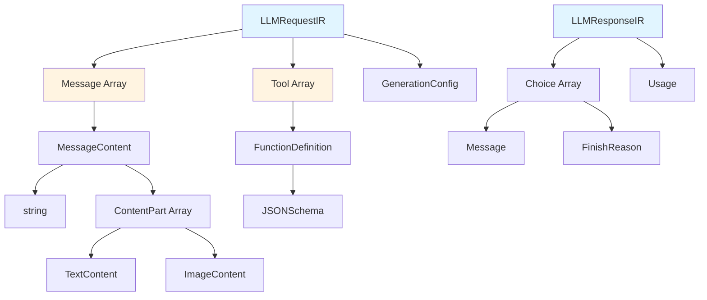
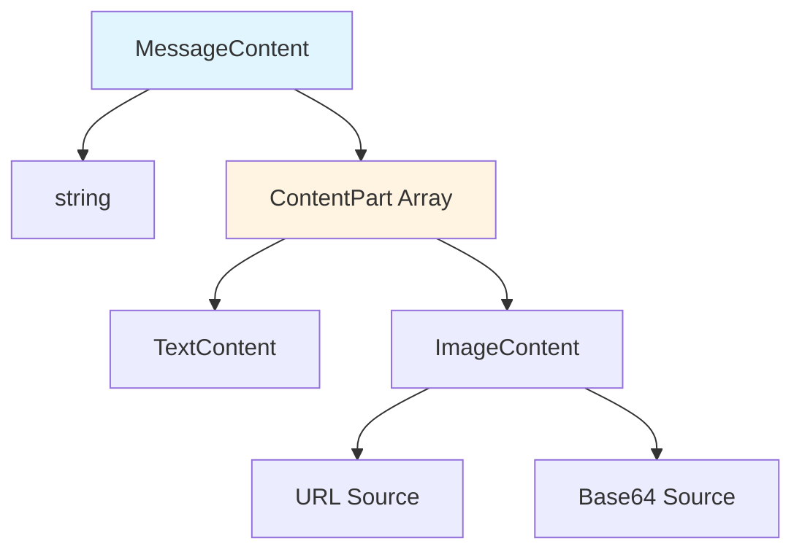
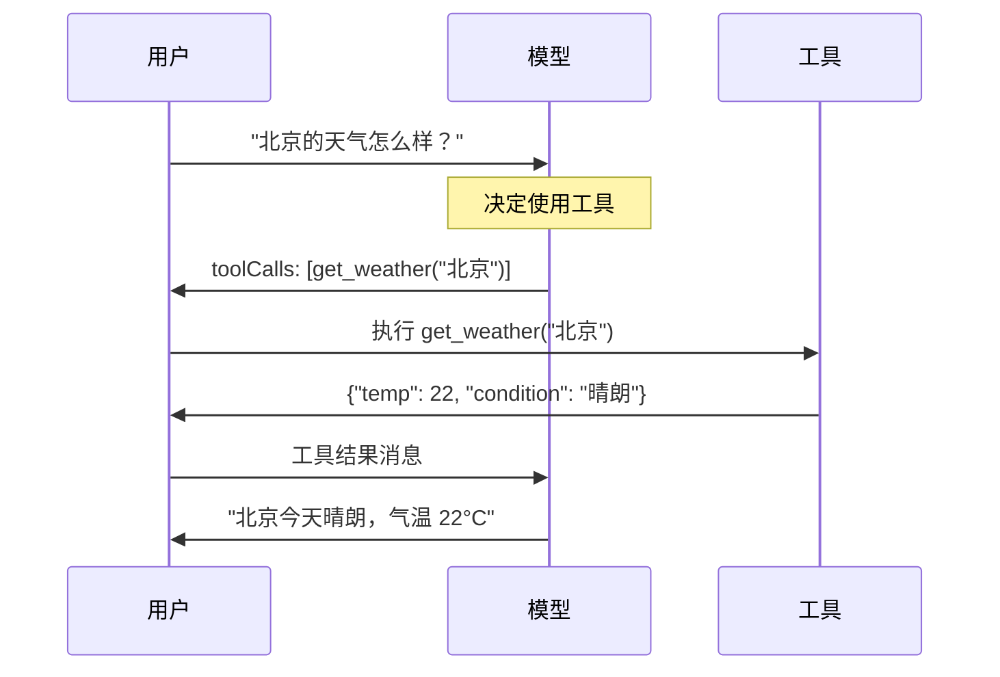

IR 是 Amux 的核心，它是所有适配器转换的统一格式，以提供商无关的方式捕获所有 LLM 功能，提供了所有适配器都能理解的通用语言，实现任何提供商格式之间的无缝转换。

## IR 类型层次结构



## 核心类型

<Tabs items={['Request', 'Response', 'Message', 'Tool', 'Stream', 'Error']}>
  <Tab value="Request">
    ### LLMRequestIR

    统一的请求格式。

    ```typescript
    interface LLMRequestIR {
      messages: Message[]              // 必需：对话消息
      model?: string                   // 模型标识符
      tools?: Tool[]                   // 可用的工具/函数
      toolChoice?: ToolChoice          // 工具使用控制
      stream?: boolean                 // 启用流式传输
      generation?: GenerationConfig    // 生成参数
      system?: string                  // 系统提示词
      metadata?: Record<string, unknown>
      extensions?: Record<string, unknown>
      raw?: unknown
    }
    ```

    <Callout type="warn">
    只有 `messages` 是必需的。所有其他字段都是可选的，取决于使用场景。
    </Callout>

    **示例：**
    ```typescript
    const request: LLMRequestIR = {
      messages: [
        { role: 'user', content: '北京的天气怎么样？' }
      ],
      model: 'gpt-4',
      tools: [{
        type: 'function',
        function: {
          name: 'get_weather',
          description: '获取某个位置的天气',
          parameters: {
            type: 'object',
            properties: {
              location: { type: 'string' }
            },
            required: ['location']
          }
        }
      }],
      toolChoice: 'auto',
      generation: {
        temperature: 0.7,
        maxTokens: 1000
      }
    }
    ```
  </Tab>

  <Tab value="Response">
    ### LLMResponseIR

    统一的响应格式。

    ```typescript
    interface LLMResponseIR {
      id: string                       // 必需：响应 ID
      model: string                    // 必需：使用的模型
      choices: Choice[]                // 必需：生成的响应
      usage?: Usage                    // 令牌使用统计
      created?: number                 // 响应创建时间戳
      systemFingerprint?: string       // 用于可重复性的系统指纹
      metadata?: Record<string, unknown>
      extensions?: Record<string, unknown>
      raw?: unknown
    }
    ```

    **示例：**
    ```typescript
    const response: LLMResponseIR = {
      id: 'resp_123',
      model: 'gpt-4',
      choices: [{
        index: 0,
        message: {
          role: 'assistant',
          content: '北京今天晴朗，气温 22°C。'
        },
        finishReason: 'stop'
      }],
      usage: {
        promptTokens: 20,
        completionTokens: 15,
        totalTokens: 35
      },
      created: 1704067200,
      systemFingerprint: 'fp_12345'
    }
    ```
  </Tab>

  <Tab value="Message">
    ### Message

    表示对话中的单条消息。

    ```typescript
    interface Message {
      role: Role                       // 必需：消息角色
      content: MessageContent          // 必需：消息内容
      name?: string                    // 发送者名称（用于工具消息）
      toolCallId?: string              // 工具调用 ID（用于工具响应）
      toolCalls?: ToolCall[]           // 工具调用（用于助手）
      reasoningContent?: string        // 推理/思考内容（DeepSeek, Qwen, Anthropic）
    }

    type Role = 'system' | 'user' | 'assistant' | 'tool'
    type MessageContent = string | ContentPart[]
    ```

    **示例：**
    ```typescript
    // 简单文本消息
    { role: 'user', content: '你好！' }

    // 多模态消息
    {
      role: 'user',
      content: [
        { type: 'text', text: '这张图片里有什么？' },
        {
          type: 'image',
          source: { type: 'url', url: 'https://example.com/image.jpg' }
        }
      ]
    }

    // 带工具调用的助手消息
    {
      role: 'assistant',
      content: '让我查询天气。',
      toolCalls: [{
        id: 'call_123',
        type: 'function',
        function: {
          name: 'get_weather',
          arguments: '{"location":"北京"}'
        }
      }]
    }

    // 工具结果
    {
      role: 'tool',
      content: '{"temperature":22,"condition":"晴朗"}',
      toolCallId: 'call_123',
      name: 'get_weather'
    }

    // 带推理内容的助手消息
    {
      role: 'assistant',
      content: '答案是 42。',
      reasoningContent: '让我一步步思考这个问题...'
    }
    ```
  </Tab>

  <Tab value="Tool">
    ### Tool

    函数/工具定义。

    ```typescript
    interface Tool {
      type: 'function'
      function: FunctionDefinition
    }

    interface FunctionDefinition {
      name: string                     // 必需：函数名称
      description?: string             // 函数描述
      parameters?: JSONSchema          // 参数模式
      strict?: boolean                 // OpenAI 结构化输出
    }
    ```

    **示例：**
    ```typescript
    const tool: Tool = {
      type: 'function',
      function: {
        name: 'get_weather',
        description: '获取某个位置的当前天气',
        parameters: {
          type: 'object',
          properties: {
            location: {
              type: 'string',
              description: '城市名称'
            },
            unit: {
              type: 'string',
              enum: ['celsius', 'fahrenheit'],
              description: '温度单位'
            }
          },
          required: ['location']
        }
      }
    }
    ```

    ### ToolChoice

    控制模型如何使用工具。

    ```typescript
    type ToolChoice =
      | 'auto'      // 让模型决定
      | 'none'      // 不使用工具
      | 'required'  // 必须使用工具
      | {           // 使用特定工具
          type: 'function'
          function: { name: string }
        }
    ```
  </Tab>

  <Tab value="Stream">
    ### LLMStreamEvent

    流式响应的流事件。

    ```typescript
    interface LLMStreamEvent {
      type: StreamEventType
      id?: string
      model?: string
      content?: ContentDelta
      reasoning?: ReasoningDelta        // 推理/思考内容增量
      toolCall?: ToolCallDelta
      finishReason?: FinishReason
      message?: Message
      usage?: Usage                     // 使用统计（流结束时）
      error?: { message: string; code?: string }
      raw?: unknown
    }

    type StreamEventType =
      | 'start'      // 流开始
      | 'content'    // 内容增量
      | 'reasoning'  // 推理/思考内容增量
      | 'tool_call'  // 工具调用增量
      | 'end'        // 流结束
      | 'error'      // 发生错误

    interface ReasoningDelta {
      type: 'reasoning'
      delta: string
      index?: number
    }
    ```

    **示例流程：**
    ```typescript
    // 1. 开始事件
    { type: 'start', id: 'stream_123', model: 'gpt-4' }

    // 2. 内容增量
    { type: 'content', content: { type: 'content', delta: '你好' } }
    { type: 'content', content: { type: 'content', delta: '世界' } }
    { type: 'content', content: { type: 'content', delta: '！' } }

    // 3. 结束事件
    {
      type: 'end',
      finishReason: 'stop',
      message: {
        role: 'assistant',
        content: '你好世界！'
      }
    }
    ```

    **带推理的流程（DeepSeek, Qwen, Anthropic）：**
    ```typescript
    // 1. 开始事件
    { type: 'start', id: 'stream_456', model: 'deepseek-reasoner' }

    // 2. 推理内容增量
    { type: 'reasoning', reasoning: { type: 'reasoning', delta: '让我分析这个问题...' } }
    { type: 'reasoning', reasoning: { type: 'reasoning', delta: '首先，我需要考虑...' } }

    // 3. 内容增量
    { type: 'content', content: { type: 'content', delta: '根据我的分析，' } }
    { type: 'content', content: { type: 'content', delta: '答案是 42。' } }

    // 4. 结束事件
    {
      type: 'end',
      finishReason: 'stop',
      message: {
        role: 'assistant',
        content: '根据我的分析，答案是 42。',
        reasoningContent: '让我分析这个问题...首先，我需要考虑...'
      }
    }
    ```
  </Tab>

  <Tab value="Error">
    ### LLMErrorIR

    统一的错误格式。

    ```typescript
    interface LLMErrorIR {
      type: ErrorType
      message: string
      code?: string
      status?: number
      retryable?: boolean
      details?: Record<string, unknown>
      raw?: unknown
    }

    type ErrorType =
      | 'network'        // 网络错误
      | 'api'            // API 错误
      | 'validation'     // 验证错误
      | 'rate_limit'     // 速率限制错误
      | 'authentication' // 认证错误
      | 'permission'     // 权限错误
      | 'not_found'      // 资源未找到
      | 'server'         // 服务器错误
      | 'unknown'        // 未知错误
    ```

    **示例：**
    ```typescript
    {
      type: 'rate_limit',
      message: '超出速率限制',
      code: 'rate_limit_exceeded',
      status: 429,
      retryable: true,
      details: {
        retryAfter: 60
      }
    }
    ```
  </Tab>
</Tabs>

## 消息内容类型

消息可以包含不同类型的内容以支持多模态交互。



<Tabs items={['Text', 'Image']}>
  <Tab value="Text">
    ### TextContent

    ```typescript
    interface TextContent {
      type: 'text'
      text: string
    }
    ```

    **示例：**
    ```typescript
    {
      type: 'text',
      text: '这张图片里有什么？'
    }
    ```
  </Tab>

  <Tab value="Image">
    ### ImageContent

    ```typescript
    interface ImageContent {
      type: 'image'
      source: ImageSource
    }

    type ImageSource =
      | { type: 'url'; url: string }
      | { type: 'base64'; mediaType: string; data: string }
    ```

    **示例：**
    ```typescript
    // URL 图片
    {
      type: 'image',
      source: {
        type: 'url',
        url: 'https://example.com/image.jpg'
      }
    }

    // Base64 图片
    {
      type: 'image',
      source: {
        type: 'base64',
        mediaType: 'image/jpeg',
        data: '/9j/4AAQSkZJRg...'
      }
    }
    ```
  </Tab>
</Tabs>

<Callout type="info">
**关于工具调用：** 工具调用使用 Message 对象上的 `toolCalls` 字段（OpenAI 风格）表示，而不是 ContentPart 类型。详见[工具调用流程](#工具调用流程)部分。
</Callout>

## 生成参数

控制模型如何生成响应。

```typescript
interface GenerationConfig {
  temperature?: number          // 0-2：随机性
  topP?: number                // 0-1：核采样
  topK?: number                // >0：Top-k 采样
  maxTokens?: number           // >0：生成的最大令牌数
  stopSequences?: string[]     // 在这些序列处停止
  presencePenalty?: number     // -2 到 2：惩罚存在性
  frequencyPenalty?: number    // -2 到 2：惩罚频率
  n?: number                   // >0：完成数量
  seed?: number                // 确定性生成的种子
  responseFormat?: ResponseFormat  // 响应格式配置
  thinking?: ThinkingConfig    // 思考/推理配置
  enableSearch?: boolean       // 启用网页搜索（Qwen）
  logprobs?: boolean           // 对数概率
  topLogprobs?: number         // 返回的 top 对数概率数量
}

interface ResponseFormat {
  type: 'text' | 'json_object' | 'json_schema'
  jsonSchema?: {
    name: string
    description?: string
    schema: Record<string, unknown>
    strict?: boolean
  }
}

interface ThinkingConfig {
  enabled: boolean
  budgetTokens?: number        // 思考的预算令牌数（Anthropic）
}
```

<Tabs items={['Temperature', 'Sampling', 'Limits', 'Penalties', 'Response Format', 'Thinking', 'Advanced']}>
  <Tab value="Temperature">
    ### Temperature

    控制生成的随机性（0-2，通常为 0-1）。

    ```typescript
    generation: {
      temperature: 0.7  // 平衡的创造力
    }
    ```

    **指南：**
    - `0.0-0.3`：专注、确定性（适合事实性任务）
    - `0.4-0.7`：平衡（适合一般使用）
    - `0.8-1.0`：创造性（适合头脑风暴）
    - `1.0+`：非常创造性（实验性）
  </Tab>

  <Tab value="Sampling">
    ### 采样方法

    ```typescript
    generation: {
      topP: 0.9,    // 核采样
      topK: 40      // Top-k 采样
    }
    ```

    **Top-P（核采样）：**
    - 考虑累积概率 ≤ P 的令牌
    - `0.9` 是一个好的默认值
    - 是 temperature 的替代方案

    **Top-K：**
    - 只考虑前 K 个令牌
    - `40-50` 是典型值
    - 可以与 top-P 结合使用
  </Tab>

  <Tab value="Limits">
    ### 令牌限制

    ```typescript
    generation: {
      maxTokens: 1000,
      stopSequences: ['\n\n', 'END', '---']
    }
    ```

    **最大令牌数：**
    - 生成的最大令牌数
    - 不包括提示令牌
    - 适用模型特定限制

    **停止序列：**
    - 遇到任何序列时停止生成
    - 对结构化输出有用
  </Tab>

  <Tab value="Penalties">
    ### 惩罚

    ```typescript
    generation: {
      presencePenalty: 0.1,   // 鼓励新主题
      frequencyPenalty: 0.1   // 减少重复
    }
    ```

    **存在惩罚（-2 到 2）：**
    - 正值：鼓励新令牌
    - 负值：鼓励现有令牌
    - 适合主题多样性

    **频率惩罚（-2 到 2）：**
    - 正值：减少重复
    - 负值：鼓励重复
    - 适合减少冗余
  </Tab>

  <Tab value="Response Format">
    ### 响应格式

    配置结构化输出格式。

    ```typescript
    generation: {
      responseFormat: {
        type: 'json_object'  // 或 'json_schema', 'text'
      }
    }
    ```

    **格式类型：**
    - `'text'`：纯文本响应（默认）
    - `'json_object'`：有效的 JSON 对象
    - `'json_schema'`：具有模式验证的结构化输出

    **JSON Schema 示例：**
    ```typescript
    generation: {
      responseFormat: {
        type: 'json_schema',
        jsonSchema: {
          name: 'weather_response',
          description: '天气信息',
          schema: {
            type: 'object',
            properties: {
              temperature: { type: 'number' },
              condition: { type: 'string' }
            },
            required: ['temperature', 'condition']
          },
          strict: true  // OpenAI 结构化输出
        }
      }
    }
    ```
  </Tab>

  <Tab value="Thinking">
    ### 思考/推理模式

    启用推理模型的思考模式。

    ```typescript
    generation: {
      thinking: {
        enabled: true,
        budgetTokens: 1000  // 可选：用于 Anthropic
      }
    }
    ```

    **支持的提供商：**
    - **DeepSeek**：`deepseek-reasoner` 模型
    - **Qwen**：`QwQ` 模型
    - **Anthropic**：扩展思考模式（带预算）

    **工作原理：**
    - 模型生成内部推理步骤
    - 推理内容在 `reasoningContent` 字段中可用
    - 最终答案在 `content` 字段中
  </Tab>

  <Tab value="Advanced">
    ### 高级功能

    ```typescript
    generation: {
      // 网页搜索（Qwen 专用）
      enableSearch: true,

      // 对数概率
      logprobs: true,
      topLogprobs: 5  // 每个令牌的前 5 个备选项
    }
    ```

    **enableSearch**（仅 Qwen）：
    - 启用实时网页搜索
    - 模型可以访问当前信息
    - 对事实检查和最近事件有用

    **logprobs / topLogprobs**：
    - 获取令牌的概率分布
    - 对不确定性估计有用
    - 在响应的 `logprobs` 字段中可用
  </Tab>
</Tabs>

## 使用统计

`Usage` 接口提供详细的令牌使用信息：

```typescript
interface Usage {
  promptTokens: number        // 提示中的令牌数
  completionTokens: number     // 补全中的令牌数
  totalTokens: number          // 使用的总令牌数

  // 详细令牌分类（提供商特定）
  details?: {
    reasoningTokens?: number      // 推理/思考令牌（DeepSeek、Qwen）
    cachedTokens?: number        // 缓存的提示令牌（DeepSeek、Anthropic）
    cacheCreationTokens?: number // 缓存创建令牌（Anthropic）
    cacheReadTokens?: number    // 缓存读取令牌（Anthropic）
  }
}
```

### 各提供商的令牌详情

| 提供商 | reasoningTokens | cachedTokens | cacheCreationTokens | cacheReadTokens |
|----------|-----------------|--------------|---------------------|-----------------|
| OpenAI | - | - | - | - |
| Anthropic | - | ✅ | ✅ | ✅ |
| DeepSeek | ✅ | ✅ | - | - |
| Qwen | ✅ | - | - | - |
| MiniMax | ✅ | - | - | - |

<Callout type="info">
`details` 字段是可选的，仅在提供商提供这些额外的令牌计数时才会包含。这允许更精细的成本跟踪和缓存优化。
</Callout>

## 工具调用流程



<Callout type="info">
**统一的工具调用格式：** IR 使用 OpenAI 风格的工具调用作为统一格式。当从 Anthropic 格式转换时，适配器会自动将 `tool_use` 内容块转换为 `toolCalls`，将 `tool_result` 内容块转换为 tool 角色消息。
</Callout>

### IR 中的工具调用

```typescript
// 1. 用户消息
{
  role: 'user',
  content: '北京的天气怎么样？'
}

// 2. 带工具调用的助手
{
  role: 'assistant',
  content: '让我为您查询天气。',
  toolCalls: [{
    id: 'call_abc123',
    type: 'function',
    function: {
      name: 'get_weather',
      arguments: '{"location":"北京"}'
    }
  }]
}

// 3. 工具结果
{
  role: 'tool',
  content: '{"temperature":22,"condition":"晴朗"}',
  toolCallId: 'call_abc123',
  name: 'get_weather'
}

// 4. 最终助手响应
{
  role: 'assistant',
  content: '北京今天晴朗，气温 22°C。'
}
```

## 完整示例

<Tabs items={['简单对话', '工具调用', '多模态', '流式传输']}>
  <Tab value="简单对话">
    ```typescript
    const request: LLMRequestIR = {
      messages: [
        {
          role: 'system',
          content: '你是一个有帮助的助手。'
        },
        {
          role: 'user',
          content: '用简单的术语解释量子计算。'
        }
      ],
      model: 'gpt-4',
      generation: {
        temperature: 0.7,
        maxTokens: 500
      }
    }

    const response: LLMResponseIR = {
      id: 'resp_123',
      model: 'gpt-4',
      choices: [{
        index: 0,
        message: {
          role: 'assistant',
          content: '量子计算使用量子力学...'
        },
        finishReason: 'stop'
      }],
      usage: {
        promptTokens: 25,
        completionTokens: 150,
        totalTokens: 175
      }
    }
    ```
  </Tab>

  <Tab value="工具调用">
    ```typescript
    const request: LLMRequestIR = {
      messages: [
        {
          role: 'user',
          content: '北京和上海的天气怎么样？'
        }
      ],
      model: 'gpt-4',
      tools: [{
        type: 'function',
        function: {
          name: 'get_weather',
          description: '获取某个位置的天气',
          parameters: {
            type: 'object',
            properties: {
              location: { type: 'string' }
            },
            required: ['location']
          }
        }
      }],
      toolChoice: 'auto'
    }

    const response: LLMResponseIR = {
      id: 'resp_456',
      model: 'gpt-4',
      choices: [{
        index: 0,
        message: {
          role: 'assistant',
          content: null,
          toolCalls: [
            {
              id: 'call_1',
              type: 'function',
              function: {
                name: 'get_weather',
                arguments: '{"location":"北京"}'
              }
            },
            {
              id: 'call_2',
              type: 'function',
              function: {
                name: 'get_weather',
                arguments: '{"location":"上海"}'
              }
            }
          ]
        },
        finishReason: 'tool_calls'
      }]
    }
    ```
  </Tab>

  <Tab value="多模态">
    ```typescript
    const request: LLMRequestIR = {
      messages: [
        {
          role: 'user',
          content: [
            {
              type: 'text',
              text: '这张图片里有什么物体？'
            },
            {
              type: 'image',
              source: {
                type: 'url',
                url: 'https://example.com/image.jpg'
              }
            }
          ]
        }
      ],
      model: 'gpt-4-vision'
    }

    const response: LLMResponseIR = {
      id: 'resp_789',
      model: 'gpt-4-vision',
      choices: [{
        index: 0,
        message: {
          role: 'assistant',
          content: '我在图片中看到一只猫、一台笔记本电脑和一个咖啡杯。'
        },
        finishReason: 'stop'
      }]
    }
    ```
  </Tab>

  <Tab value="流式传输">
    ```typescript
    const request: LLMRequestIR = {
      messages: [
        { role: 'user', content: '讲一个短故事。' }
      ],
      model: 'gpt-4',
      stream: true
    }

    // 流事件：
    const events: LLMStreamEvent[] = [
      {
        type: 'start',
        id: 'stream_123',
        model: 'gpt-4'
      },
      {
        type: 'content',
        content: { type: 'content', delta: '从前' }
      },
      {
        type: 'content',
        content: { type: 'content', delta: '有一个' }
      },
      {
        type: 'content',
        content: { type: 'content', delta: '小村庄' }
      },
      // ... 更多内容增量
      {
        type: 'end',
        finishReason: 'stop',
        message: {
          role: 'assistant',
          content: '从前有一个小村庄...'
        }
      }
    ]
    ```
  </Tab>
</Tabs>

## 下一步

<Cards>
  <Card title="Bridge API" href="/zh/docs/api/bridge">
    了解如何在 Bridge 中使用 IR
  </Card>
  <Card title="适配器 API" href="/zh/docs/api/adapters">
    了解适配器转换
  </Card>
  <Card title="示例" href="/zh/docs/examples">
    查看 IR 的实际应用
  </Card>
</Cards>
