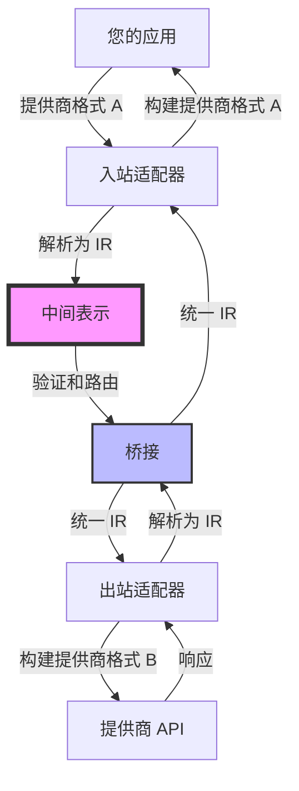
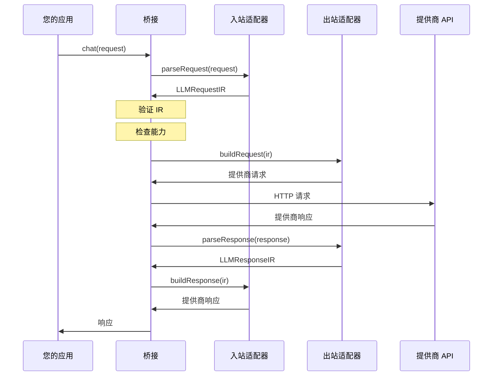

<Callout type="info">
LLM Bridge 建立在三个核心概念之上：**适配器（Adapters）**、**IR（中间表示）** 和 **桥接（Bridge）**。理解这些概念是有效使用 LLM Bridge 的关键。
</Callout>

## 架构概览

LLM Bridge 建立在三个核心概念之上：

1. **适配器（Adapters）** - 在提供商格式和 IR 之间转换
2. **IR（中间表示）** - 所有 LLM 功能的统一格式
3. **桥接（Bridge）** - 编排双向转换



## 适配器

适配器是 LLM Bridge 的核心。每个适配器实现两个方向：

<Tabs items={['入站', '出站', '能力', '示例']}>
  <Tab value="入站">
    ### 入站（提供商 → IR）

    将提供商特定格式解析为 IR：

    ```typescript
    interface InboundAdapter {
      parseRequest(request: unknown): LLMRequestIR
      parseResponse?(response: unknown): LLMResponseIR
      parseStream?(chunk: unknown): LLMStreamEvent | LLMStreamEvent[] | null
      parseError?(error: unknown): LLMErrorIR
    }
    ```

    **方法：**
    - `parseRequest` - 将提供商请求转换为 IR（必需）
    - `parseResponse` - 将提供商响应转换为 IR（可选）
    - `parseStream` - 将流数据块转换为 IR 事件（可选）
    - `parseError` - 将提供商错误转换为 IR（可选）

    **示例：**
    ```typescript
    const ir = adapter.inbound.parseRequest({
      model: 'gpt-4',
      messages: [{ role: 'user', content: '你好！' }]
    })
    // 返回：LLMRequestIR
    ```
  </Tab>

  <Tab value="出站">
    ### 出站（IR → 提供商）

    从 IR 构建提供商特定格式：

    ```typescript
    interface OutboundAdapter {
      buildRequest(ir: LLMRequestIR): unknown
      buildResponse?(ir: LLMResponseIR): unknown
      buildStreamHandler?(): StreamHandler
      buildErrorHandler?(): ErrorHandler
    }
    ```

    **方法：**
    - `buildRequest` - 将 IR 转换为提供商请求（必需）
    - `buildResponse` - 将 IR 转换为提供商响应（可选）
    - `buildStreamHandler` - 创建流处理器（可选）
    - `buildErrorHandler` - 创建错误处理器（可选）

    **示例：**
    ```typescript
    const providerRequest = adapter.outbound.buildRequest(ir)
    // 返回提供商特定格式
    ```
  </Tab>

  <Tab value="能力">
    ### 适配器能力

    每个适配器声明其能力：

    ```typescript
    interface AdapterCapabilities {
      streaming: boolean      // 支持流式响应
      tools: boolean          // 支持函数/工具调用
      vision: boolean         // 支持图像输入
      multimodal: boolean     // 支持多种内容类型
      systemPrompt: boolean   // 支持系统提示
      toolChoice: boolean     // 支持工具选择控制
      reasoning?: boolean     // 支持推理/思考模式（DeepSeek, Qwen, Anthropic）
      webSearch?: boolean     // 支持网页搜索（Qwen）
      jsonMode?: boolean      // 支持 JSON 模式/结构化输出
      logprobs?: boolean      // 支持日志概率
      seed?: boolean          // 支持种子（可复现性）
    }
    ```

    **示例：**
    ```typescript
    console.log(openaiAdapter.capabilities)
    // {
    //   streaming: true,
    //   tools: true,
    //   vision: true,
    //   multimodal: true,
    //   systemPrompt: true,
    //   toolChoice: true,
    //   reasoning: false,
    //   webSearch: false,
    //   jsonMode: true,
    //   logprobs: true,
    //   seed: true
    // }
    ```

    <Callout type="warn">
    桥接使用能力声明来检查兼容性并警告不支持的功能。
    </Callout>
  </Tab>

  <Tab value="示例">
    ### 完整适配器示例

    ```typescript
    import type { LLMAdapter } from '@llm-bridge/core'

    export const myAdapter: LLMAdapter = {
      name: 'my-provider',
      version: '1.0.0',

      capabilities: {
        streaming: true,
        tools: true,
        vision: false,
        multimodal: false,
        systemPrompt: true,
        toolChoice: true,
        reasoning: false,
        webSearch: false,
        jsonMode: false,
        logprobs: false,
        seed: false,
      },

      inbound: {
        parseRequest(request: unknown): LLMRequestIR {
          // 转换提供商格式 → IR
          return {
            messages: request.messages,
            model: request.model,
            // ... 更多字段
          }
        },

        parseResponse(response: unknown): LLMResponseIR {
          // 转换提供商格式 → IR
          return {
            id: response.id,
            model: response.model,
            choices: response.choices
          }
        }
      },

      outbound: {
        buildRequest(ir: LLMRequestIR): unknown {
          // 转换 IR → 提供商格式
          return {
            model: ir.model,
            messages: ir.messages,
            // ... 更多字段
          }
        }
      },

      getInfo() {
        return {
          name: this.name,
          version: this.version,
          capabilities: this.capabilities,
          endpoint: {
            baseUrl: 'https://api.my-provider.com',
            chatPath: '/v1/chat/completions',
          }
        }
      }
    }
    ```
  </Tab>
</Tabs>

## 中间表示（IR）

IR 是一种统一格式，捕获所有 LLM 功能：

```typescript
interface LLMRequestIR {
  messages: Message[]                    // 必需：对话消息
  model?: string                         // 模型标识符
  tools?: Tool[]                         // 可用的工具/函数
  toolChoice?: ToolChoice                // 工具使用控制
  stream?: boolean                       // 启用流式传输
  generation?: GenerationConfig          // 生成参数
  system?: string                        // 系统提示
  metadata?: Record<string, unknown>     // 附加元数据
  extensions?: Record<string, unknown>   // 提供商特定扩展
  raw?: unknown                          // 原始请求（用于调试）
}
```

### 关键特性

<Tabs items={['全面', '可扩展', '可调试', '类型安全']}>
  <Tab value="全面">
    ### 全面

    IR 支持所有常见的 LLM 功能：

    - **消息** - 文本、图像、工具调用、工具结果
    - **工具** - 带有 JSON 模式的函数定义
    - **流式传输** - 实时响应生成
    - **多模态** - 文本、图像等
    - **生成** - 温度、top-p、最大令牌数等

    ```typescript
    const ir: LLMRequestIR = {
      messages: [
        { role: 'user', content: '你好！' }
      ],
      model: 'gpt-4',
      tools: [{
        type: 'function',
        function: {
          name: 'get_weather',
          parameters: { /* ... */ }
        }
      }],
      generation: {
        temperature: 0.7,
        maxTokens: 1000
      }
    }
    ```
  </Tab>

  <Tab value="可扩展">
    ### 可扩展

    `extensions` 字段允许提供商特定功能：

    ```typescript
    const ir: LLMRequestIR = {
      messages: [{ role: 'user', content: '你好！' }],
      extensions: {
        // OpenAI 特定
        response_format: { type: 'json_object' },
        // Anthropic 特定
        thinking: { type: 'enabled', budget_tokens: 1000 }
      }
    }
    ```

    <Callout type="info">
    扩展在转换过程中被保留，允许提供商特定功能在两个适配器都支持时工作。
    </Callout>
  </Tab>

  <Tab value="可调试">
    ### 可调试

    `raw` 字段保留原始请求：

    ```typescript
    const ir: LLMRequestIR = {
      messages: [{ role: 'user', content: '你好！' }],
      raw: originalRequest  // 原始提供商格式
    }
    ```

    这对以下场景很有用：
    - 调试转换问题
    - 记录原始请求
    - 回退到原始格式
  </Tab>

  <Tab value="类型安全">
    ### 类型安全

    完整的 TypeScript 支持，包含全面的类型：

    ```typescript
    import type {
      LLMRequestIR,
      LLMResponseIR,
      Message,
      Tool,
      GenerationConfig
    } from '@llm-bridge/core'

    // 所有类型都完全定义
    const message: Message = {
      role: 'user',
      content: '你好！'
    }

    const tool: Tool = {
      type: 'function',
      function: {
        name: 'get_weather',
        description: '获取某个位置的天气',
        parameters: {
          type: 'object',
          properties: {
            location: { type: 'string' }
          }
        }
      }
    }
    ```
  </Tab>
</Tabs>

## 桥接

桥接编排转换过程：

```typescript
const bridge = createBridge({
  inbound: openaiAdapter,      // 解析传入格式
  outbound: anthropicAdapter,  // 构建传出格式
  config: {
    apiKey: 'xxx',
    baseURL: 'https://api.anthropic.com'
  }
})
```

### 桥接工作流



### 桥接步骤

<Tabs items={['1-2: 解析和验证', '3-4: 构建和调用', '5-6: 解析和构建', '7-8: 返回']}>
  <Tab value="1-2: 解析和验证">
    ### 步骤 1-2：解析和验证

    **1. 解析** - 入站适配器解析请求 → IR
    ```typescript
    const ir = inbound.parseRequest(request)
    ```

    **2. 验证** - 桥接验证 IR 完整性
    ```typescript
    if (!ir.messages || ir.messages.length === 0) {
      throw new Error('消息是必需的')
    }
    ```

    <Callout type="info">
    桥接确保 IR 在继续之前具有所有必需字段。
    </Callout>
  </Tab>

  <Tab value="3-4: 构建和调用">
    ### 步骤 3-4：构建和调用

    **3. 检查** - 桥接检查适配器兼容性
    ```typescript
    if (ir.tools && !outbound.capabilities.tools) {
      console.warn('出站适配器不支持工具')
    }
    ```

    **4. 构建** - 出站适配器构建提供商请求
    ```typescript
    const providerRequest = outbound.buildRequest(ir)
    ```
  </Tab>

  <Tab value="5-6: 解析和构建">
    ### 步骤 5-6：解析和构建

    **5. 调用** - 桥接调用提供商 API
    ```typescript
    const response = await fetch(apiUrl, {
      method: 'POST',
      body: JSON.stringify(providerRequest)
    })
    ```

    **6. 解析** - 出站适配器解析响应 → IR
    ```typescript
    const responseIR = outbound.parseResponse(response)
    ```
  </Tab>

  <Tab value="7-8: 返回">
    ### 步骤 7-8：构建和返回

    **7. 构建** - 入站适配器构建响应格式
    ```typescript
    const finalResponse = inbound.buildResponse(responseIR)
    ```

    **8. 返回** - 桥接将响应返回给用户
    ```typescript
    return finalResponse
    ```

    <Callout type="info">
    响应与原始请求的格式相同，确保应用程序的一致性。
    </Callout>
  </Tab>
</Tabs>

## 错误处理

桥接提供统一的错误处理：

```typescript
import { LLMBridgeError } from '@llm-bridge/core'

try {
  const response = await bridge.chat(request)
} catch (error) {
  if (error instanceof LLMBridgeError) {
    console.error('错误类型：', error.type)
    console.error('消息：', error.message)
    console.error('可重试：', error.retryable)
    console.error('详情：', error.details)
  }
}
```

### 错误类型

| 类型 | 描述 | 可重试 |
|------|------|--------|
| `network` | 网络连接问题 | 是 |
| `api` | 提供商 API 错误 | 可能 |
| `validation` | 无效的请求格式 | 否 |
| `rate_limit` | 超出速率限制 | 是 |
| `authentication` | 无效的 API 密钥 | 否 |
| `permission` | 权限不足 | 否 |
| `not_found` | 资源未找到 | 否 |
| `server` | 提供商服务器错误 | 是 |
| `unknown` | 未知错误 | 可能 |

## 下一步

<Cards>
  <Card title="Bridge API" href="/docs/zh/api/bridge">
    探索完整的 Bridge API
  </Card>
  <Card title="适配器 API" href="/docs/zh/api/adapters">
    了解适配器实现
  </Card>
  <Card title="IR 格式" href="/docs/zh/api/ir">
    深入了解 IR 格式
  </Card>
  <Card title="快速开始" href="/docs/zh/quick-start">
    构建您的第一个桥接
  </Card>
</Cards>
