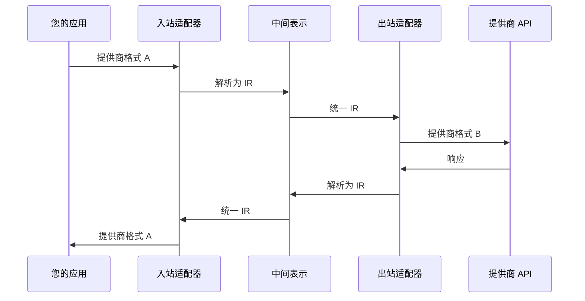

## 什么是 LLM Bridge？

LLM Bridge 是一个双向 API 适配器，允许您：

- 🔄 **在任意 LLM 提供商格式之间转换** - OpenAI、Anthropic、DeepSeek、Kimi、Qwen、Gemini
- 🎯 **类型安全的 TypeScript** - 所有适配器都有完整的类型定义
- 🔌 **可扩展** - 轻松添加自定义适配器
- ⚡ **零依赖** - 核心包没有运行时依赖
- 📦 **可 Tree-shake** - 为现代打包工具优化

<Callout type="info">
LLM Bridge 实现了**真正的双向转换** - 接受任意格式的请求，调用任意提供商 API，并返回任意格式的响应。
</Callout>

## 快速示例

```typescript
import { createBridge } from '@llm-bridge/core'
import { openaiAdapter } from '@llm-bridge/adapter-openai'
import { anthropicAdapter } from '@llm-bridge/adapter-anthropic'

// 创建一个桥接：OpenAI 格式输入 → Anthropic API 输出
const bridge = createBridge({
  inbound: openaiAdapter,
  outbound: anthropicAdapter,
  config: {
    apiKey: process.env.ANTHROPIC_API_KEY
  }
})

// 发送 OpenAI 格式的请求，获取 OpenAI 格式的响应
// 但实际上在底层调用的是 Claude API
const response = await bridge.chat({
  model: 'gpt-4',
  messages: [{ role: 'user', content: '你好！' }]
})
```

## 架构



**中间表示（IR）** 是双向转换的关键：
- 所有 LLM 功能的统一格式
- 支持消息、工具、流式传输、多模态内容
- 可扩展以支持提供商特定功能

## 核心特性

<Tabs items={['双向转换', '类型安全', '可扩展性', '性能']}>
  <Tab value="双向转换">
    ### 双向转换

    与其他只提供统一接口的解决方案不同，LLM Bridge 允许您：

    - **接受请求** - 任意提供商格式
    - **发送请求** - 任意提供商 API
    - **返回响应** - 任意提供商格式

    ```typescript
    // 示例：接受 OpenAI 格式，调用 Anthropic API
    const bridge1 = createBridge({
      inbound: openaiAdapter,
      outbound: anthropicAdapter
    })

    // 示例：接受 Anthropic 格式，调用 OpenAI API
    const bridge2 = createBridge({
      inbound: anthropicAdapter,
      outbound: openaiAdapter
    })
    ```
  </Tab>

  <Tab value="类型安全">
    ### 类型安全

    完整的 TypeScript 支持，包含全面的类型定义：

    - 所有提供商的请求/响应格式
    - 中间表示（IR）
    - 适配器接口
    - 桥接配置

    ```typescript
    import type { LLMRequestIR, LLMResponseIR } from '@llm-bridge/core'

    // 完全类型化的 IR
    const request: LLMRequestIR = {
      messages: [{ role: 'user', content: '你好！' }],
      model: 'gpt-4',
      generation: {
        temperature: 0.7,
        maxTokens: 1000
      }
    }
    ```
  </Tab>

  <Tab value="可扩展性">
    ### 可扩展性

    易于使用自定义适配器扩展：

    - 清晰的适配器接口
    - 文档完善的 IR 格式
    - 常见模式的示例

    ```typescript
    import type { LLMAdapter } from '@llm-bridge/core'

    export const myAdapter: LLMAdapter = {
      name: 'my-provider',
      version: '1.0.0',
      capabilities: {
        streaming: true,
        tools: true,
        vision: false,
        multimodal: false,
        systemPrompt: true,
        toolChoice: true
      },
      inbound: {
        parseRequest: (request) => { /* ... */ }
      },
      outbound: {
        buildRequest: (ir) => { /* ... */ }
      }
    }
    ```
  </Tab>

  <Tab value="性能">
    ### 性能

    为生产环境优化：

    - **零运行时依赖** - 核心包无依赖
    - **可 Tree-shake** - 只打包您使用的部分
    - **最小开销** - 直接转换，无中间步骤
    - **流式支持** - 高效处理大型响应

    ```typescript
    // 只有您使用的适配器会被打包
    import { createBridge } from '@llm-bridge/core'
    import { openaiAdapter } from '@llm-bridge/adapter-openai'
    // 其他适配器不会包含在您的打包文件中
    ```
  </Tab>
</Tabs>

## 支持的提供商

<Tabs items={['OpenAI', 'Anthropic', 'DeepSeek', '其他']}>
  <Tab value="OpenAI">
    ### OpenAI

    完整支持 OpenAI API 格式：
    - 聊天补全
    - 流式传输
    - 函数调用
    - 视觉（GPT-4V）
    - JSON 模式

    ```typescript
    import { openaiAdapter } from '@llm-bridge/adapter-openai'
    ```
  </Tab>

  <Tab value="Anthropic">
    ### Anthropic

    完整支持 Anthropic API 格式：
    - Messages API
    - 流式传输
    - 工具使用
    - 视觉
    - 系统提示

    ```typescript
    import { anthropicAdapter } from '@llm-bridge/adapter-anthropic'
    ```
  </Tab>

  <Tab value="DeepSeek">
    ### DeepSeek

    完整支持 DeepSeek API 格式：
    - 聊天补全
    - 流式传输
    - 函数调用

    ```typescript
    import { deepseekAdapter } from '@llm-bridge/adapter-deepseek'
    ```
  </Tab>

  <Tab value="其他">
    ### 其他提供商

    其他可用的适配器：

    - **Kimi** - 月之暗面
    - **Qwen** - 阿里云
    - **Gemini** - Google AI

    ```typescript
    import { kimiAdapter } from '@llm-bridge/adapter-kimi'
    import { qwenAdapter } from '@llm-bridge/adapter-qwen'
    import { geminiAdapter } from '@llm-bridge/adapter-gemini'
    ```
  </Tab>
</Tabs>

## 使用场景

<Callout type="info">
LLM Bridge 非常适合需要支持多个 LLM 提供商或在提供商之间迁移而无需更改应用代码的应用程序。
</Callout>

- **多提供商支持** - 让用户选择他们喜欢的 LLM 提供商
- **提供商迁移** - 无需重写代码即可切换提供商
- **测试** - 使用相同代码测试多个提供商
- **成本优化** - 根据成本/性能将请求路由到不同提供商
- **故障转移** - 自动故障转移到备用提供商

## 下一步

<Cards>
  <Card title="安装" href="/docs/zh/installation">
    开始使用 LLM Bridge
  </Card>
  <Card title="快速开始" href="/docs/zh/quick-start">
    5 分钟构建您的第一个桥接
  </Card>
  <Card title="核心概念" href="/docs/zh/core-concepts">
    理解架构
  </Card>
  <Card title="API 参考" href="/docs/zh/api/bridge">
    探索完整 API
  </Card>
</Cards>
