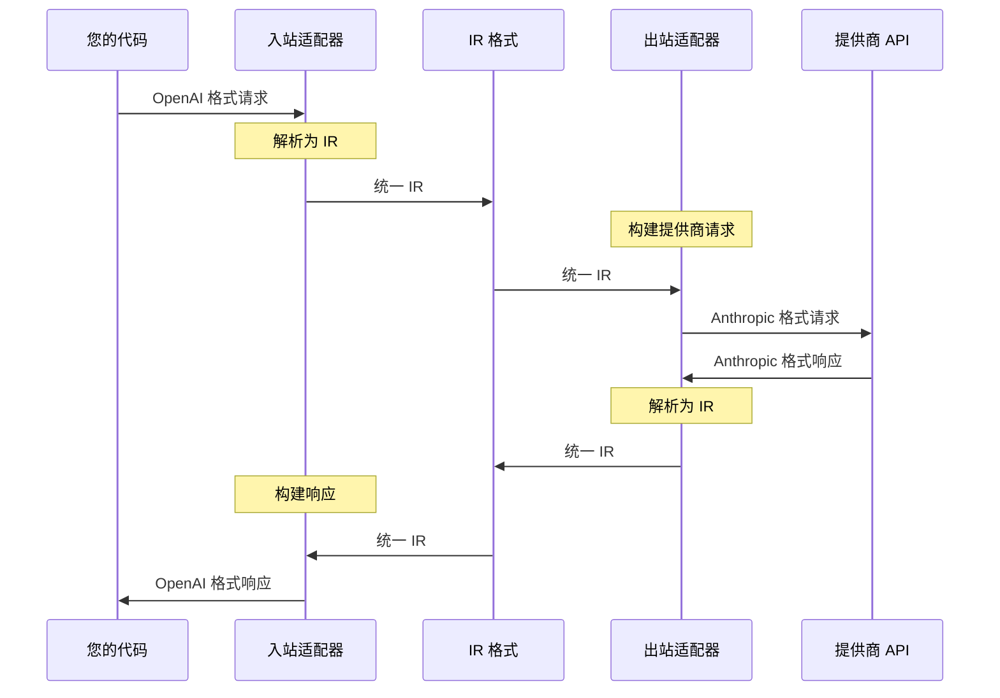

<Callout type="info">
本指南将引导您创建第一个 Amux 桥接。您将学习如何在几分钟内在 OpenAI 和 Anthropic 格式之间进行转换。
</Callout>

## 步骤 1：安装包

```bash tab="pnpm"
pnpm add @amux/llm-bridge @amux/adapter-openai @amux/adapter-anthropic
```

```bash tab="npm"
npm install @amux/llm-bridge @amux/adapter-openai @amux/adapter-anthropic
```

```bash tab="yarn"
yarn add @amux/llm-bridge @amux/adapter-openai @amux/adapter-anthropic
```

```bash tab="bun"
bun add @amux/llm-bridge @amux/adapter-openai @amux/adapter-anthropic
```

## 步骤 2：设置环境变量

在项目根目录创建一个 `.env` 文件：

```bash
OPENAI_API_KEY=your_openai_key_here
ANTHROPIC_API_KEY=your_anthropic_key_here
```

<Callout type="warn">
永远不要将 `.env` 文件提交到版本控制。将其添加到 `.gitignore` 文件中。
</Callout>

## 步骤 3：创建您的第一个桥接

创建一个文件 `bridge.ts`：

<Tabs items={['OpenAI → Anthropic', 'Anthropic → OpenAI', '流式传输']}>
  <Tab value="OpenAI → Anthropic">
    ### OpenAI 格式输入 → Anthropic API 输出

    ```typescript
    import { createBridge } from '@amux/llm-bridge'
    import { openaiAdapter } from '@amux/adapter-openai'
    import { anthropicAdapter } from '@amux/adapter-anthropic'

    // 创建一个桥接：OpenAI 格式输入 → Anthropic API 输出
    const bridge = createBridge({
      inbound: openaiAdapter,
      outbound: anthropicAdapter,
      config: {
        apiKey: process.env.ANTHROPIC_API_KEY!,
        baseURL: 'https://api.anthropic.com'
      }
    })

    // 发送 OpenAI 格式的请求
    const response = await bridge.chat({
      model: 'gpt-4',
      messages: [
        { role: 'user', content: '说你好！' }
      ]
    })

    console.log(response.choices[0].message.content)
    ```

    **发生了什么：**
    1. 您发送了一个 OpenAI 格式的请求
    2. 桥接将其转换为 Anthropic 格式
    3. 调用 Claude API
    4. 响应被转换回 OpenAI 格式
  </Tab>

  <Tab value="Anthropic → OpenAI">
    ### Anthropic 格式输入 → OpenAI API 输出

    ```typescript
    import { createBridge } from '@amux/llm-bridge'
    import { openaiAdapter } from '@amux/adapter-openai'
    import { anthropicAdapter } from '@amux/adapter-anthropic'

    // Anthropic 格式输入 → OpenAI API 输出
    const bridge = createBridge({
      inbound: anthropicAdapter,
      outbound: openaiAdapter,
      config: {
        apiKey: process.env.OPENAI_API_KEY!
      }
    })

    const response = await bridge.chat({
      model: 'claude-3-5-sonnet-20241022',
      messages: [
        { role: 'user', content: '说你好！' }
      ],
      max_tokens: 100
    })

    console.log(response.content[0].text)
    ```

    **发生了什么：**
    1. 您发送了一个 Anthropic 格式的请求
    2. 桥接将其转换为 OpenAI 格式
    3. 调用 GPT API
    4. 响应被转换回 Anthropic 格式
  </Tab>

  <Tab value="流式传输">
    ### 流式响应

    ```typescript
    import { createBridge } from '@amux/llm-bridge'
    import { openaiAdapter } from '@amux/adapter-openai'
    import { anthropicAdapter } from '@amux/adapter-anthropic'

    const bridge = createBridge({
      inbound: openaiAdapter,
      outbound: anthropicAdapter,
      config: {
        apiKey: process.env.ANTHROPIC_API_KEY!
      }
    })

    // 启用流式传输
    const stream = await bridge.chat({
      model: 'gpt-4',
      messages: [
        { role: 'user', content: '讲一个短故事' }
      ],
      stream: true
    })

    // 处理流事件
    for await (const event of stream) {
      if (event.type === 'content') {
        process.stdout.write(event.content.delta)
      }
    }
    ```

    **流式传输的好处：**
    - 更低的延迟 - 在生成时即可看到响应
    - 更好的用户体验 - 向用户显示进度
    - 适用于所有提供商
  </Tab>
</Tabs>

## 步骤 4：运行您的桥接

```bash tab="tsx"
tsx bridge.ts
```

```bash tab="node"
node --loader tsx bridge.ts
```

```bash tab="bun"
bun bridge.ts
```

您应该会看到来自 Claude API 的响应，但格式是 OpenAI 的！

## 刚才发生了什么？



<Callout type="info">
**中间表示（IR）** 是双向转换的关键。它是所有适配器都能理解的统一格式。
</Callout>

## 高级示例

<Tabs items={['工具调用', '视觉', '错误处理']}>
  <Tab value="工具调用">
    ### 函数/工具调用

    ```typescript
    const bridge = createBridge({
      inbound: openaiAdapter,
      outbound: anthropicAdapter,
      config: {
        apiKey: process.env.ANTHROPIC_API_KEY!
      }
    })

    const response = await bridge.chat({
      model: 'gpt-4',
      messages: [
        { role: 'user', content: '北京的天气怎么样？' }
      ],
      tools: [{
        type: 'function',
        function: {
          name: 'get_weather',
          description: '获取某个位置的天气',
          parameters: {
            type: 'object',
            properties: {
              location: { type: 'string' }
            },
            required: ['location']
          }
        }
      }],
      toolChoice: 'auto'
    })

    // 检查模型是否想要调用工具
    if (response.choices[0].message.toolCalls) {
      console.log('工具调用：', response.choices[0].message.toolCalls)
    }
    ```
  </Tab>

  <Tab value="视觉">
    ### 视觉/多模态

    ```typescript
    const bridge = createBridge({
      inbound: openaiAdapter,
      outbound: anthropicAdapter,
      config: {
        apiKey: process.env.ANTHROPIC_API_KEY!
      }
    })

    const response = await bridge.chat({
      model: 'gpt-4-vision-preview',
      messages: [{
        role: 'user',
        content: [
          { type: 'text', text: '这张图片里有什么？' },
          {
            type: 'image',
            source: {
              type: 'url',
              url: 'https://example.com/image.jpg'
            }
          }
        ]
      }]
    })

    console.log(response.choices[0].message.content)
    ```
  </Tab>

  <Tab value="错误处理">
    ### 错误处理

    ```typescript
    import { LLMBridgeError } from '@amux/llm-bridge'

    try {
      const response = await bridge.chat({
        model: 'gpt-4',
        messages: [{ role: 'user', content: '你好！' }]
      })
      console.log(response.choices[0].message.content)
    } catch (error) {
      if (error instanceof LLMBridgeError) {
        console.error('桥接错误：', error.type)
        console.error('消息：', error.message)
        console.error('可重试：', error.retryable)

        // 处理特定错误类型
        switch (error.type) {
          case 'rate_limit':
            console.log('速率限制，重试时间：', error.details?.retryAfter)
            break
          case 'authentication':
            console.log('无效的 API 密钥')
            break
          case 'network':
            console.log('网络错误，正在重试...')
            break
        }
      }
    }
    ```
  </Tab>
</Tabs>

## 下一步

<Cards>
  <Card title="核心概念" href="/docs/zh/core-concepts">
    了解 Amux 的工作原理
  </Card>
  <Card title="API 参考" href="/docs/zh/api/bridge">
    探索完整 API
  </Card>
  <Card title="适配器" href="/docs/zh/api/adapters">
    了解所有可用的适配器
  </Card>
  <Card title="IR 格式" href="/docs/zh/api/ir">
    深入了解 IR 格式
  </Card>
</Cards>
